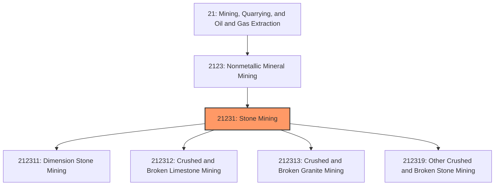

# Stone Mining

> This industry comprises establishments primarily engaged in developing mine sites, mining or quarrying dimension stone and crushed/broken stone, and beneficiating stone products.

## Overview

Stone Mining represents a vital industry within the Nonmetallic Mineral Mining and Quarrying subsector (NAICS 2123). This industry encompasses two primary activities: (1) establishments engaged in developing mine sites, mining or quarrying dimension stone (rough blocks and slabs), or mining and quarrying crushed and broken stone, and (2) preparation plants primarily engaged in beneficiating stone through crushing, grinding, washing, screening, pulverizing, and sizing.

### Industry Scope

Stone mining operations produce materials essential for construction, infrastructure, and manufacturing:
- **Dimension Stone**: Large blocks and slabs for architectural and monumental applications
- **Crushed Stone**: Aggregate for concrete, asphalt, road base, and fill material
- **Industrial Stone**: Specialized stone products for manufacturing processes

### Market Context

The U.S. crushed stone industry produces approximately 1.5 billion metric tons annually, valued at over $20 billion. Dimension stone adds another $500 million in production value. Demand is driven primarily by construction and infrastructure spending, making the industry closely tied to economic cycles and government infrastructure investment.

Key market dynamics include:
- **Infrastructure Investment**: Federal infrastructure legislation driving sustained demand growth
- **Urbanization**: Continued construction activity in growing metropolitan areas
- **Transportation Costs**: Stone is heavy and low-value per ton, making location critical
- **Sustainability Focus**: Increasing use of recycled aggregates and emphasis on land reclamation
- **Consolidation**: Large aggregate producers acquiring regional quarry networks

## Industry Hierarchy

## Key Statistics

| Metric | Value |
|--------|-------|
| NAICS Code | 21231 |
| Level | Industry |
| U.S. Production | 1.5 billion metric tons/year |
| Market Value | ~$21 billion |
| Active Quarries | ~4,000 |
| U.S. Employment | ~70,000 workers |
| Average Quarry Life | 25-50+ years |

## Sub-Industries

| Industry | Code | Description |
|----------|------|-------------|
| [Dimension Stone Mining](./DimensionStoneMining.mdx) | 212311 | Mining and quarrying rough blocks and slabs for architectural uses |
| [Crushed and Broken Limestone](./Crushed.mdx) | 212312 | Mining and crushing limestone for aggregate and industrial uses |
| [Broken Limestone Mining](./BrokenLimestoneMining.mdx) | 212312 | Quarrying broken limestone for construction aggregate |
| [Broken Granite Mining](./BrokenGraniteMining.mdx) | 212313 | Quarrying and crushing granite for aggregate products |
| [Broken Stone Mining](./BrokenStoneMining.mdx) | 212319 | Other crushed and broken stone operations |

## Related Occupations

| Occupation | Role | Employment |
|------------|------|------------|
| [Mining and Geological Engineers](/occupations/Architecture/MiningAndGeologicalEngineers) | Design quarry layouts and extraction plans | 2,100 |
| [First-Line Supervisors of Mining Workers](/occupations/Production/FirstLineSupervisorsOfExtractionWorkers) | Supervise quarry operations | 6,500 |
| [Crushing/Grinding Machine Operators](/occupations/Production/CrushingGrindingAndPolishingMachineSettersOperatorsAndTenders) | Operate stone processing equipment | 8,200 |
| [Excavating Machine Operators](/occupations/Construction/ExcavatingAndLoadingMachineAndDraglineOperators) | Operate excavators and loaders | 12,400 |
| [Industrial Truck Operators](/occupations/Transportation/IndustrialTruckAndTractorOperators) | Transport material within quarries | 9,800 |
| [Heavy Equipment Mechanics](/occupations/Installation/MobileHeavyEquipmentMechanics) | Maintain quarry equipment | 5,600 |
| [Explosives Workers](/occupations/Construction/ExplosivesWorkersOrdnanceHandlingExpertsAndBlasters) | Conduct drilling and blasting operations | 2,800 |
| [Quality Control Inspectors](/occupations/Production/InspectorsTestersAndSamplers) | Test stone quality and gradation | 1,900 |

## Core Business Processes

```mermaid
flowchart LR
    subgraph Planning["Planning & Development"]
        P1["Site<br/>Assessment"]
        P2["Resource<br/>Estimation"]
        P3["Permitting &<br/>Zoning"]
        P4["Infrastructure<br/>Development"]
    end

    subgraph Extraction["Extraction Operations"]
        E1["Overburden<br/>Removal"]
        E2["Drilling &<br/>Blasting"]
        E3["Loading &<br/>Hauling"]
        E4["Primary<br/>Crushing"]
    end

    subgraph Processing["Processing & Distribution"]
        PR1["Secondary<br/>Crushing"]
        PR2["Screening &<br/>Sizing"]
        PR3["Washing &<br/>Washing"]
        PR4["Stockpiling &<br/>Loading"]
    end

    subgraph Closure["Reclamation"]
        C1["Progressive<br/>Reclamation"]
        C2["Final<br/>Grading"]
        C3["Revegetation"]
        C4["Post-closure<br/>Monitoring"]
    end

    P1 --> P2 --> P3 --> P4
    P4 --> E1 --> E2 --> E3 --> E4
    E4 --> PR1 --> PR2 --> PR3 --> PR4
    PR4 -.-> C1 --> C2 --> C3 --> C4
```

### Key Operating Processes

**Quarry Development**
- Geological assessment and reserve estimation
- Environmental impact assessment
- Land acquisition and zoning approvals
- Access road and infrastructure construction
- Water management system installation

**Extraction Operations**
- Overburden stripping and stockpiling
- Bench drilling and blast pattern design
- Controlled blasting with delay detonators
- Loading with front-end loaders and excavators
- Haul truck transport to primary crusher

**Processing and Beneficiation**
- Primary jaw or gyratory crushing
- Secondary and tertiary cone crushing
- Vibrating screens for size classification
- Washing for removal of fines and clay
- Conveyor systems and radial stackers

**Quality Control**
- Gradation testing (sieve analysis)
- Specific gravity and absorption testing
- LA abrasion resistance testing
- Soundness and durability testing
- Deleterious material content analysis

## Industry Value Chain

```mermaid
graph LR
    subgraph Inputs["Inputs & Resources"]
        I1["Land &<br/>Mineral Rights"]
        I2["Heavy Mobile<br/>Equipment"]
        I3["Crushing &<br/>Screening Plants"]
        I4["Explosives &<br/>Drilling Supplies"]
        I5["Labor &<br/>Management"]
    end

    subgraph Primary["Primary Activities"]
        A1["Quarry<br/>Development"]
        A2["Stone<br/>Extraction"]
        A3["Crushing &<br/>Processing"]
        A4["Quality Control<br/>& Inventory"]
    end

    subgraph Outputs["Products"]
        O1["Dimension<br/>Stone"]
        O2["Crushed<br/>Aggregate"]
        O3["Road Base<br/>& Fill"]
        O4["Specialty<br/>Products"]
    end

    subgraph Customers["Markets"]
        C1["Ready-Mix<br/>Concrete"]
        C2["Asphalt<br/>Paving"]
        C3["Construction<br/>Contractors"]
        C4["DOT &<br/>Municipalities"]
        C5["Landscaping<br/>& Retail"]
    end

    Inputs --> Primary --> Outputs --> Customers
```

## Regulatory Environment

### Federal Regulations

| Agency | Regulation | Scope |
|--------|------------|-------|
| **MSHA** | Mine Safety and Health Act | Quarry safety standards, training, inspections |
| **EPA** | Clean Water Act | Stormwater permits (NPDES), discharge limits |
| **EPA** | Clean Air Act | Dust control, emissions from processing |
| **OSMRE** | SMCRA | Surface mining reclamation requirements |
| **USFWS** | Endangered Species Act | Wildlife and habitat protection |
| **USACE** | Section 404 | Wetlands and waters permits |

### State and Local Requirements
- State mining permits and reclamation plans
- County/municipal zoning and conditional use permits
- Blasting permits and notification requirements
- Truck weight limits and haul route restrictions
- Noise and dust ordinances
- Reclamation bonding (typically $1,000-10,000/acre)

### Industry Standards
- **ASTM C33**: Standard Specification for Concrete Aggregates
- **AASHTO M 43**: Sizes of Aggregate for Road and Bridge Construction
- **ASTM D448**: Standard Classification for Sizes of Aggregate
- **NSSGA Best Practices**: Industry safety and environmental guidelines

## Technology & Innovation

### Current Technologies

| Technology | Application | Benefits |
|------------|-------------|----------|
| **GPS Fleet Management** | Track and optimize haul truck routes | 10-15% fuel savings, improved utilization |
| **Drone Surveying** | Volumetric measurements, pit inspection | Faster surveys, improved safety |
| **Automated Crushing** | Process control for consistent gradation | Reduced waste, better quality |
| **Dust Suppression Systems** | Misting and chemical suppressants | Regulatory compliance, air quality |
| **Telematics** | Equipment monitoring and diagnostics | Predictive maintenance, reduced downtime |
| **Load Scanning** | Automated truck load measurement | Accurate inventory, truck optimization |

### Emerging Innovations

- **Electric Haul Trucks**: Battery-electric vehicles for reduced emissions and fuel costs
- **Autonomous Haulage**: Self-driving trucks in closed quarry environments
- **AI-Powered Blasting**: Machine learning optimization of blast patterns for fragmentation
- **Modular Processing Plants**: Portable crushing and screening for flexibility
- **Recycled Aggregate Processing**: Equipment for processing construction demolition waste
- **Carbon Capture in Concrete**: Using captured CO2 in concrete aggregate production
- **Digital Twin Quarries**: Virtual modeling for planning and optimization

## Market Size and Trends

### U.S. Crushed Stone Production by Type

| Stone Type | Production | Share | Primary Uses |
|------------|------------|-------|--------------|
| Limestone/Dolomite | 1.0 billion tons | 67% | Concrete, asphalt, road base, cement |
| Granite | 220 million tons | 15% | Concrete, asphalt, railroad ballast |
| Traprock | 130 million tons | 9% | Asphalt, railroad ballast |
| Sandstone/Quartzite | 45 million tons | 3% | Building stone, glass manufacturing |
| Other | 90 million tons | 6% | Various industrial uses |

### Industry Trends

1. **Infrastructure Spending**: Federal infrastructure bill driving sustained demand growth through 2030
2. **Urban Quarry Challenges**: Encroachment making urban/suburban quarries difficult to expand
3. **Vertical Integration**: Ready-mix and asphalt producers acquiring aggregate sources
4. **Recycled Aggregates**: Growing acceptance of recycled concrete in specifications
5. **Sustainability Reporting**: ESG metrics becoming important for large customers
6. **Workforce Shortage**: Difficulty attracting younger workers to quarry operations
7. **Technology Adoption**: Increasing automation to address labor challenges

### Regional Market Dynamics

| Region | Characteristics | Key Drivers |
|--------|-----------------|-------------|
| **Southeast** | High growth, limestone dominant | Population growth, highway construction |
| **Texas** | Large market, diverse stone types | Energy sector, residential construction |
| **Midwest** | Mature market, consolidated | Infrastructure maintenance, manufacturing |
| **Northeast** | Constrained supply, high prices | Limited new permits, urban development |
| **West** | Granite/basalt focus | Infrastructure, mining sector support |

### Investment Outlook

The stone mining industry benefits from sustained infrastructure investment and construction activity. Average quarry prices have increased 4-6% annually due to transportation costs and supply constraints near urban areas. Investment is focused on processing efficiency, environmental compliance, and extending quarry reserves through acquisitions. The industry is expected to grow 2-3% annually through 2030.

---

*Source: NAICS 21231 - Stone Mining*
