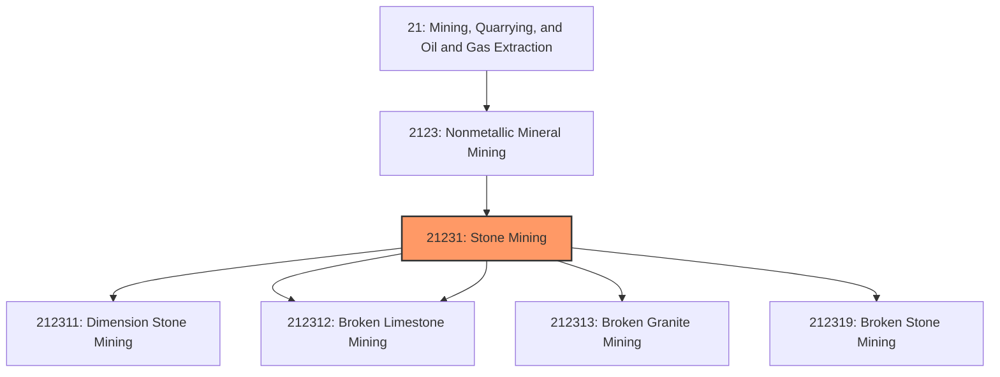
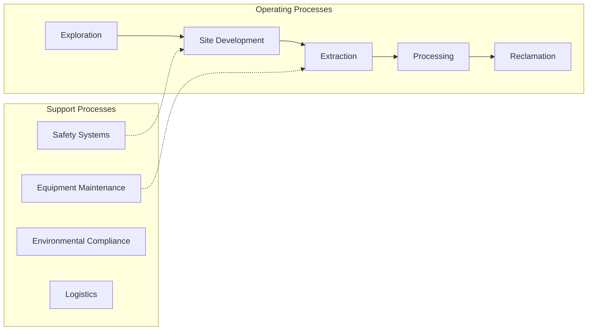

# Stone Mining

> This industry comprises (1) establishments primarily engaged in developing the mine site, mining or quarrying dimension stone (i.

## Overview

Stone Mining represents an important category within the Mining, Quarrying, and Oil and Gas Extraction sector (NAICS 21).

This industry comprises (1) establishments primarily engaged in developing the mine site, mining or quarrying dimension stone (i.e., rough blocks and/or slabs of stone), or mining and quarrying crushed and broken stone and/or (2) preparation plants primarily engaged in beneficiating stone (e.g., crushing, grinding, washing, screening, pulverizing, and sizing). Cross-References. Establishments primarily engaged in--

## Industry Hierarchy

## Key Statistics

| Metric | Value |
|--------|-------|
| NAICS Code | 21231 |
| Level | Industry |
| Parent | [Nonmetallic Mineral Mining](../) |
| Child Industries | 5 |

## Sub-Industries

| Industry | Code | Description |
|----------|------|-------------|
| [Dimension Stone Mining](./DimensionStoneMining.mdx) | 212311 | This U |
| [Crushed](./Crushed.mdx) | 212312 | This U |
| [Broken Limestone Mining](./BrokenLimestoneMining.mdx) | 212312 | This U |
| [Broken Granite Mining](./BrokenGraniteMining.mdx) | 212313 | This U |
| [Broken Stone Mining](./BrokenStoneMining.mdx) | 212319 | This U |

## Related Occupations

See the [occupations directory](/occupations) for roles commonly found in this industry.

## Core Business Processes

## Industry Value Chain

```mermaid
graph LR
    subgraph Inputs["Inputs"]
        I1["Equipment"]
        I2["Energy"]
        I3["Labor"]
        I4["Permits"]
    end

    subgraph Primary["Primary Activities"]
        A1["Inbound Logistics"]
        A2["Core Operations"]
        A3["Quality Assurance"]
        A4["Outbound/Delivery"]
    end

    subgraph Outputs["Products/Services"]
        O1["Minerals"]
        O2["Oil/Gas"]
        O3["Raw Materials"]
    end

    subgraph Customers["Markets"]
        C1["Refineries"]
        C2["Manufacturers"]
        C3["Utilities"]
        C4["Export Markets"]
    end

    Inputs --> Primary --> Outputs --> Customers
```

---

*Source: NAICS 21231 - Stone Mining*
