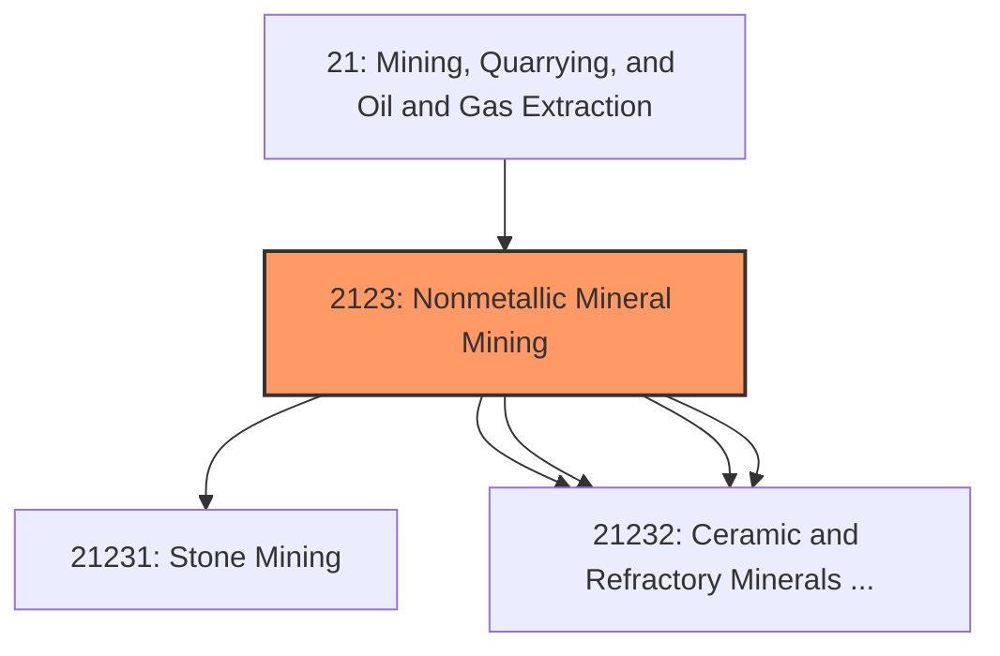
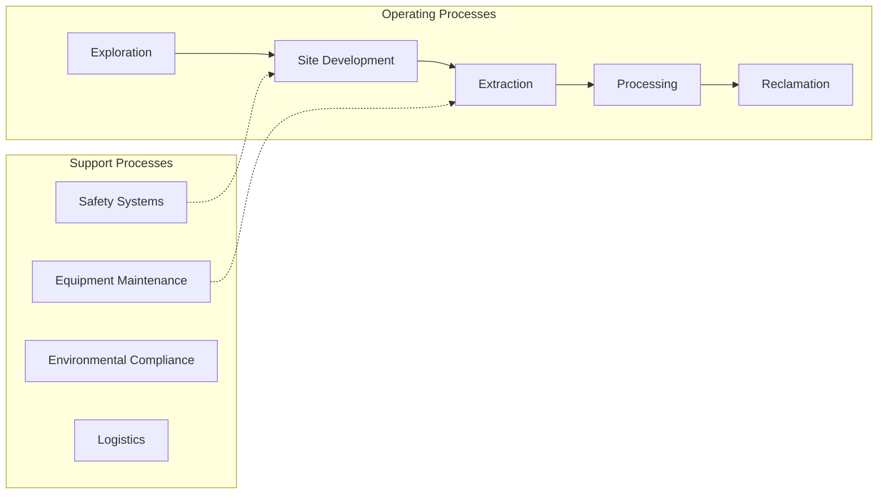

# Nonmetallic Mineral Mining

> This industry group comprises establishments primarily engaged in developing mine sites, or in mining or quarrying nonmetallic minerals (except fuels).

## Overview

Nonmetallic Mineral Mining represents an important category within the Mining, Quarrying, and Oil and Gas Extraction sector (NAICS 21).

This industry group comprises establishments primarily engaged in developing mine sites, or in mining or quarrying nonmetallic minerals (except fuels). Also included are certain well and brine operations, and preparation plants primarily engaged in beneficiating (e.g., crushing, grinding, washing, and concentrating) nonmetallic minerals. Beneficiation is the process whereby the extracted material is reduced to particles which can be separated into mineral and waste, the former suitable for further processing or direct use. The operations that take place in beneficiation are primarily mechanical, such as grinding, washing, magnetic separation, and centrifugal separation. In contrast, manufacturing operations primarily use chemical and electrochemical processes, such as electrolysis and distillation. However, some treatments, such as heat treatments, take place in both the beneficiation and the manufacturing (i.e., smelting/refining) stages. The range of preparation activities varies by mineral and the purity of any given ore deposit. While some minerals, such as petroleum and natural gas, require little or no preparation, others are washed and screened, while yet others, such as gold and silver, can be transformed into bullion before leaving the mine site.

## Industry Hierarchy

## Key Statistics

| Metric | Value |
|--------|-------|
| NAICS Code | 2123 |
| Level | Industry Group |
| Child Industries | 5 |

## Sub-Industries

| Industry | Code | Description |
|----------|------|-------------|
| [Stone Mining](./StoneMining/) | 21231 | This industry comprises (1) establishments primarily engaged in developing the m |
| [Sand](./Sand/) | 21232 | This industry comprises (1) establishments primarily engaged in developing the m |
| [Gravel](./Gravel/) | 21232 | This industry comprises (1) establishments primarily engaged in developing the m |
| [Clay](./Clay/) | 21232 | This industry comprises (1) establishments primarily engaged in developing the m |
| [Ceramic and Refractory Minerals Mining and Quarrying](./CeramicAndRefractoryMineralsMiningAndQuarrying/) | 21232 | This industry comprises (1) establishments primarily engaged in developing the m |

## Related Occupations

See the [occupations directory](/occupations) for roles commonly found in this industry.

## Core Business Processes

## Industry Value Chain

```mermaid
graph LR
    subgraph Inputs["Inputs"]
        I1["Equipment"]
        I2["Energy"]
        I3["Labor"]
        I4["Permits"]
    end

    subgraph Primary["Primary Activities"]
        A1["Inbound Logistics"]
        A2["Core Operations"]
        A3["Quality Assurance"]
        A4["Outbound/Delivery"]
    end

    subgraph Outputs["Products/Services"]
        O1["Minerals"]
        O2["Oil/Gas"]
        O3["Raw Materials"]
    end

    subgraph Customers["Markets"]
        C1["Refineries"]
        C2["Manufacturers"]
        C3["Utilities"]
        C4["Export Markets"]
    end

    Inputs --> Primary --> Outputs --> Customers
```

---

*Source: NAICS 2123 - Nonmetallic Mineral Mining*
