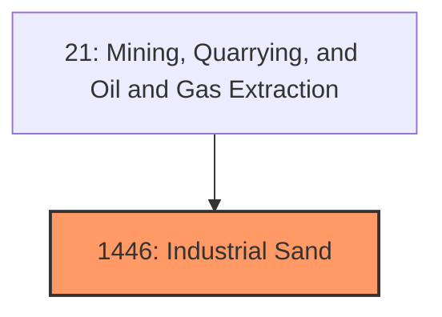
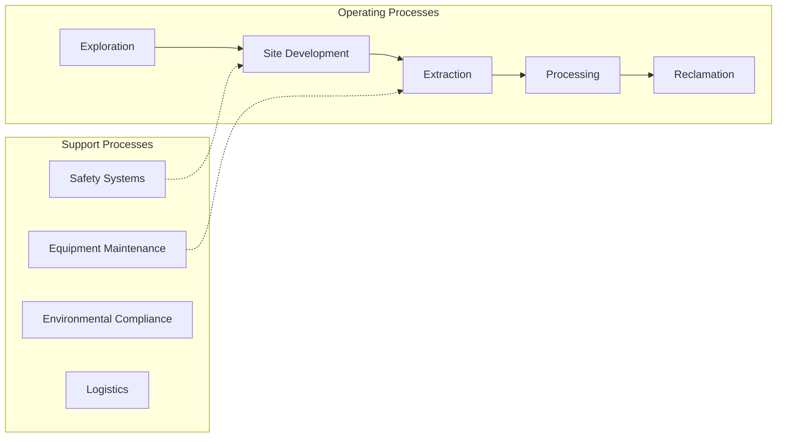

# Industrial Sand

> Industrial Sand.

## Overview

Industrial Sand represents an important category within the Mining, Quarrying, and Oil and Gas Extraction sector (SIC 1446).

## Industry Hierarchy

## Key Statistics

| Metric | Value |
|--------|-------|
| SIC Code | 1446 |
| Level | SIC (1446) |
| Child Industries | 0 |

## Related Occupations

- [Mining and Geological Engineers](/occupations/Architecture/MiningAndGeologicalEngineers) - Design mines and extraction systems
- [Geological Technicians](/occupations/Science/GeologicalTechniciansExceptHydrologicTechnicians) - Assist geologists in exploration
- [Continuous Mining Machine Operators](/occupations/Construction/ContinuousMiningMachineOperators) - Operate mining machinery
- [Rotary Drill Operators, Oil and Gas](/occupations/Construction/RotaryDrillOperatorsOilAndGas) - Operate drilling equipment

## Core Business Processes

## Industry Value Chain

## Regulatory Environment

- **MSHA** (Mine Safety and Health Administration) - Enforces safety and health standards in mines
- **EPA** (Environmental Protection Agency) - Regulates environmental impact of extraction operations
- **Bureau of Land Management** - Manages mineral rights on federal lands
- **State Mining Commissions** - Oversee permitting and reclamation requirements

## Technology & Innovation

- **Autonomous Mining** - Self-driving haul trucks, automated drilling, and remote-operated equipment
- **Advanced Exploration** - 3D seismic imaging, AI-powered geological modeling, and satellite surveying
- **Environmental Technologies** - Carbon capture, mine water treatment, and land reclamation innovations
- **Digital Twins** - Virtual mine modeling for operational optimization and safety planning

## Industry Outlook

The mining and extraction sector faces a dual transition: meeting ongoing demand for traditional minerals while rapidly scaling production of critical minerals needed for clean energy technologies. Automation and remote operations are reshaping the workforce, and environmental stewardship is increasingly central to obtaining social license to operate. Long-term demand for lithium, cobalt, and rare earth elements continues to drive exploration investment.

## Market Context

The mining industry provides essential raw materials for manufacturing and construction, with growing focus on sustainable extraction and safety technology.

| Aspect | Details |
|--------|---------|
| Industry Sector | Mining |
| NAICS/SIC Code | 1446 |
| Market Segment | Industrial Sand |

## Key Business Processes

- Exploration and surveying
- Extraction and processing
- Safety and compliance
- Environmental management
- Reclamation and closure

## Common Occupations

- [Mining Engineers](/occupations/Engineering/MiningAndGeologicalEngineers)
- [Extraction Workers](/occupations/Construction/ExtractionWorkers)
- [Mining Machine Operators](/occupations/Production/MiningMachineOperators)
- [Geological Engineers](/occupations/Engineering/MiningAndGeologicalEngineers)

## Regulations and Standards

- Mine Safety and Health Administration (MSHA)
- Environmental Protection Agency (EPA)
- Bureau of Land Management (BLM)
- State mining regulations
- Clean Water Act requirements

## Technology and Tools

- Autonomous mining equipment
- Real-time monitoring systems
- Geological modeling software
- Safety detection systems
- Environmental monitoring

## Industry Trends

- Digital transformation and automation adoption
- Sustainability and environmental compliance focus
- Workforce development and skills training
- Supply chain resilience and optimization
- Customer experience enhancement

---

*Source: SIC 1446 - Industrial Sand*
