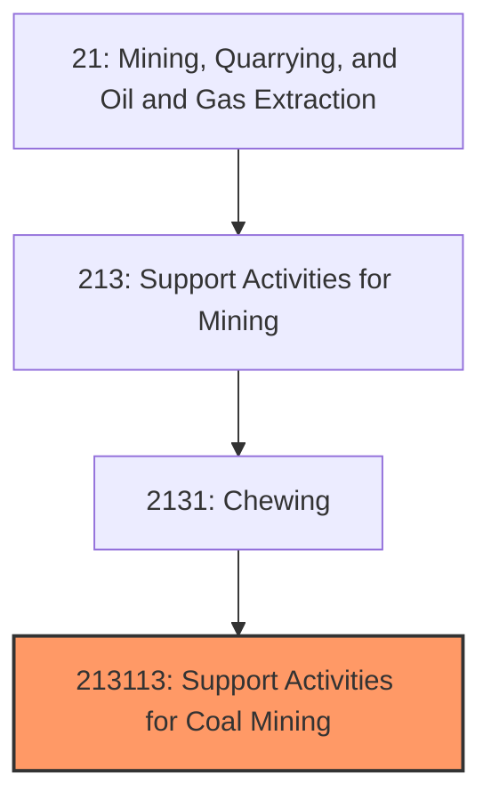
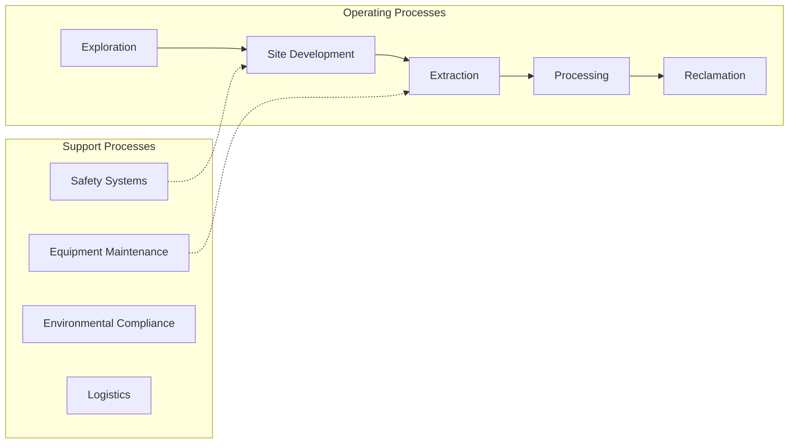

# Support Activities for Coal Mining

> This U.

## Overview

Support Activities for Coal Mining represents a specialized segment within the Mining, Quarrying, and Oil and Gas Extraction sector (NAICS 21).

This U.S. industry comprises establishments primarily engaged in providing support activities for coal mining (except geophysical surveying and mapping, site preparation, construction, and transportation activities) on a contract or fee basis. Exploration for coal is included in this industry. Exploration services include traditional prospecting methods, such as taking core samples and making geological observations at prospective sites. Cross-References. Establishments primarily engaged in--

## Industry Hierarchy

## Key Statistics

| Metric | Value |
|--------|-------|
| NAICS Code | 213113 |
| Level | National Industry |
| Child Industries | 0 |

## Related Occupations

See the [occupations directory](/occupations) for roles commonly found in this industry.

## Core Business Processes

## Industry Value Chain

```mermaid
graph LR
    subgraph Inputs["Inputs"]
        I1["Equipment"]
        I2["Energy"]
        I3["Labor"]
        I4["Permits"]
    end

    subgraph Primary["Primary Activities"]
        A1["Inbound Logistics"]
        A2["Core Operations"]
        A3["Quality Assurance"]
        A4["Outbound/Delivery"]
    end

    subgraph Outputs["Products/Services"]
        O1["Minerals"]
        O2["Oil/Gas"]
        O3["Raw Materials"]
    end

    subgraph Customers["Markets"]
        C1["Refineries"]
        C2["Manufacturers"]
        C3["Utilities"]
        C4["Export Markets"]
    end

    Inputs --> Primary --> Outputs --> Customers
```

---

*Source: NAICS 213113 - Support Activities for Coal Mining*
