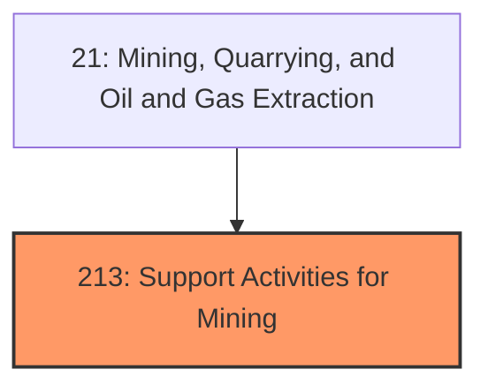
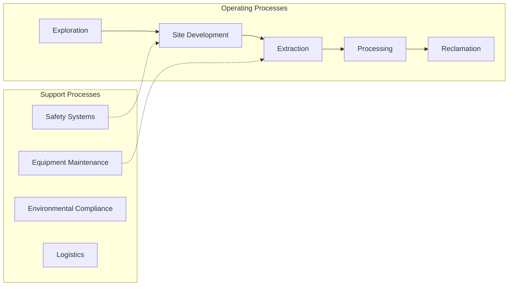

# Support Activities for Mining

> Industries in the Support Activities for Mining subsector group establishments primarily providing support services, on a contract or fee basis (except geophysical surveying and mapping, mine site preparation, construction, and transportation activities), required for the mining and quarrying of minerals and for the extraction of oil and gas.

## Overview

Support Activities for Mining represents an important category within the Mining, Quarrying, and Oil and Gas Extraction sector (NAICS 21). This subsector encompasses establishments primarily engaged in support activities for mining.

Industries in the Support Activities for Mining subsector group establishments primarily providing support services, on a contract or fee basis (except geophysical surveying and mapping, mine site preparation, construction, and transportation activities), required for the mining and quarrying of minerals and for the extraction of oil and gas. Establishments performing exploration for minerals, on a contract or fee basis, are included in this subsector. Exploration services include traditional prospecting methods, such as taking core samples and making geological observations at prospective sites. The activities performed on a contract or fee basis by establishments in the Support Activities for Mining subsector are also often performed in-house by mining operators. These activities include taking core samples, making geological observations at prospective sites, excavating slush pits and cellars, and such oil and gas operations as spudding in, drilling in, redrilling, directional drilling, and well surveying; running, cutting, and pulling casings, tubes, and rods; cementing and shooting wells; perforating well casings; acidizing and chemically treating wells; cleaning out, bailing, and swabbing wells; and operating oil and gas field gathering lines. Establishments primarily engaged in providing site preparation and related construction activities on a contract or fee basis are classified in Sector 23, Construction. Establishments primarily engaged in providing transportation activities in support of mining, quarrying, or oil and gas extraction are classified in Sector 48-49, Transportation and Warehousing, based on the primary activity.

## Industry Hierarchy

## Key Statistics

| Metric | Value |
|--------|-------|
| NAICS Code | 213 |
| Level | Subsector |
| Parent | [Oil and Gas Extraction](../) |
| Child Industries | 0 |

## Core Business Processes

## Industry Value Chain

```mermaid
graph LR
    subgraph Inputs["Inputs"]
        I1["Equipment"]
        I2["Energy"]
        I3["Labor"]
        I4["Permits"]
    end

    subgraph Primary["Primary Activities"]
        A1["Inbound Logistics"]
        A2["Core Operations"]
        A3["Quality Assurance"]
        A4["Outbound/Delivery"]
    end

    subgraph Outputs["Products/Services"]
        O1["Minerals"]
        O2["Oil/Gas"]
        O3["Raw Materials"]
    end

    subgraph Customers["Markets"]
        C1["Refineries"]
        C2["Manufacturers"]
        C3["Utilities"]
        C4["Export Markets"]
    end

    Inputs --> Primary --> Outputs --> Customers
```

## Market Context

The mining industry provides essential raw materials for manufacturing and construction, with growing focus on sustainable extraction and safety technology.

| Aspect | Details |
|--------|---------|
| Industry Sector | Mining |
| NAICS/SIC Code | 213 |
| Market Segment | Support Activities for Mining |

## Key Business Processes

- Exploration and surveying
- Extraction and processing
- Safety and compliance
- Environmental management
- Reclamation and closure

## Common Occupations

- [Mining Engineers](/occupations/Engineering/MiningAndGeologicalEngineers)
- [Extraction Workers](/occupations/Construction/ExtractionWorkers)
- [Mining Machine Operators](/occupations/Production/MiningMachineOperators)
- [Geological Engineers](/occupations/Engineering/MiningAndGeologicalEngineers)

## Regulations and Standards

- Mine Safety and Health Administration (MSHA)
- Environmental Protection Agency (EPA)
- Bureau of Land Management (BLM)
- State mining regulations
- Clean Water Act requirements

## Technology and Tools

- Autonomous mining equipment
- Real-time monitoring systems
- Geological modeling software
- Safety detection systems
- Environmental monitoring

## Industry Trends

- Digital transformation and automation adoption
- Sustainability and environmental compliance focus
- Workforce development and skills training
- Supply chain resilience and optimization
- Customer experience enhancement

---

*Source: NAICS 213 - Support Activities for Mining*
