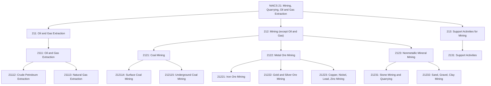
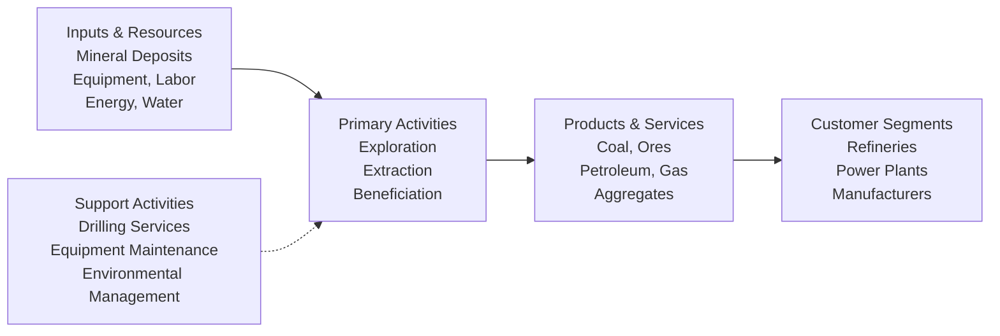

# Mining, Quarrying, and Oil and Gas Extraction

> The Mining, Quarrying, and Oil and Gas Extraction sector comprises establishments that extract naturally occurring mineral solids, liquid minerals, and gases from the earth.

## Overview

This sector extracts naturally occurring mineral solids (such as coal and ores), liquid minerals (crude petroleum), and gases (natural gas). The term "mining" encompasses quarrying, well operations, and beneficiating (crushing, screening, washing, flotation) customarily performed at the mine site.

The sector distinguishes two basic activities: mine operation (establishments operating mines, quarries, or oil and gas wells) and mining support activities (establishments performing exploration and other mining services on a contract or fee basis).

Beneficiation is the process of reducing extracted material to particles that can be separated into mineral and waste. Operations are primarily mechanical (grinding, washing, magnetic separation) rather than chemical processes used in manufacturing.

## Industry Hierarchy

## Key Statistics

| Metric | Value |
|--------|-------|
| NAICS Code | 21 |
| Level | Sector |
| Subsectors | 3 |
| Industry Groups | 5 |
| Industries | 28 |

## Sub-Industries

| Subsector | Code | Description |
|-----------|------|-------------|
| [Oil and Gas Extraction](../OilAndGas/) | 211 | Exploration and production of crude petroleum and natural gas |
| Mining (except Oil and Gas) | 212 | Coal, metal ore, and nonmetallic mineral mining and quarrying |
| [Support Activities for Mining](../OilAndGas/MiningSupport/) | 213 | Exploration, drilling, and other contract mining services |

## Related Occupations

- [Mining and Geological Engineers](/occupations/MiningAndGeologicalEngineers) - Mine planning and design
- [Petroleum Engineers](/occupations/PetroleumEngineers) - Oil and gas extraction design
- [Continuous Mining Machine Operators](/occupations/ContinuousMiningMachineOperators) - Underground mining operations
- [Derrick Operators, Oil and Gas](/occupations/DerrickOperatorsOilAndGas) - Drilling rig operations
- [Geologists and Geoscientists](/occupations/GeologistsAndGeoscientists) - Exploration and site evaluation
- [Explosives Workers](/occupations/ExplosivesWorkers) - Blasting operations

## Core Business Processes

```mermaid
flowchart LR
    subgraph Exploration["Exploration"]
        E1["Geological Survey"]
        E2["Site Assessment"]
        E3["Resource Estimation"]
        E4["Permitting"]
    end

    subgraph Development["Development"]
        D1["Mine Planning"]
        D2["Infrastructure"]
        D3["Equipment Setup"]
    end

    subgraph Production["Production"]
        P1["Extraction"]
        P2["Beneficiation"]
        P3["Transportation"]
    end

    subgraph Closure["Closure"]
        C1["Reclamation"]
        C2["Environmental Remediation"]
        C3["Site Monitoring"]
    end

    E1 --> E2 --> E3 --> E4
    E4 --> D1 --> D2 --> D3
    D3 --> P1 --> P2 --> P3
    P3 --> C1 --> C2 --> C3
```

### Exploration and Development

Identifying and evaluating mineral deposits through geological surveys, core sampling, and prospecting methods. Developing mine plans and securing necessary permits.

**Key Activities:**
- Conduct geological and geophysical surveys
- Take core samples and analyze mineral content
- Estimate resource size and quality
- Prepare environmental impact assessments
- Secure mining permits and licenses

### Extraction Operations

Operating mines, quarries, and wells to extract mineral resources. This includes both surface and underground mining methods.

**Key Activities:**
- Operate extraction equipment and machinery
- Manage blasting and excavation
- Control ventilation and safety systems
- Monitor production rates and quality
- Maintain equipment and infrastructure

### Beneficiation and Processing

Preparing extracted materials through crushing, washing, screening, and other mechanical processes to separate valuable minerals from waste.

**Key Activities:**
- Operate crushing and grinding equipment
- Manage screening and classification systems
- Control washing and separation processes
- Handle tailings and waste materials
- Monitor product quality and specifications

## Industry Value Chain

## Mining Methods

### Surface Mining
Extraction of minerals near the surface, including open-pit mining, strip mining, and quarrying. Used for coal, aggregates, and near-surface ore deposits.

### Underground Mining
Extraction of minerals from below the surface through shafts, tunnels, and specialized equipment. Used for deeper deposits of coal, metals, and other minerals.

### Well Operations
Drilling and operating wells for oil and gas extraction, including conventional and unconventional methods (hydraulic fracturing, horizontal drilling).

## Regulatory Environment

Mining operations are heavily regulated:

- **Mine Safety and Health Administration (MSHA)**: Workplace safety standards for mining
- **Environmental Protection Agency (EPA)**: Air, water, and waste regulations
- **Bureau of Land Management (BLM)**: Federal land access and reclamation
- **State Mining Agencies**: Permitting, bonding, and reclamation requirements
- **Securities Regulations**: Resource reporting and disclosure requirements

## Technology & Innovation

The mining sector is adopting advanced technologies:

- **Autonomous Equipment**: Self-driving haul trucks and drilling systems
- **Remote Operations**: Control centers for monitoring operations from distance
- **IoT and Sensors**: Real-time monitoring of equipment and conditions
- **Drone Technology**: Aerial surveying and inspection
- **Advanced Analytics**: Predictive maintenance and production optimization
- **Electric Vehicles**: Battery-electric underground equipment
- **Water Management**: Treatment and recycling systems
- **Carbon Capture**: Technologies for reducing environmental impact

## Environmental Considerations

Mining operations must address significant environmental challenges:

- **Land Disturbance**: Minimizing footprint and planning reclamation
- **Water Management**: Treating discharge and protecting groundwater
- **Air Quality**: Controlling dust and emissions
- **Wildlife Habitat**: Protecting and restoring ecosystems
- **Waste Management**: Safe disposal of tailings and overburden

---

*Source: NAICS 21 - Mining, Quarrying, and Oil and Gas Extraction*
