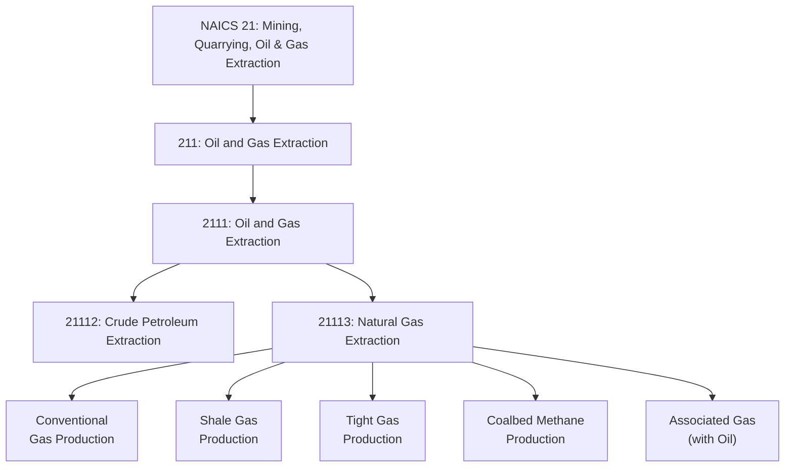
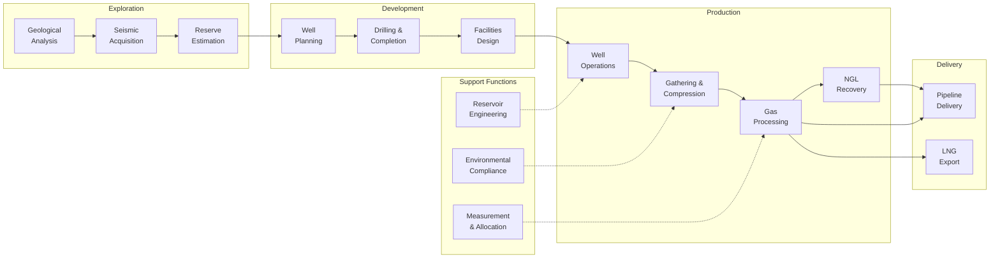
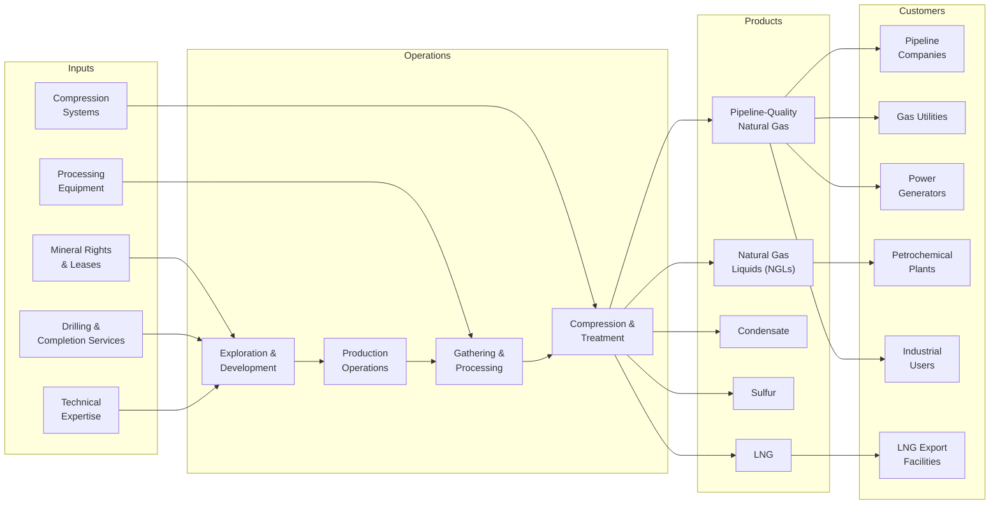

# Natural Gas Extraction

> Industries in the Oil and Gas Extraction subsector operate and/or develop oil and gas field properties. This includes the production of natural gas, sulfur recovery from natural gas, and recovery of hydrocarbon liquids.

## Overview

The Natural Gas Extraction subsector encompasses all activities related to the production of natural gas from underground reservoirs. This includes conventional gas production from traditional formations, unconventional gas extraction from shale and tight formations, and the recovery of associated products including natural gas liquids (NGLs), condensate, and sulfur.

Natural gas production involves a complex series of operations from initial exploration through processing and delivery to pipeline systems. Modern natural gas operations increasingly focus on unconventional resources, which require specialized drilling and completion techniques.

Key operational activities include:
- Exploration for natural gas deposits
- Drilling and completing gas wells
- Operating gas processing and treatment facilities
- Recovering natural gas liquids and condensate
- Sulfur recovery from sour gas streams
- Managing gathering systems and compression

## Industry Hierarchy

## Key Statistics

| Metric | Value |
|--------|-------|
| NAICS Code | 21113 |
| Level | Industry |
| Parent Subsector | [211: Oil and Gas Extraction](../) |
| Related Industry | [21112: Crude Petroleum Extraction](../Oil/) |
| Support Services | [213: Support Activities for Mining](../MiningSupport/) |

## Natural Gas Types

| Gas Type | Description | Key Characteristics |
|----------|-------------|---------------------|
| Conventional Gas | Gas trapped in permeable reservoir rock | High permeability, vertical wells |
| Shale Gas | Gas trapped in organic-rich shale formations | Requires hydraulic fracturing |
| Tight Gas | Gas in low-permeability sandstone or limestone | Horizontal drilling and stimulation |
| Coalbed Methane | Gas adsorbed in coal seams | Dewatering required for production |
| Associated Gas | Gas produced with crude oil | Separated at production facilities |
| Non-Associated Gas | Gas from dedicated gas reservoirs | Primarily methane production |

## Related Occupations

- [Petroleum Engineers](/occupations/PetroleumEngineers) - Design gas extraction and processing systems
- [Geoscientists](/occupations/Geoscientists) - Identify gas-bearing formations and estimate reserves
- [Rotary Drill Operators, Oil and Gas](/occupations/RotaryDrillOperators) - Operate drilling equipment for gas wells
- [Derrick Operators, Oil and Gas](/occupations/DerrickOperatorsOilAndGas) - Rig equipment and manage drilling operations
- [Service Unit Operators](/occupations/ServiceUnitOperators) - Operate well servicing equipment
- [Gas Plant Operators](/occupations/GasPlantOperators) - Operate gas processing and treatment facilities
- [Gas Compressor and Gas Pumping Station Operators](/occupations/GasCompressorOperators) - Operate compression equipment
- [Chemical Engineers](/occupations/ChemicalEngineers) - Design gas processing systems
- [First-Line Supervisors of Extraction Workers](/occupations/FirstLineSupervisorsExtractionWorkers) - Supervise production operations

## Core Business Processes

### Exploration and Appraisal

Identifying prospective gas-bearing formations and quantifying resource potential.

**Key Activities:**
- Acquire and process seismic data
- Analyze geological and petrophysical data
- Conduct reservoir characterization studies
- Estimate reserves and contingent resources
- Evaluate economic viability of prospects

### Drilling and Completion

Creating wellbores and preparing wells for gas production.

**Key Activities:**
- Design well trajectories (vertical, deviated, horizontal)
- Execute drilling programs with appropriate mud systems
- Run and cement casing strings
- Perform hydraulic fracturing in unconventional wells
- Install completion equipment and wellheads
- Conduct well testing and flow analysis

### Gas Processing

Treating raw natural gas to meet pipeline quality specifications and recovering valuable liquids.

**Key Activities:**
- Remove water and dehydrate gas streams
- Extract hydrogen sulfide and CO2 (acid gas removal)
- Recover natural gas liquids (NGLs)
- Fractionate NGLs into component products
- Compress gas for pipeline delivery
- Monitor gas quality and specifications

## Industry Value Chain

## Natural Gas Products

| Product | Description | Primary Uses |
|---------|-------------|--------------|
| Methane (CH4) | Primary component of pipeline gas | Power generation, heating, industrial fuel |
| Ethane (C2H6) | Lightest NGL | Ethylene production for petrochemicals |
| Propane (C3H8) | NGL/LPG component | Heating, petrochemical feedstock |
| Butane (C4H10) | NGL/LPG component | Gasoline blending, petrochemical feedstock |
| Natural Gasoline | Pentanes and heavier NGLs | Gasoline blending, diluent |
| Condensate | Light hydrocarbon liquid | Refinery feedstock, diluent |
| Sulfur | Recovered from sour gas | Fertilizers, chemicals |

## Related Industries

- [Crude Petroleum Extraction](../Oil/) - Often produces associated natural gas
- [Support Activities for Mining](../MiningSupport/) - Contract drilling and well services
- [Natural Gas Distribution](/industries/Utilities/) - Distribution to end users
- [Pipeline Transportation of Natural Gas](/industries/Transportation/) - Interstate transportation
- [Chemical Manufacturing](/industries/Manufacturing/) - Uses gas as feedstock
- [Electric Power Generation](/industries/Utilities/) - Gas-fired power plants

## Regulatory Environment

Natural gas extraction operates under comprehensive federal and state regulations:

- **Federal Energy Regulatory Commission (FERC)**: Interstate pipeline regulation and gas markets
- **Bureau of Land Management (BLM)**: Federal onshore leasing and development
- **Bureau of Ocean Energy Management (BOEM)**: Offshore development approvals
- **Environmental Protection Agency (EPA)**:
  - New Source Performance Standards (NSPS) for methane
  - National Emission Standards for Hazardous Air Pollutants (NESHAP)
  - Underground Injection Control (UIC) for disposal wells
  - Greenhouse Gas Reporting Program (GHGRP)
- **Pipeline and Hazardous Materials Safety Administration (PHMSA)**: Gathering line safety
- **State Agencies**:
  - State oil and gas commissions
  - State environmental quality agencies
  - Production and well spacing regulations

### Key Compliance Areas

- Methane emissions monitoring and reduction
- Hydraulic fracturing fluid disclosure
- Produced water management
- Air quality permits and monitoring
- Well integrity and blowout prevention
- Groundwater protection
- Surface use and reclamation

## Technology & Innovation

The natural gas extraction industry continues advancing through technological innovation:

### Drilling and Completion
- **Extended Reach Drilling**: Access larger areas from single pad locations
- **Multi-Well Pads**: Reduce surface disturbance and improve efficiency
- **Zipper Fracturing**: Simultaneous operations on adjacent wells
- **Refracturing**: Re-stimulate existing wells for additional production
- **Proppant Technology**: Improved fracture conductivity materials

### Processing Technologies
- **Cryogenic Processing**: Enhanced NGL recovery
- **Membrane Separation**: CO2 and H2S removal
- **Molecular Sieves**: High-efficiency dehydration
- **Modular Processing**: Rapid deployment of processing capacity

### Digital and Automation
- **SCADA Systems**: Real-time monitoring and control
- **Advanced Analytics**: Production optimization and forecasting
- **Remote Operations**: Centralized control of distributed assets
- **Artificial Intelligence**: Predictive maintenance and automated decision-making
- **Digital Twins**: Simulation and optimization of facilities

### Environmental Technologies
- **Methane Detection**: Continuous monitoring and LDAR programs
- **Reduced Emission Completions (Green Completions)**: Capture gas during flowback
- **Vapor Recovery Units**: Capture tank emissions
- **Electric Fracturing**: Reduce diesel emissions from completion operations
- **Water Recycling**: Reuse of produced and flowback water

### Emerging Areas
- **Responsibly Sourced Gas (RSG)**: Certified low-emission production
- **Carbon Capture**: Integration with blue hydrogen production
- **Hydrogen Blending**: Natural gas infrastructure for hydrogen transport
- **Renewable Natural Gas (RNG)**: Biogas injection into pipelines

---

*Source: NAICS 21113 - Natural Gas Extraction*
