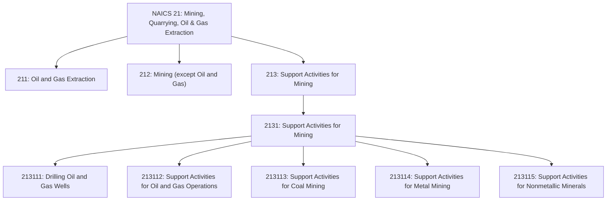
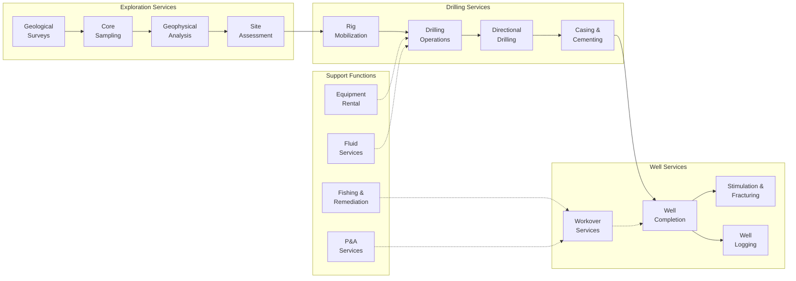
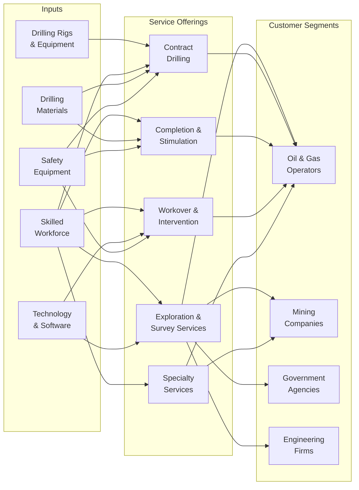

# Support Activities for Mining

> Industries in the Support Activities for Mining subsector group establishments primarily providing support services, on a contract or fee basis, required for the mining and quarrying of minerals and for the extraction of oil and gas. This includes exploration services and other mining support activities.

## Overview

The Support Activities for Mining subsector encompasses establishments that provide essential services to the mining, quarrying, and oil and gas extraction industries on a contract or fee basis. These services are critical to the exploration, development, and production phases of mineral and hydrocarbon extraction.

Support activities include traditional prospecting methods such as taking core samples and making geological observations, as well as specialized services for oil and gas operations including drilling, well completion, and well servicing. Many of these activities are also performed in-house by mining and extraction operators, but a significant portion of the industry relies on specialized service contractors.

Key service categories include:
- Contract drilling of oil and gas wells
- Well completion and workover services
- Exploration and prospecting services
- Well logging and surveying
- Equipment rental and operation
- Site preparation and remediation

## Industry Hierarchy

## Key Statistics

| Metric | Value |
|--------|-------|
| NAICS Code | 213 |
| Level | Subsector |
| Parent Sector | [21: Mining, Quarrying, Oil and Gas Extraction](../) |
| Industry Group | 2131: Support Activities for Mining |
| National Industries | 5 |

## Sub-Industries

| Industry | Code | Description |
|----------|------|-------------|
| Drilling Oil and Gas Wells | 213111 | Contract drilling including spudding in, drilling in, redrilling, and directional drilling |
| Support Activities for Oil and Gas | 213112 | Well services, completion, acidizing, cementing, perforating, and well stimulation |
| Support Activities for Coal Mining | 213113 | Exploration and other support services for coal mining operations |
| Support Activities for Metal Mining | 213114 | Exploration and support for metallic mineral mining and ore extraction |
| Support Activities for Nonmetallic Minerals | 213115 | Exploration and support for nonmetallic mineral mining and quarrying |

## Related Occupations

- [Petroleum Engineers](/occupations/PetroleumEngineers) - Design drilling and completion programs
- [Geoscientists](/occupations/Geoscientists) - Conduct exploration and site assessments
- [Rotary Drill Operators, Oil and Gas](/occupations/RotaryDrillOperators) - Operate drilling equipment
- [Derrick Operators, Oil and Gas](/occupations/DerrickOperatorsOilAndGas) - Rig derrick equipment and manage drill pipe
- [Service Unit Operators](/occupations/ServiceUnitOperators) - Operate well servicing and workover equipment
- [Wellhead Pumpers](/occupations/WellheadPumpers) - Operate pumping equipment
- [Roustabouts, Oil and Gas](/occupations/Roustabouts) - Perform manual labor on rigs and well sites
- [Mining Machine Operators](/occupations/MiningMachineOperators) - Operate mining extraction equipment
- [Explosives Workers and Blasters](/occupations/ExplosivesWorkers) - Handle explosives for mining operations
- [First-Line Supervisors of Extraction Workers](/occupations/FirstLineSupervisorsExtractionWorkers) - Supervise drilling and service crews
- [Cost Estimators](/occupations/CostEstimators) - Prepare bid estimates for service contracts

## Core Business Processes

### Drilling Services

Contract drilling operations for oil, gas, and mineral exploration wells.

**Key Activities:**
- Mobilize and rig up drilling equipment
- Execute drilling programs per operator specifications
- Manage mud systems and well control
- Provide directional and horizontal drilling services
- Install casing and perform cementing operations
- Conduct drilling data acquisition

### Well Completion and Stimulation

Preparing wells for production through completion and stimulation services.

**Key Activities:**
- Install completion equipment and tubing
- Perform perforating services
- Execute hydraulic fracturing operations
- Conduct acidizing and chemical treatments
- Install artificial lift systems
- Perform well testing and evaluation

### Workover and Intervention

Maintaining and enhancing production from existing wells.

**Key Activities:**
- Perform workover operations and recompletions
- Conduct fishing operations for stuck equipment
- Execute coiled tubing interventions
- Perform wireline services and logging
- Manage well integrity repairs
- Conduct plug and abandonment (P&A) operations

## Industry Value Chain

## Service Categories

### Oil and Gas Services

| Service Type | Description | Key Providers |
|--------------|-------------|---------------|
| Contract Drilling | Land and offshore drilling operations | Nabors, Patterson-UTI, Helmerich & Payne |
| Pressure Pumping | Hydraulic fracturing and cementing | Halliburton, Schlumberger, Liberty |
| Well Services | Completion, workover, and intervention | Basic Energy, Key Energy, C&J Energy |
| Directional Drilling | Horizontal and directional well services | Baker Hughes, Weatherford |
| Wireline Services | Logging, perforating, and data acquisition | Schlumberger, Halliburton |
| Coiled Tubing | Well intervention and cleanout | RPC Inc., Forbes Energy |

### Mining Support Services

| Service Type | Description | Applications |
|--------------|-------------|--------------|
| Exploration Drilling | Core sampling and test holes | Mineral exploration, coal prospecting |
| Geological Services | Site assessment and mapping | All mining operations |
| Blasting Services | Explosive handling and detonation | Surface mining, quarrying |
| Dewatering | Groundwater management | Underground and surface mining |
| Shaft Sinking | Underground access development | Metal and coal mining |

## Related Industries

- [Crude Petroleum Extraction](../Oil/) - Primary customer for oil well services
- [Natural Gas Extraction](../Gas/) - Primary customer for gas well services
- [Coal Mining](/industries/Mining/) - Customer for coal mining support
- [Metal Ore Mining](/industries/Mining/) - Customer for metal mining support
- [Nonmetallic Mineral Mining](/industries/Mining/) - Customer for quarrying support
- [Mining Machinery Manufacturing](/industries/Manufacturing/) - Equipment suppliers
- [Petroleum Refineries](/industries/Manufacturing/) - End users of produced hydrocarbons

## Regulatory Environment

Support activities for mining operate under multiple regulatory frameworks:

- **Occupational Safety and Health Administration (OSHA)**:
  - General industry standards
  - Process safety management
  - Hazard communication
- **Mine Safety and Health Administration (MSHA)**:
  - Mining-specific safety regulations
  - Training and certification requirements
- **Bureau of Safety and Environmental Enforcement (BSEE)**:
  - Offshore drilling safety standards
  - Well control requirements
- **Environmental Protection Agency (EPA)**:
  - Air emissions from drilling operations
  - Waste management and disposal
  - Spill prevention requirements
- **State Oil and Gas Agencies**:
  - Well construction standards
  - Hydraulic fracturing regulations
  - Contractor licensing requirements
- **Department of Transportation (DOT)**:
  - Transportation of hazardous materials
  - Equipment transport regulations

### Key Compliance Areas

- Well control and blowout prevention training
- Hydraulic fracturing chemical disclosure
- Air quality permitting for drilling operations
- Hazardous waste management
- Worker safety training and certification
- Equipment inspection and maintenance standards
- Contractor qualification and insurance requirements

## Technology & Innovation

The mining support services sector continues to advance through technology:

### Drilling Technologies
- **Automated Drilling Systems**: Autonomous rig operations and auto-drillers
- **Managed Pressure Drilling**: Precise wellbore pressure control
- **Rotary Steerable Systems**: Real-time directional control
- **Measurement While Drilling (MWD)**: Real-time downhole data
- **Logging While Drilling (LWD)**: Formation evaluation during drilling

### Completion Technologies
- **Multi-Stage Fracturing**: Plug-and-perf and sliding sleeve systems
- **Dissolvable Frac Plugs**: Reduced intervention requirements
- **Proppant Technologies**: Ceramic, resin-coated, and tracer proppants
- **Fiber Optic Monitoring**: Distributed temperature and acoustic sensing

### Well Intervention
- **E-Line Services**: Advanced wireline capabilities
- **Thru-Tubing Tools**: Minimally invasive intervention
- **Robotic Inspection**: Downhole cameras and robotics
- **Smart Well Technologies**: Intelligent completions with remote control

### Digital Transformation
- **Real-Time Operating Centers**: Centralized monitoring and optimization
- **Predictive Analytics**: Equipment failure prediction
- **Digital Twins**: Virtual modeling of drilling operations
- **Remote Operations**: Reduced personnel on location
- **Automated Reporting**: Electronic data capture and transmission

### Safety and Environmental
- **Managed Pressure Drilling**: Enhanced well control capabilities
- **Closed-Loop Systems**: Reduced environmental impact
- **Emission Monitoring**: Real-time air quality measurement
- **Dual-Fuel Engines**: Reduced diesel consumption
- **Electric Rigs**: Battery and grid-powered drilling equipment

## Market Dynamics

The support activities sector is highly cyclical and sensitive to:

- **Commodity Prices**: Oil, gas, and mineral prices drive activity levels
- **Operator Capital Budgets**: E&P spending determines service demand
- **Rig Counts**: Key indicator of drilling activity
- **Well Complexity**: Horizontal and unconventional wells require more services
- **Completion Intensity**: Multi-stage completions increase service requirements
- **Technology Adoption**: Digital and automated systems changing workforce needs
- **Consolidation**: Industry M&A affecting competitive landscape

---

*Source: NAICS 213 - Support Activities for Mining*
