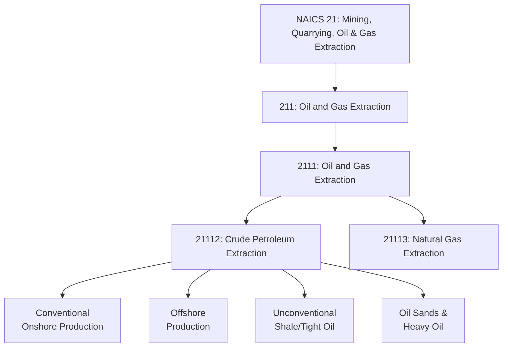
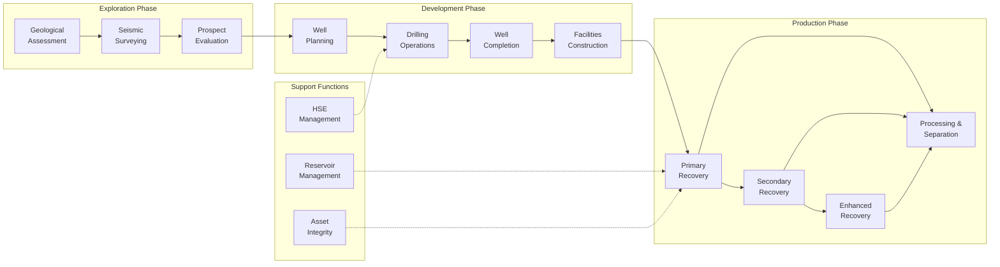
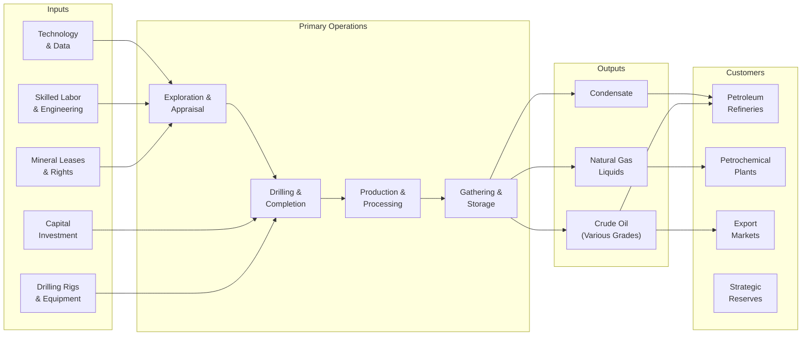

# Crude Petroleum Extraction

> Industries in the Oil and Gas Extraction subsector operate and/or develop oil and gas field properties. Operation and development activities include exploration for crude petroleum; drilling, completing, and equipping wells; operating separators, emulsion breakers, and field gathering lines; and all other activities in the preparation of oil up to the point of shipment from the producing property.

## Overview

The Crude Petroleum Extraction subsector represents the upstream segment of the petroleum industry, encompassing all activities from initial exploration through production and field preparation of crude oil for transport. This includes establishments that operate oil wells on their own account or for others on a contract or fee basis.

This subsector includes the production of crude petroleum, the mining and extraction of oil from oil shale and oil sands, and the recovery of hydrocarbon liquids. Crude oil production ranges from conventional onshore wells to complex offshore deepwater operations.

Key operational activities include:
- Exploration for crude petroleum deposits
- Drilling, completing, and equipping wells
- Operating production facilities and separators
- Managing field gathering lines and storage
- Preparing crude oil for shipment to refineries

## Industry Hierarchy

## Key Statistics

| Metric | Value |
|--------|-------|
| NAICS Code | 21112 |
| Level | Industry |
| Parent Subsector | [211: Oil and Gas Extraction](../) |
| Related Industry | [21113: Natural Gas Extraction](../Gas/) |
| Support Services | [213: Support Activities for Mining](../MiningSupport/) |

## Production Types

| Production Type | Description | Key Regions |
|----------------|-------------|-------------|
| Conventional Onshore | Traditional vertical/deviated wells in permeable reservoirs | Permian Basin, Bakken, Eagle Ford |
| Offshore | Shallow water platforms and deepwater floating systems | Gulf of Mexico, North Sea |
| Unconventional | Horizontal drilling with hydraulic fracturing in tight formations | Permian, Marcellus, Bakken |
| Oil Sands | Mining and in-situ extraction of bituminous sands | Alberta, Canada |
| Heavy Oil | Thermal and enhanced recovery of viscous crude | California, Venezuela |

## Related Occupations

- [Petroleum Engineers](/occupations/Architecture/PetroleumEngineers) - Design extraction methods and oversee drilling operations
- [Geoscientists](/occupations/Geoscientists) - Analyze geological data to locate petroleum deposits
- [Rotary Drill Operators, Oil and Gas](/occupations/RotaryDrillOperators) - Operate drilling equipment
- [Derrick Operators, Oil and Gas](/occupations/Construction/DerrickOperatorsOilAndGas) - Rig derrick equipment and circulate drilling fluids
- [Service Unit Operators](/occupations/ServiceUnitOperators) - Operate equipment to enhance production
- [Petroleum Pump System Operators](/occupations/PetroleumPumpSystemOperators) - Control pumping systems
- [Roustabouts, Oil and Gas](/occupations/Roustabouts) - Perform manual labor on oil rigs and production sites
- [First-Line Supervisors of Extraction Workers](/occupations/FirstLineSupervisorsExtractionWorkers) - Supervise drilling and production crews
- [Industrial Production Managers](/occupations/Management/IndustrialProductionManagers) - Coordinate overall production activities

## Core Business Processes

### Exploration Phase

Identifying prospective areas and evaluating reservoir potential through scientific analysis and data acquisition.

**Key Activities:**
- Acquire and interpret seismic data
- Conduct geological and geophysical studies
- Estimate reserves and resources
- Evaluate drilling prospects and ranking
- Negotiate mineral rights and leases

### Drilling and Completion

Creating wellbores to access petroleum reservoirs and preparing wells for production.

**Key Activities:**
- Plan well trajectories and casing designs
- Operate rotary drilling equipment
- Install casing and cementing systems
- Perforate producing zones
- Install artificial lift equipment
- Conduct well testing and evaluation

### Production Operations

Extracting crude oil and preparing it for transportation to refineries.

**Key Activities:**
- Operate wellhead and surface equipment
- Separate oil, gas, and water
- Treat and store crude oil
- Manage artificial lift systems
- Monitor reservoir performance
- Optimize production rates

## Industry Value Chain

## Crude Oil Classifications

| API Gravity | Classification | Characteristics | Examples |
|-------------|---------------|-----------------|----------|
| > 31.1 | Light | Lower viscosity, higher yield of light products | WTI, Brent |
| 22.3 - 31.1 | Medium | Moderate processing requirements | Dubai, OPEC Basket |
| < 22.3 | Heavy | Higher viscosity, requires more refining | Maya, Western Canadian Select |
| < 10 | Extra Heavy/Bitumen | Very viscous, often requires upgrading | Orinoco, Athabasca |

## Related Industries

- [Natural Gas Extraction](../Gas/) - Often co-produced with crude oil
- [Support Activities for Mining](../MiningSupport/) - Contract drilling and well services
- [Pipeline Transportation of Crude Oil](/industries/Transportation/) - Transport to refineries
- [Petroleum Refineries](/industries/Manufacturing/) - Downstream processing
- [Mining Machinery Manufacturing](/industries/Manufacturing/) - Drilling equipment
- [Chemical Manufacturing](/industries/Manufacturing/) - Drilling fluids and chemicals

## Regulatory Environment

Crude petroleum extraction operates under comprehensive regulatory frameworks:

- **Bureau of Land Management (BLM)**: Federal onshore leasing, permitting, and royalty collection
- **Bureau of Ocean Energy Management (BOEM)**: Offshore lease sales and development plans
- **Bureau of Safety and Environmental Enforcement (BSEE)**: Offshore safety and environmental regulations
- **Environmental Protection Agency (EPA)**:
  - Clean Air Act emissions requirements
  - Clean Water Act discharge permits
  - RCRA waste management
  - SPCC spill prevention requirements
- **State Regulatory Agencies**:
  - Railroad Commission of Texas
  - California DOGGR
  - Oklahoma Corporation Commission
  - State-specific well spacing and production rules
- **International**: OPEC production quotas, international maritime regulations

### Key Compliance Areas

- Well integrity and blowout prevention
- Produced water management and disposal
- Air emissions monitoring and control
- Spill prevention and response planning
- Well plugging and abandonment
- Surface reclamation requirements

## Technology & Innovation

The crude petroleum extraction industry continues to evolve through technological advancement:

### Drilling Technologies
- **Horizontal Drilling**: Access larger reservoir volumes from single surface locations
- **Managed Pressure Drilling**: Precise wellbore pressure control
- **Rotary Steerable Systems**: Accurate directional control
- **Automated Drilling Systems**: Improved efficiency and consistency

### Production Enhancement
- **Hydraulic Fracturing**: Multi-stage completions in unconventional reservoirs
- **Enhanced Oil Recovery (EOR)**:
  - CO2 injection and miscible flooding
  - Chemical flooding (polymer, surfactant)
  - Thermal methods (steam, in-situ combustion)
- **Artificial Lift**: ESP, rod pump, gas lift optimization

### Digital Technologies
- **Real-time Monitoring**: SCADA and production surveillance systems
- **Predictive Analytics**: Machine learning for equipment failure prediction
- **Digital Twins**: Virtual reservoir and facility modeling
- **Autonomous Operations**: Automated well control and optimization
- **Drone Inspections**: Pipeline and facility monitoring

### Sustainability
- **Methane Reduction**: Leak detection and repair (LDAR) programs
- **Flare Reduction**: Gas capture and utilization
- **Water Recycling**: Produced water treatment and reuse
- **Carbon Capture**: Integration with EOR operations

---

*Source: NAICS 21112 - Crude Petroleum Extraction*
