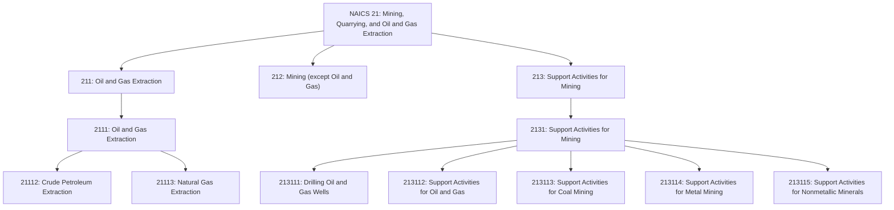
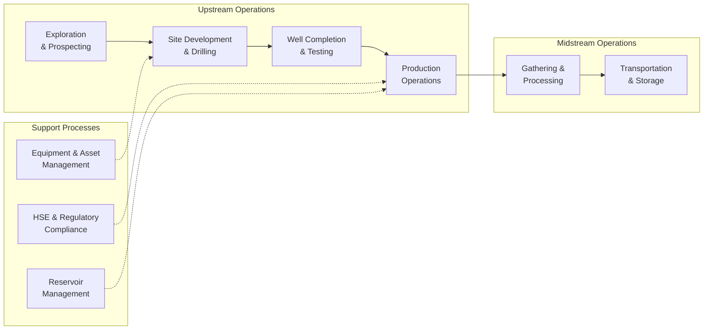
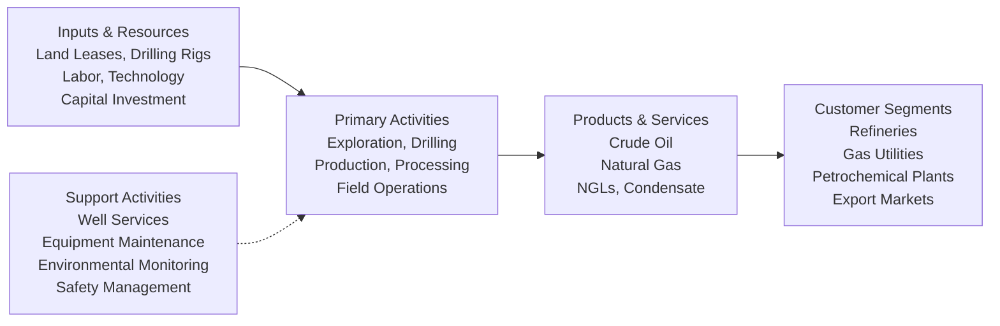

# Oil and Gas Extraction

> The Mining, Quarrying, and Oil and Gas Extraction sector comprises establishments that extract naturally occurring mineral solids, such as coal and ores; liquid minerals, such as crude petroleum; and gases, such as natural gas.

## Overview

This sector represents one of the most capital-intensive and technologically advanced industries in the global economy. The Oil and Gas Extraction sector encompasses the complete lifecycle of hydrocarbon resource development, from initial exploration and prospecting through production and field operations.

The sector distinguishes two basic activities: **mine operation** (establishments operating mines, quarries, or oil and gas wells) and **mining support activities** (establishments providing exploration, drilling, and other support services on a contract or fee basis).

Establishments in this sector are classified according to the natural resource extracted. Operations include developing well sites, extracting crude petroleum and natural gas, operating field gathering lines, and preparing products for shipment from producing properties.

## Industry Hierarchy

## Key Statistics

| Metric | Value |
|--------|-------|
| NAICS Code | 21 |
| Level | Sector |
| Subsectors | 3 |
| Industry Groups | 6 |
| Parent | None (Top-level sector) |

## Sub-Industries

| Subsector | Code | Description |
|-----------|------|-------------|
| [Oil and Gas Extraction](./Oil/) | 211 | Operating and developing oil and gas field properties including exploration, drilling, and production |
| [Natural Gas Extraction](./Gas/) | 211 | Extracting natural gas, recovering hydrocarbon liquids, and sulfur recovery operations |
| [Support Activities for Mining](./MiningSupport/) | 213 | Contract drilling, well services, exploration, and other support activities |

## Related Occupations

- [Petroleum Engineers](/occupations/Architecture/PetroleumEngineers) - Devise methods to improve extraction and production
- [Geoscientists](/occupations/Geoscientists) - Study earth composition to locate oil and gas deposits
- [Derrick Operators, Oil and Gas](/occupations/Construction/DerrickOperatorsOilAndGas) - Rig derrick equipment and operate pumps
- [Rotary Drill Operators](/occupations/RotaryDrillOperators) - Set up and operate drilling equipment
- [Service Unit Operators](/occupations/ServiceUnitOperators) - Operate equipment to increase oil flow
- [First-Line Supervisors of Extraction Workers](/occupations/FirstLineSupervisorsExtractionWorkers) - Supervise extraction operations
- [Industrial Production Managers](/occupations/Management/IndustrialProductionManagers) - Coordinate production activities
- [Environmental Scientists](/occupations/EnvironmentalScientists) - Monitor environmental compliance

## Core Business Processes

### Exploration and Prospecting

Identifying and evaluating potential hydrocarbon reservoirs through geological surveys, seismic analysis, and core sampling.

**Key Activities:**
- Conduct geophysical and geological surveys
- Analyze seismic data and well logs
- Evaluate reservoir characteristics and reserves
- Assess economic viability of prospects

### Drilling Operations

Developing well sites and drilling to access underground oil and gas formations.

**Key Activities:**
- Prepare drilling sites and access roads
- Operate rotary drilling equipment
- Monitor drilling parameters and mud systems
- Manage well control and safety systems

### Production Operations

Extracting crude petroleum and natural gas from producing wells and preparing for shipment.

**Key Activities:**
- Operate separators and processing equipment
- Maintain artificial lift systems
- Monitor production rates and well performance
- Manage field gathering systems

## Industry Value Chain

## Related Industries

- [Utilities - Natural Gas Distribution](../Utilities/) - Distribution of natural gas to end users
- [Pipeline Transportation](/industries/Transportation/) - Transportation of crude oil and natural gas
- [Petroleum Refining](/industries/Manufacturing/) - Processing crude oil into refined products
- [Petroleum Wholesalers](/industries/Wholesale/) - Wholesale distribution of petroleum products
- [Mining Machinery Manufacturing](/industries/Manufacturing/) - Equipment for extraction operations

## Regulatory Environment

The oil and gas extraction sector operates under extensive federal, state, and international regulations:

- **Bureau of Land Management (BLM)**: Leasing and permitting for federal lands
- **Bureau of Safety and Environmental Enforcement (BSEE)**: Offshore safety and environmental regulations
- **Environmental Protection Agency (EPA)**: Air quality, water discharge, and waste management
- **Pipeline and Hazardous Materials Safety Administration (PHMSA)**: Pipeline safety standards
- **State Oil and Gas Commissions**: Well spacing, production allowables, and state-specific requirements
- **OSHA**: Occupational safety and health standards for drilling and production operations

Key regulatory concerns include well integrity, produced water management, air emissions, hydraulic fracturing disclosure, and decommissioning/reclamation requirements.

## Technology & Innovation

The sector continues to evolve through technological advancement:

- **Horizontal Drilling & Hydraulic Fracturing**: Enabled development of unconventional shale resources
- **Digital Oilfield**: Real-time monitoring, predictive analytics, and automated operations
- **Enhanced Oil Recovery (EOR)**: CO2 injection, chemical flooding, and thermal methods
- **Subsea Technologies**: Advanced subsea production systems for deepwater development
- **Artificial Intelligence**: Machine learning for reservoir characterization and drilling optimization
- **Carbon Capture & Storage**: Technologies for reducing emissions and carbon sequestration
- **Renewable Integration**: Hybrid power systems and reduced-emission completions

---

*Source: NAICS 21 - Mining, Quarrying, and Oil and Gas Extraction*
