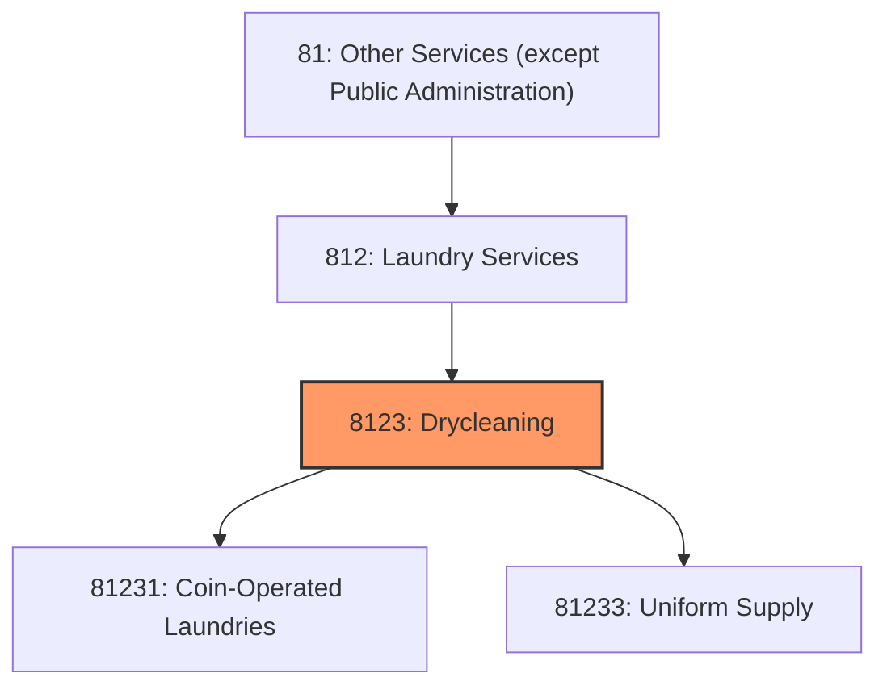
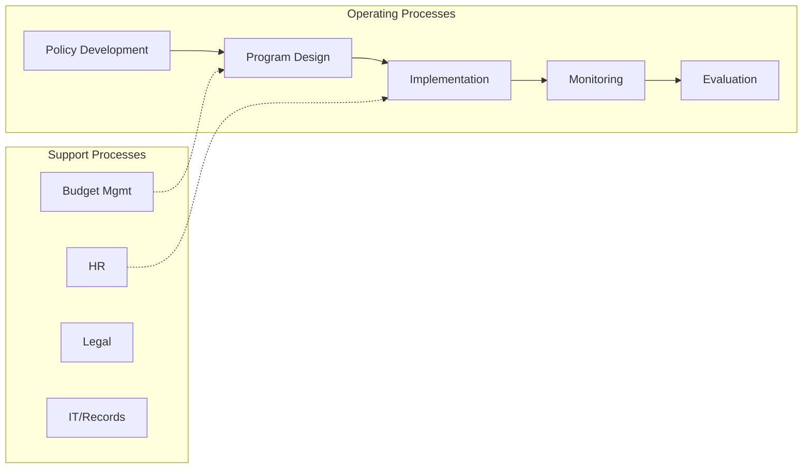

# Drycleaning

> This industry group comprises establishments primarily engaged in operating coin- or card-operated or similar self-service laundries and drycleaners; providing drycleaning and laundry services (except coin- or card-operated); and supplying, on a rental or contract basis, laundered items (e.

## Overview

Drycleaning represents an important category within the Other Services (except Public Administration) sector (NAICS 81). This industry group encompasses establishments primarily engaged in drycleaning.

This industry group comprises establishments primarily engaged in operating coin- or card-operated or similar self-service laundries and drycleaners; providing drycleaning and laundry services (except coin- or card-operated); and supplying, on a rental or contract basis, laundered items (e.g., uniforms, gowns, shop towels, etc.). Included in this industry group are establishments primarily engaged in supplying and servicing coin- or card-operated laundry and drycleaning equipment in places of business operated by others, such as apartments and dormitories.

## Industry Hierarchy

## Key Statistics

| Metric | Value |
|--------|-------|
| NAICS Code | 8123 |
| Level | Industry Group |
| Parent | [Laundry Services](../) |
| Child Industries | 2 |

## Sub-Industries

| Industry | Code | Description |
|----------|------|-------------|
| [Coin-Operated Laundries](./CoinoperatedLaundries/) | 81231 | See industry description for 812310 |
| [Uniform Supply](./UniformSupply/) | 81233 | This industry comprises establishments primarily engaged in supplying, on a rent |

## Core Business Processes

## Industry Value Chain

```mermaid
graph LR
    subgraph Inputs["Inputs"]
        I1["Resources"]
        I2["Expertise"]
        I3["Technology"]
    end

    subgraph Primary["Primary Activities"]
        A1["Inbound Logistics"]
        A2["Core Operations"]
        A3["Quality Assurance"]
        A4["Outbound/Delivery"]
    end

    subgraph Outputs["Products/Services"]
        O1["Products"]
        O2["Services"]
        O3["Solutions"]
    end

    subgraph Customers["Markets"]
        C1["Businesses"]
        C2["Consumers"]
        C3["Government"]
        C4["Institutions"]
    end

    Inputs --> Primary --> Outputs --> Customers
```

---

*Source: NAICS 8123 - Drycleaning*
