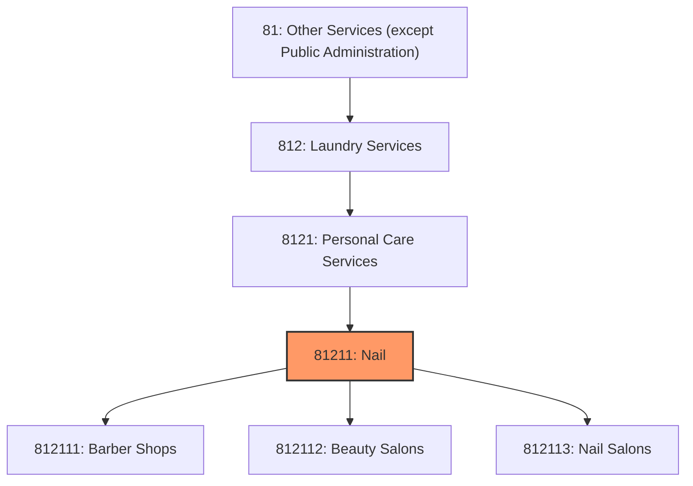
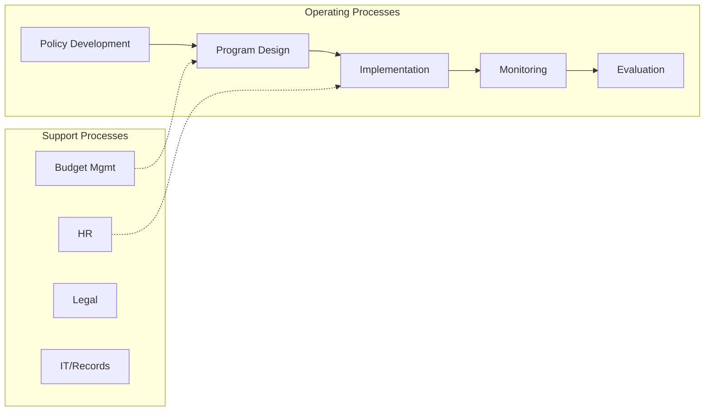

# Nail

> This industry comprises establishments primarily engaged in one or more of the following: (1) providing hair care services; (2) providing nail care services; and (3) providing facials or applying makeup (except permanent makeup).

## Overview

Nail represents an important category within the Other Services (except Public Administration) sector (NAICS 81).

This industry comprises establishments primarily engaged in one or more of the following: (1) providing hair care services; (2) providing nail care services; and (3) providing facials or applying makeup (except permanent makeup). Illustrative Examples: Barber shops Hair stylist shops Beauty salons Nail salons Cosmetology salons Cross-References. Establishments primarily engaged in--

## Industry Hierarchy

## Key Statistics

| Metric | Value |
|--------|-------|
| NAICS Code | 81211 |
| Level | Industry |
| Parent | [Personal Care Services](../) |
| Child Industries | 3 |

## Sub-Industries

| Industry | Code | Description |
|----------|------|-------------|
| [Barber Shops](./BarberShops.mdx) | 812111 | This U |
| [Beauty Salons](./BeautySalons.mdx) | 812112 | This U |
| [Nail Salons](./NailSalons.mdx) | 812113 | This U |

## Related Occupations

See the [occupations directory](/occupations) for roles commonly found in this industry.

## Core Business Processes

## Industry Value Chain

```mermaid
graph LR
    subgraph Inputs["Inputs"]
        I1["Resources"]
        I2["Expertise"]
        I3["Technology"]
    end

    subgraph Primary["Primary Activities"]
        A1["Inbound Logistics"]
        A2["Core Operations"]
        A3["Quality Assurance"]
        A4["Outbound/Delivery"]
    end

    subgraph Outputs["Products/Services"]
        O1["Products"]
        O2["Services"]
        O3["Solutions"]
    end

    subgraph Customers["Markets"]
        C1["Businesses"]
        C2["Consumers"]
        C3["Government"]
        C4["Institutions"]
    end

    Inputs --> Primary --> Outputs --> Customers
```

---

*Source: NAICS 81211 - Nail*
