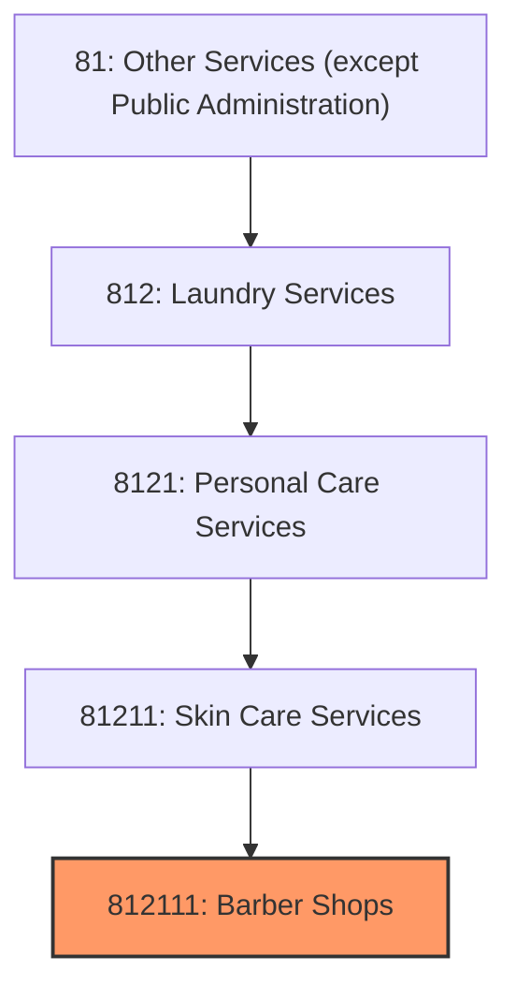
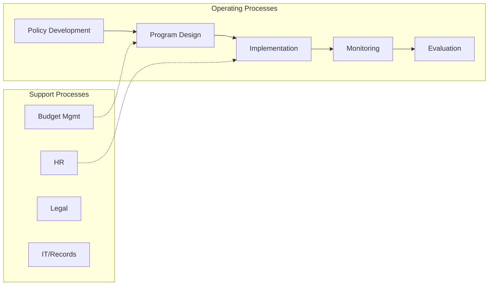

# Barber Shops

> This U.S.

## Overview

Barber Shops represents a specialized segment within the Other Services (except Public Administration) sector (NAICS 81). This national industry encompasses establishments primarily engaged in barber shops.

This U.S. industry comprises establishments known as barber shops or men's hair stylist shops primarily engaged in cutting, trimming, and styling men's and boys' hair; and/or shaving and trimming men's beards. Cross-References. Establishments primarily engaged in--

## Industry Hierarchy

## Key Statistics

| Metric | Value |
|--------|-------|
| NAICS Code | 812111 |
| Level | National Industry |
| Parent | [Skin Care Services](../) |
| Child Industries | 0 |

## Core Business Processes

## Industry Value Chain

```mermaid
graph LR
    subgraph Inputs["Inputs"]
        I1["Resources"]
        I2["Expertise"]
        I3["Technology"]
    end

    subgraph Primary["Primary Activities"]
        A1["Inbound Logistics"]
        A2["Core Operations"]
        A3["Quality Assurance"]
        A4["Outbound/Delivery"]
    end

    subgraph Outputs["Products/Services"]
        O1["Products"]
        O2["Services"]
        O3["Solutions"]
    end

    subgraph Customers["Markets"]
        C1["Businesses"]
        C2["Consumers"]
        C3["Government"]
        C4["Institutions"]
    end

    Inputs --> Primary --> Outputs --> Customers
```

---

*Source: NAICS 812111 - Barber Shops*
