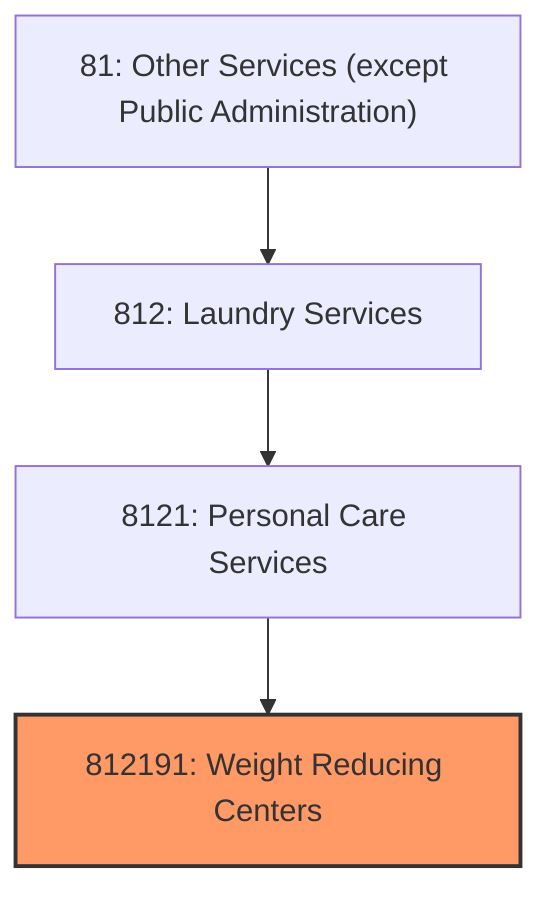
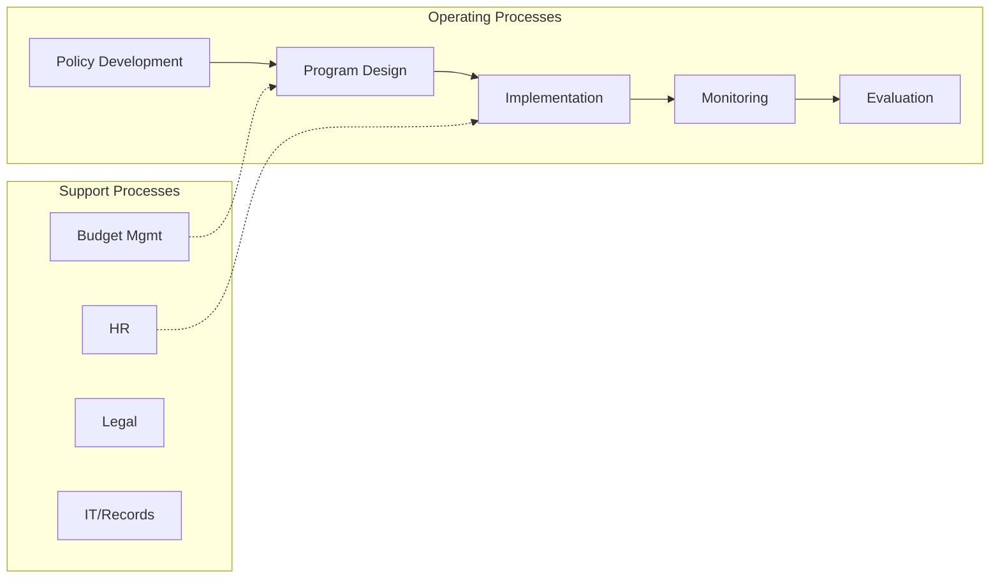

# Weight Reducing Centers

> This U.

## Overview

Weight Reducing Centers represents a specialized segment within the Other Services (except Public Administration) sector (NAICS 81).

This U.S. industry comprises establishments primarily engaged in providing non-medical services to assist clients in attaining or maintaining a desired weight. The sale of weight reduction products, such as food supplements, may be an integral component of the program. These services typically include individual or group counseling, menu and exercise planning, and weight and body measurement monitoring. Cross-References. Establishments primarily engaged in--

## Industry Hierarchy

## Key Statistics

| Metric | Value |
|--------|-------|
| NAICS Code | 812191 |
| Level | National Industry |
| Child Industries | 0 |

## Related Occupations

See the [occupations directory](/occupations) for roles commonly found in this industry.

## Core Business Processes

## Industry Value Chain

```mermaid
graph LR
    subgraph Inputs["Inputs"]
        I1["Resources"]
        I2["Expertise"]
        I3["Technology"]
    end

    subgraph Primary["Primary Activities"]
        A1["Inbound Logistics"]
        A2["Core Operations"]
        A3["Quality Assurance"]
        A4["Outbound/Delivery"]
    end

    subgraph Outputs["Products/Services"]
        O1["Products"]
        O2["Services"]
        O3["Solutions"]
    end

    subgraph Customers["Markets"]
        C1["Businesses"]
        C2["Consumers"]
        C3["Government"]
        C4["Institutions"]
    end

    Inputs --> Primary --> Outputs --> Customers
```

---

*Source: NAICS 812191 - Weight Reducing Centers*
