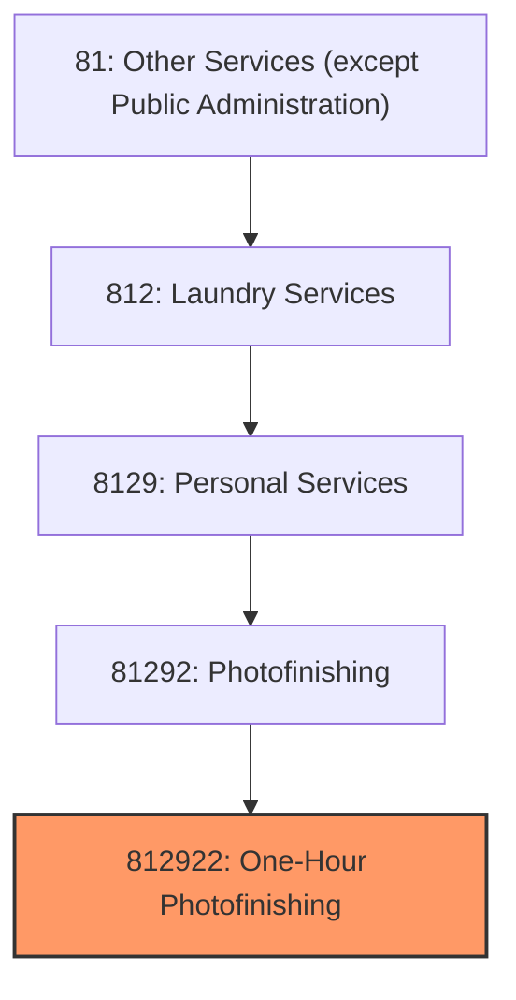
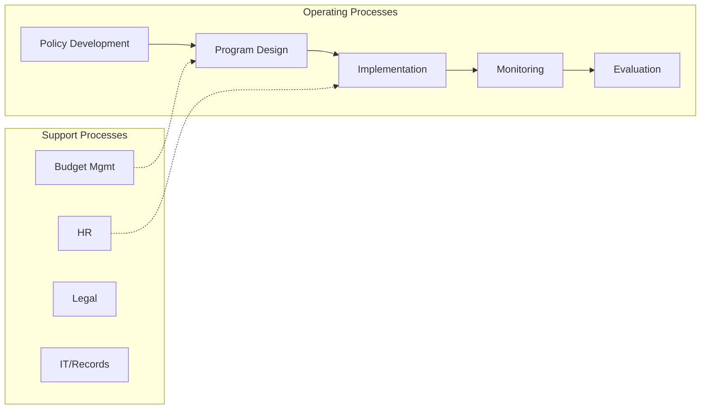

# One-Hour Photofinishing

> This U.S. industry comprises establishments known as "one-hour" photofinishing labs primarily engaged in developing film and/or making photographic slides, prints, and enlargements on a short turnaround or while-you-wait basis.
## Overview

One-Hour Photofinishing represents a specialized segment within the Other Services (except Public Administration) sector (NAICS 81). This national industry encompasses establishments primarily engaged in one-hour photofinishing.

This U.S. industry comprises establishments known as "one-hour" photofinishing labs primarily engaged in developing film and/or making photographic slides, prints, and enlargements on a short turnaround or while-you-wait basis. Cross-References.

## Industry Hierarchy

## Key Statistics

| Metric | Value |
|--------|-------|
| NAICS Code | 812922 |
| Level | National Industry |
| Parent | [Photofinishing](../) |
| Child Industries | 0 |

## Core Business Processes

## Industry Value Chain

```mermaid
graph LR
    subgraph Inputs["Inputs"]
        I1["Resources"]
        I2["Expertise"]
        I3["Technology"]
    end

    subgraph Primary["Primary Activities"]
        A1["Inbound Logistics"]
        A2["Core Operations"]
        A3["Quality Assurance"]
        A4["Outbound/Delivery"]
    end

    subgraph Outputs["Products/Services"]
        O1["Products"]
        O2["Services"]
        O3["Solutions"]
    end

    subgraph Customers["Markets"]
        C1["Businesses"]
        C2["Consumers"]
        C3["Government"]
        C4["Institutions"]
    end

    Inputs --> Primary --> Outputs --> Customers
```

---

*Source: NAICS 812922 - One-Hour Photofinishing*
