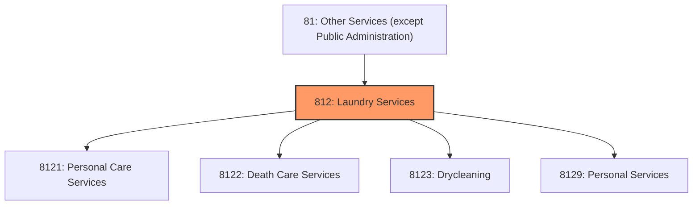
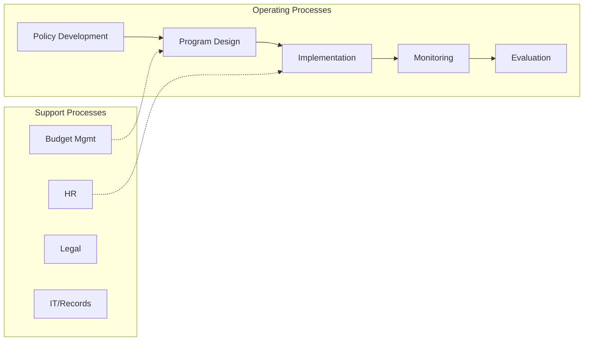

# Laundry Services

> Industries in the Personal and Laundry Services subsector group establishments that provide personal and laundry services to individuals, households, and businesses.

## Overview

Laundry Services represents an important category within the Other Services (except Public Administration) sector (NAICS 81). This subsector encompasses establishments primarily engaged in laundry services.

Industries in the Personal and Laundry Services subsector group establishments that provide personal and laundry services to individuals, households, and businesses. Services performed include: personal care services; death care services; laundry and drycleaning services; and a wide range of other personal services, such as pet care (except veterinary) services, photofinishing services, temporary parking services, and dating services. The Personal and Laundry Services subsector is by no means all-inclusive of the services that could be termed personal services (i.e., those provided to individuals rather than businesses). There are many other subsectors, as well as sectors, that provide services to persons. Establishments providing legal, accounting, tax preparation, architectural, portrait photography, and similar professional services are classified in Sector 54, Professional, Scientific, and Technical Services; those providing job placement, travel arrangement, home security, interior and exterior house cleaning, exterminating, lawn and garden care, and similar support services are classified in Sector 56, Administrative and Support and Waste Management and Remediation Services; those providing health and social services are classified in Sector 62, Health Care and Social Assistance; those providing amusement and recreation services are classified in Sector 71, Arts, Entertainment, and Recreation; those providing educational instruction are classified in Sector 61, Educational Services; those providing repair services are classified in Subsector 811, Repair and Maintenance; and those providing spiritual, civic, and advocacy services are classified in Subsector 813, Religious, Grantmaking, Civic, Professional, and Similar Organizations.

## Industry Hierarchy

## Key Statistics

| Metric | Value |
|--------|-------|
| NAICS Code | 812 |
| Level | Subsector |
| Child Industries | 4 |

## Sub-Industries

| Industry | Code | Description |
|----------|------|-------------|
| [Personal Care Services](./PersonalCareServices/) | 8121 | This industry group comprises establishments, such as barber and beauty shops, t |
| [Death Care Services](./DeathCareServices/) | 8122 | This industry group comprises establishments primarily engaged in preparing the  |
| [Drycleaning](./Drycleaning/) | 8123 | This industry group comprises establishments primarily engaged in operating coin |
| [Personal Services](./PersonalServices/) | 8129 | This industry group comprises establishments primarily engaged in providing pers |

## Core Business Processes

## Industry Value Chain

```mermaid
graph LR
    subgraph Inputs["Inputs"]
        I1["Resources"]
        I2["Expertise"]
        I3["Technology"]
    end

    subgraph Primary["Primary Activities"]
        A1["Inbound Logistics"]
        A2["Core Operations"]
        A3["Quality Assurance"]
        A4["Outbound/Delivery"]
    end

    subgraph Outputs["Products/Services"]
        O1["Products"]
        O2["Services"]
        O3["Solutions"]
    end

    subgraph Customers["Markets"]
        C1["Businesses"]
        C2["Consumers"]
        C3["Government"]
        C4["Institutions"]
    end

    Inputs --> Primary --> Outputs --> Customers
```

---

*Source: NAICS 812 - Laundry Services*
