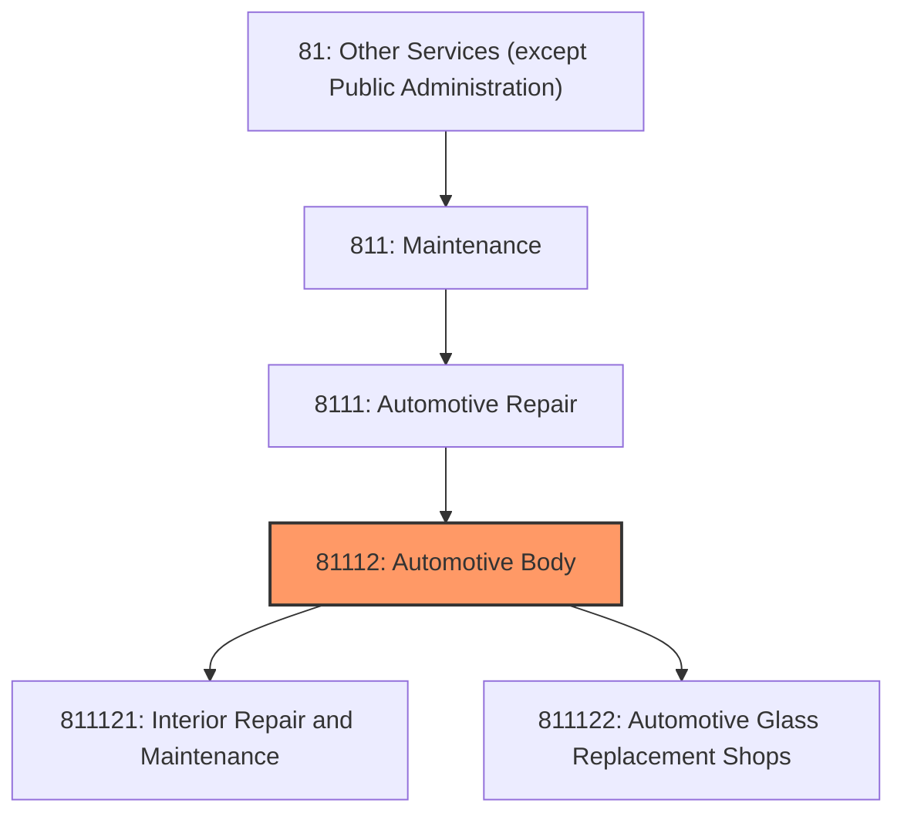
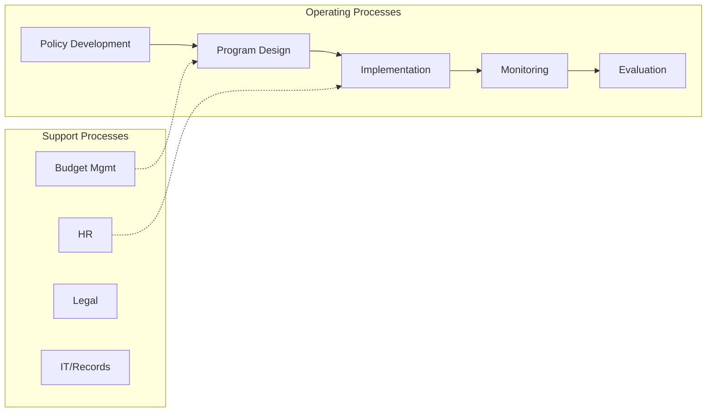

# Automotive Body

> This industry comprises establishments primarily engaged in providing one or more of the following: (1) repairing or customizing automotive vehicle and trailer bodies and interiors; (2) painting automotive vehicle and trailer bodies; (3) replacing, repairing, and/or tinting automotive vehicle glass; and (4) customizing automobile, truck, and van interiors for the physically disabled or other customers with special requirements.

## Overview

Automotive Body represents an important category within the Other Services (except Public Administration) sector (NAICS 81). This industry encompasses establishments primarily engaged in automotive body.

This industry comprises establishments primarily engaged in providing one or more of the following: (1) repairing or customizing automotive vehicle and trailer bodies and interiors; (2) painting automotive vehicle and trailer bodies; (3) replacing, repairing, and/or tinting automotive vehicle glass; and (4) customizing automobile, truck, and van interiors for the physically disabled or other customers with special requirements. Illustrative Examples: Automotive body shops Automotive paint shops Automotive glass shops Restoration shops, antique and classic automotive Cross-References. Establishments primarily engaged in--

## Industry Hierarchy

## Key Statistics

| Metric | Value |
|--------|-------|
| NAICS Code | 81112 |
| Level | Industry |
| Parent | [Automotive Repair](../) |
| Child Industries | 2 |

## Sub-Industries

| Industry | Code | Description |
|----------|------|-------------|
| [Interior Repair and Maintenance](./InteriorRepairAndMaintenance.mdx) | 811121 | This U |
| [Automotive Glass Replacement Shops](./AutomotiveGlassReplacementShops.mdx) | 811122 | This U |

## Core Business Processes

## Industry Value Chain

```mermaid
graph LR
    subgraph Inputs["Inputs"]
        I1["Resources"]
        I2["Expertise"]
        I3["Technology"]
    end

    subgraph Primary["Primary Activities"]
        A1["Inbound Logistics"]
        A2["Core Operations"]
        A3["Quality Assurance"]
        A4["Outbound/Delivery"]
    end

    subgraph Outputs["Products/Services"]
        O1["Products"]
        O2["Services"]
        O3["Solutions"]
    end

    subgraph Customers["Markets"]
        C1["Businesses"]
        C2["Consumers"]
        C3["Government"]
        C4["Institutions"]
    end

    Inputs --> Primary --> Outputs --> Customers
```

---

*Source: NAICS 81112 - Automotive Body*
