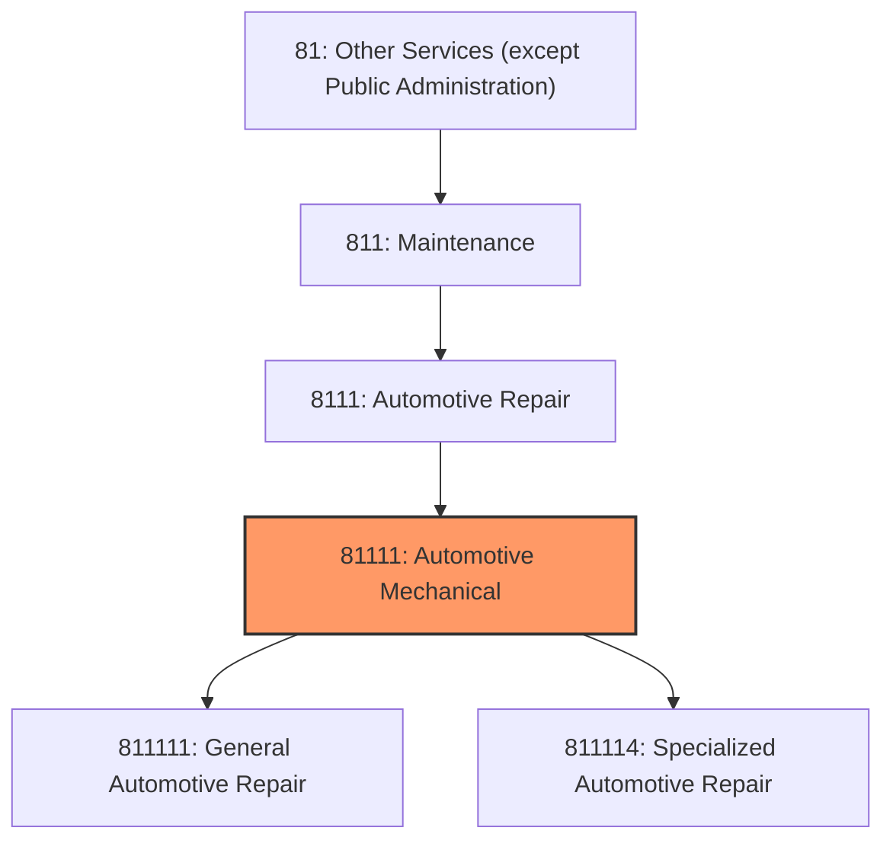
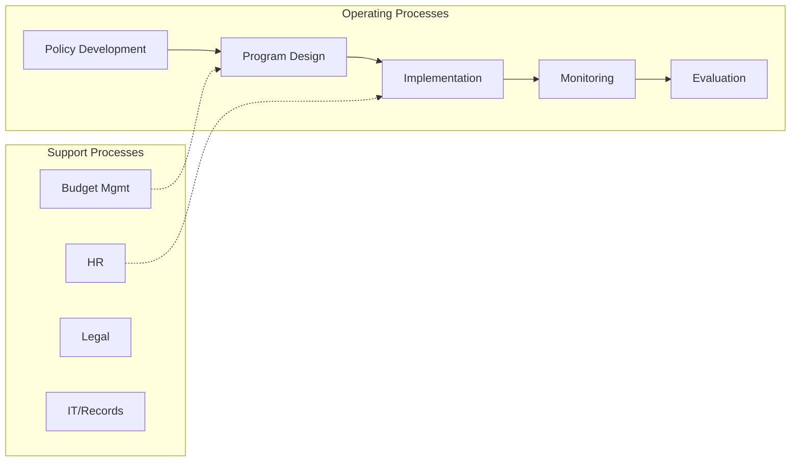

# Automotive Mechanical

> This industry comprises establishments primarily engaged in providing mechanical or electrical repair and maintenance services for automotive vehicles, such as passenger cars, trucks, and vans, and all trailers.

## Overview

Automotive Mechanical represents an important category within the Other Services (except Public Administration) sector (NAICS 81). This industry encompasses establishments primarily engaged in automotive mechanical.

This industry comprises establishments primarily engaged in providing mechanical or electrical repair and maintenance services for automotive vehicles, such as passenger cars, trucks, and vans, and all trailers. These establishments may specialize in a single service or may provide a wide range of these services. Cross-References. Establishments primarily engaged in--

## Industry Hierarchy

## Key Statistics

| Metric | Value |
|--------|-------|
| NAICS Code | 81111 |
| Level | Industry |
| Parent | [Automotive Repair](../) |
| Child Industries | 2 |

## Sub-Industries

| Industry | Code | Description |
|----------|------|-------------|
| [General Automotive Repair](./GeneralAutomotiveRepair.mdx) | 811111 | This U |
| [Specialized Automotive Repair](./SpecializedAutomotiveRepair.mdx) | 811114 | This U |

## Related Occupations

- [Automotive Service Technicians](/occupations/Maintenance/AutomotiveServiceTechniciansAndMechanics) - Diagnose and repair motor vehicles
- [Hairdressers and Cosmetologists](/occupations/PersonalService/HairdressersHairstylistsAndCosmetologists) - Provide beauty services
- [General Maintenance and Repair Workers](/occupations/GeneralMaintenanceAndRepairWorkers) - Perform general maintenance tasks
- [Clergy](/occupations/SocialServices/Clergy) - Conduct religious services and provide spiritual guidance

## Core Business Processes

## Industry Value Chain

## Regulatory Environment

- **EPA** (Environmental Protection Agency) - Regulates auto repair waste and emissions testing
- **State Licensing Boards** - License repair shops, cosmetologists, and other services
- **IRS** (Internal Revenue Service) - Governs tax-exempt status for religious organizations
- **OSHA** (Occupational Safety and Health Administration) - Workplace safety for service workers

## Technology & Innovation

- **Digital Booking Platforms** - Online appointment scheduling for auto repair, salons, and services
- **Diagnostic Technology** - OBD-II scanners, AI-powered diagnostics, and predictive vehicle maintenance
- **Mobile Service Delivery** - On-demand home repair, mobile detailing, and field service apps
- **Contactless Payments** - Tap-to-pay, mobile wallets, and automated invoicing

## Industry Outlook

The other services sector encompasses diverse businesses adapting to digital transformation and changing consumer preferences. Auto repair shops are navigating the transition to electric vehicles, personal care services are adopting online booking and contactless payments, and religious organizations are expanding digital outreach. Skilled trade shortages and aging workforce demographics present ongoing challenges.

---

*Source: NAICS 81111 - Automotive Mechanical*
