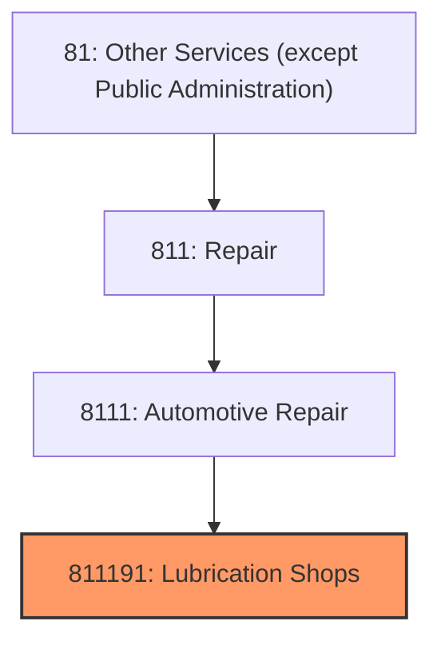
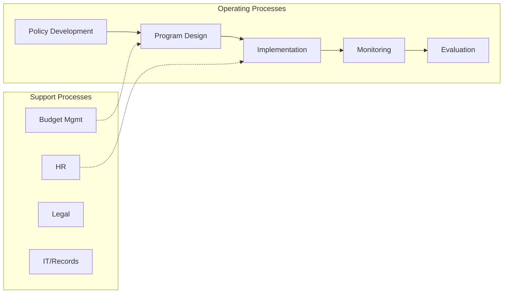

# Lubrication Shops

> This U.

## Overview

Lubrication Shops represents a specialized segment within the Other Services (except Public Administration) sector (NAICS 81).

This U.S. industry comprises establishments primarily engaged in changing motor oil and lubricating the chassis of automotive vehicles, such as passenger cars, trucks, and vans. Cross-References.

## Industry Hierarchy

## Key Statistics

| Metric | Value |
|--------|-------|
| NAICS Code | 811191 |
| Level | National Industry |
| Child Industries | 0 |

## Related Occupations

- [Automotive Service Technicians](/occupations/Maintenance/AutomotiveServiceTechniciansAndMechanics) - Diagnose and repair motor vehicles
- [Hairdressers and Cosmetologists](/occupations/PersonalService/HairdressersHairstylistsAndCosmetologists) - Provide beauty services
- [General Maintenance and Repair Workers](/occupations/GeneralMaintenanceAndRepairWorkers) - Perform general maintenance tasks
- [Clergy](/occupations/SocialServices/Clergy) - Conduct religious services and provide spiritual guidance

## Core Business Processes

## Industry Value Chain

```mermaid
graph LR
    subgraph Inputs["Inputs"]
        I1["Resources"]
        I2["Expertise"]
        I3["Technology"]
    end

    subgraph Primary["Primary Activities"]
        A1["Inbound Logistics"]
        A2["Core Operations"]
        A3["Quality Assurance"]
        A4["Outbound/Delivery"]
    end

    subgraph Outputs["Products/Services"]
        O1["Products"]
        O2["Services"]
        O3["Solutions"]
    end

    subgraph Customers["Markets"]
        C1["Businesses"]
        C2["Consumers"]
        C3["Government"]
        C4["Institutions"]
    end

    Inputs --> Primary --> Outputs --> Customers
```

## Regulatory Environment

- **EPA** (Environmental Protection Agency) - Regulates auto repair waste and emissions testing
- **State Licensing Boards** - License repair shops, cosmetologists, and other services
- **IRS** (Internal Revenue Service) - Governs tax-exempt status for religious organizations
- **OSHA** (Occupational Safety and Health Administration) - Workplace safety for service workers

## Technology & Innovation

- **Digital Booking Platforms** - Online appointment scheduling for auto repair, salons, and services
- **Diagnostic Technology** - OBD-II scanners, AI-powered diagnostics, and predictive vehicle maintenance
- **Mobile Service Delivery** - On-demand home repair, mobile detailing, and field service apps
- **Contactless Payments** - Tap-to-pay, mobile wallets, and automated invoicing

## Industry Outlook

The other services sector encompasses diverse businesses adapting to digital transformation and changing consumer preferences. Auto repair shops are navigating the transition to electric vehicles, personal care services are adopting online booking and contactless payments, and religious organizations are expanding digital outreach. Skilled trade shortages and aging workforce demographics present ongoing challenges.

## Market Context

Manufacturing transforms raw materials into finished goods, with Industry 4.0 driving automation, digitalization, and smart factory implementations.

| Aspect | Details |
|--------|---------|
| Industry Sector | OtherServices |
| NAICS/SIC Code | 811191 |
| Market Segment | Lubrication Shops |

## Key Business Processes

- Production planning
- Manufacturing operations
- Quality assurance
- Inventory management
- Distribution and logistics

## Common Occupations

- [Industrial Production Managers](/occupations/Management/IndustrialProductionManagers)
- [Production Workers](/occupations/Production/ProductionWorkers)
- [Quality Control Inspectors](/occupations/Production/QualityControlInspectors)
- [Industrial Engineers](/occupations/Engineering/IndustrialEngineers)

## Regulations and Standards

- OSHA Manufacturing Standards
- EPA Environmental Regulations
- FDA regulations (where applicable)
- ISO quality standards
- Industry-specific certifications

## Technology and Tools

- Industrial automation and robotics
- Enterprise Resource Planning (ERP)
- Quality management systems
- Predictive maintenance
- IoT and smart manufacturing

## Industry Trends

- Digital transformation and automation adoption
- Sustainability and environmental compliance focus
- Workforce development and skills training
- Supply chain resilience and optimization
- Customer experience enhancement

---

*Source: NAICS 811191 - Lubrication Shops*
