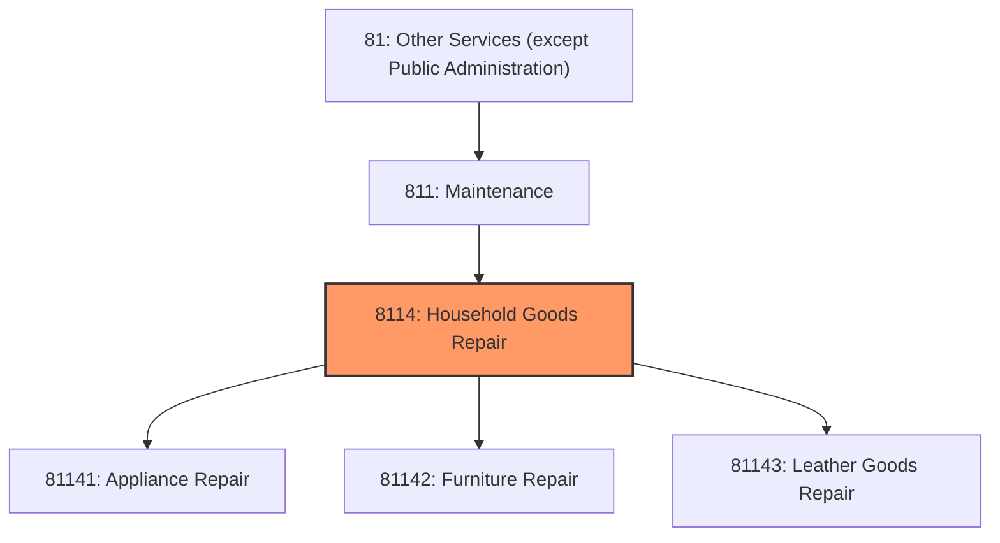
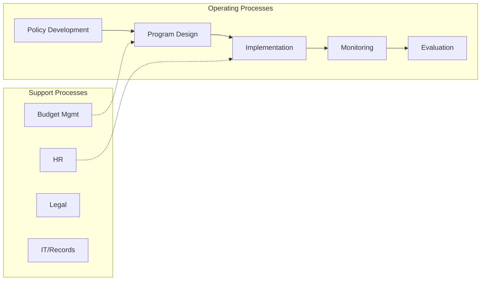

# Household Goods Repair

> This industry group comprises establishments primarily engaged in home and garden equipment and appliance repair and maintenance; reupholstery and furniture repair; footwear and leather goods repair; and other personal and household goods repair and maintenance.

## Overview

Household Goods Repair represents an important category within the Other Services (except Public Administration) sector (NAICS 81). This industry group encompasses establishments primarily engaged in household goods repair.

This industry group comprises establishments primarily engaged in home and garden equipment and appliance repair and maintenance; reupholstery and furniture repair; footwear and leather goods repair; and other personal and household goods repair and maintenance.

## Industry Hierarchy

## Key Statistics

| Metric | Value |
|--------|-------|
| NAICS Code | 8114 |
| Level | Industry Group |
| Parent | [Maintenance](../) |
| Child Industries | 3 |

## Sub-Industries

| Industry | Code | Description |
|----------|------|-------------|
| [Appliance Repair](./ApplianceRepair/) | 81141 | This industry comprises establishments primarily engaged in repairing and servic |
| [Furniture Repair](./FurnitureRepair/) | 81142 | See industry description for 811420 |
| [Leather Goods Repair](./LeatherGoodsRepair/) | 81143 | See industry description for 811430 |

## Core Business Processes

## Industry Value Chain

## Market Context

Manufacturing transforms raw materials into finished goods, with Industry 4.0 driving automation, digitalization, and smart factory implementations.

| Aspect | Details |
|--------|---------|
| Industry Sector | OtherServices |
| NAICS/SIC Code | 8114 |
| Market Segment | Household Goods Repair |

## Key Business Processes

- Production planning
- Manufacturing operations
- Quality assurance
- Inventory management
- Distribution and logistics

## Common Occupations

- [Industrial Production Managers](/occupations/Management/IndustrialProductionManagers)
- [Production Workers](/occupations/Production/ProductionWorkers)
- [Quality Control Inspectors](/occupations/Production/QualityControlInspectors)
- [Industrial Engineers](/occupations/Engineering/IndustrialEngineers)

## Regulations and Standards

- OSHA Manufacturing Standards
- EPA Environmental Regulations
- FDA regulations (where applicable)
- ISO quality standards
- Industry-specific certifications

## Technology and Tools

- Industrial automation and robotics
- Enterprise Resource Planning (ERP)
- Quality management systems
- Predictive maintenance
- IoT and smart manufacturing

## Industry Trends

- Digital transformation and automation adoption
- Sustainability and environmental compliance focus
- Workforce development and skills training
- Supply chain resilience and optimization
- Customer experience enhancement

---

*Source: NAICS 8114 - Household Goods Repair*
