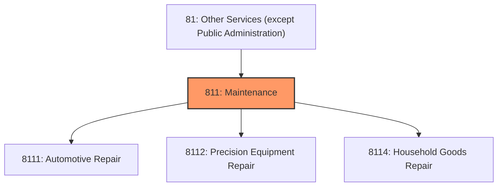
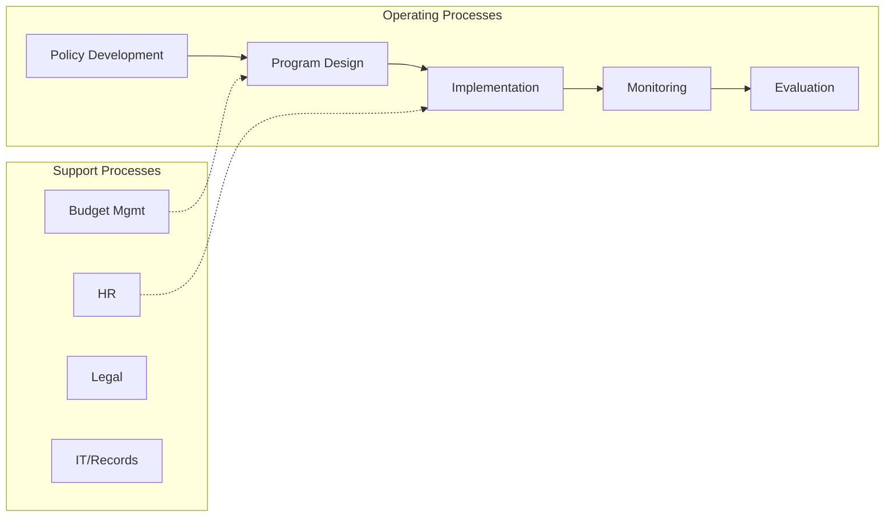

# Maintenance

> Industries in the Repair and Maintenance subsector restore machinery, equipment, and other products to working order.

## Overview

Maintenance represents an important category within the Other Services (except Public Administration) sector (NAICS 81). This subsector encompasses establishments primarily engaged in maintenance.

Industries in the Repair and Maintenance subsector restore machinery, equipment, and other products to working order. These establishments also typically provide general or routine maintenance (i.e., servicing) on such products to ensure they work efficiently and to prevent breakdown and unnecessary repairs. The NAICS structure for this subsector brings together most types of repair and maintenance establishments and categorizes them based on production processes (i.e., on the type of repair and maintenance activity performed, and the necessary skills, expertise, and processes that are found in different repair and maintenance establishments). This NAICS classification does not delineate between repair services provided to businesses versus those that serve households. Although some industries primarily serve either businesses or households, separation by class of customer is limited by the fact that many establishments serve both. Establishments repairing computers and consumer electronics products are two examples of such overlap. The Repair and Maintenance subsector does not include all establishments that do repair and maintenance. For example, a substantial amount of repair is done by establishments that also manufacture machinery, equipment, and other goods. These establishments are included in the Manufacturing sector in NAICS. In addition, repair of transportation equipment is often provided by or based at transportation facilities, such as airports and seaports, and these activities are included in the Transportation and Warehousing sector. A particularly unique situation exists with repair of buildings. Plumbing, electrical installation and repair, painting and decorating, and other construction-related establishments are often involved in performing installation or other work on new construction as well as providing repair services on existing structures. While some specialize in repair, it is difficult to distinguish between the two types and all are included in the Construction sector. Excluded from this subsector are establishments primarily engaged in rebuilding or remanufacturing machinery and equipment. These are classified in Sector 31-33, Manufacturing. Also excluded are retail establishments that provide after-sale services and repair. These are classified in Sector 44-45, Retail Trade.

## Industry Hierarchy

## Key Statistics

| Metric | Value |
|--------|-------|
| NAICS Code | 811 |
| Level | Subsector |
| Child Industries | 3 |

## Sub-Industries

| Industry | Code | Description |
|----------|------|-------------|
| [Automotive Repair](./AutomotiveRepair/) | 8111 | This industry group comprises establishments involved in providing repair and ma |
| [Precision Equipment Repair](./PrecisionEquipmentRepair/) | 8112 | Precision Equipment Repair |
| [Household Goods Repair](./HouseholdGoodsRepair/) | 8114 | This industry group comprises establishments primarily engaged in home and garde |

## Core Business Processes

## Industry Value Chain

```mermaid
graph LR
    subgraph Inputs["Inputs"]
        I1["Resources"]
        I2["Expertise"]
        I3["Technology"]
    end

    subgraph Primary["Primary Activities"]
        A1["Inbound Logistics"]
        A2["Core Operations"]
        A3["Quality Assurance"]
        A4["Outbound/Delivery"]
    end

    subgraph Outputs["Products/Services"]
        O1["Products"]
        O2["Services"]
        O3["Solutions"]
    end

    subgraph Customers["Markets"]
        C1["Businesses"]
        C2["Consumers"]
        C3["Government"]
        C4["Institutions"]
    end

    Inputs --> Primary --> Outputs --> Customers
```

---

*Source: NAICS 811 - Maintenance*
