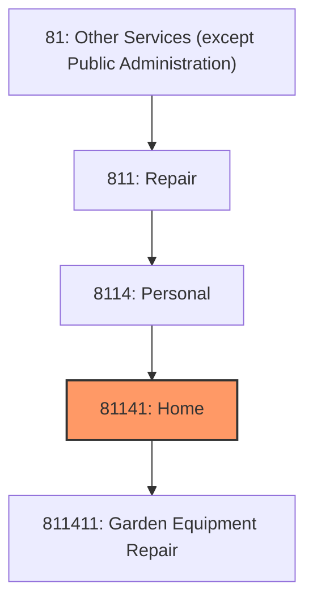
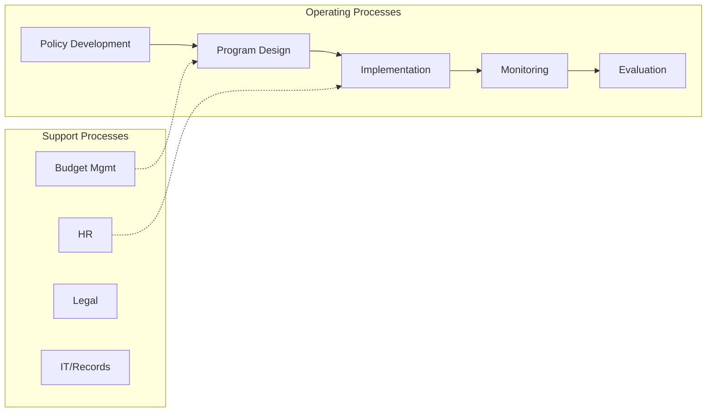

# Home

> This industry comprises establishments primarily engaged in repairing and servicing home and garden equipment and/or household-type appliances without retailing new equipment or appliances.

## Overview

Home represents an important category within the Other Services (except Public Administration) sector (NAICS 81).

This industry comprises establishments primarily engaged in repairing and servicing home and garden equipment and/or household-type appliances without retailing new equipment or appliances. Establishments in this industry repair and maintain items, such as lawnmowers, edgers, snowblowers, leaf blowers, washing machines, clothes dryers, and refrigerators. Cross-References. Establishments primarily engaged in--

## Industry Hierarchy

## Key Statistics

| Metric | Value |
|--------|-------|
| NAICS Code | 81141 |
| Level | Industry |
| Parent | [Personal](../) |
| Child Industries | 1 |

## Sub-Industries

| Industry | Code | Description |
|----------|------|-------------|
| [Garden Equipment Repair](./GardenEquipmentRepair.mdx) | 811411 | This U |

## Related Occupations

See the [occupations directory](/occupations) for roles commonly found in this industry.

## Core Business Processes

## Industry Value Chain

```mermaid
graph LR
    subgraph Inputs["Inputs"]
        I1["Resources"]
        I2["Expertise"]
        I3["Technology"]
    end

    subgraph Primary["Primary Activities"]
        A1["Inbound Logistics"]
        A2["Core Operations"]
        A3["Quality Assurance"]
        A4["Outbound/Delivery"]
    end

    subgraph Outputs["Products/Services"]
        O1["Products"]
        O2["Services"]
        O3["Solutions"]
    end

    subgraph Customers["Markets"]
        C1["Businesses"]
        C2["Consumers"]
        C3["Government"]
        C4["Institutions"]
    end

    Inputs --> Primary --> Outputs --> Customers
```

---

*Source: NAICS 81141 - Home*
