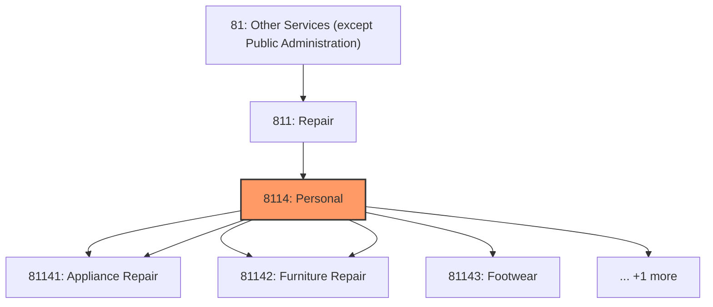
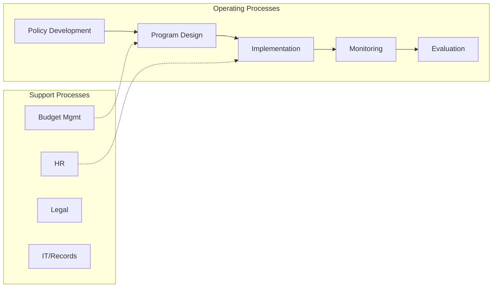

# Personal

> This industry group comprises establishments primarily engaged in home and garden equipment and appliance repair and maintenance; reupholstery and furniture repair; footwear and leather goods repair; and other personal and household goods repair and maintenance.

## Overview

Personal represents an important category within the Other Services (except Public Administration) sector (NAICS 81).

This industry group comprises establishments primarily engaged in home and garden equipment and appliance repair and maintenance; reupholstery and furniture repair; footwear and leather goods repair; and other personal and household goods repair and maintenance.

## Industry Hierarchy

## Key Statistics

| Metric | Value |
|--------|-------|
| NAICS Code | 8114 |
| Level | Industry Group |
| Parent | [Repair](../) |
| Child Industries | 6 |

## Sub-Industries

| Industry | Code | Description |
|----------|------|-------------|
| [Home](./Home/) | 81141 | This industry comprises establishments primarily engaged in repairing and servic |
| [Appliance Repair](./ApplianceRepair/) | 81141 | This industry comprises establishments primarily engaged in repairing and servic |
| [Reupholstery](./Reupholstery/) | 81142 | See industry description for 811420 |
| [Furniture Repair](./FurnitureRepair/) | 81142 | See industry description for 811420 |
| [Footwear](./Footwear/) | 81143 | See industry description for 811430 |
| [Leather Goods Repair](./LeatherGoodsRepair/) | 81143 | See industry description for 811430 |

## Related Occupations

See the [occupations directory](/occupations) for roles commonly found in this industry.

## Core Business Processes

## Industry Value Chain

```mermaid
graph LR
    subgraph Inputs["Inputs"]
        I1["Resources"]
        I2["Expertise"]
        I3["Technology"]
    end

    subgraph Primary["Primary Activities"]
        A1["Inbound Logistics"]
        A2["Core Operations"]
        A3["Quality Assurance"]
        A4["Outbound/Delivery"]
    end

    subgraph Outputs["Products/Services"]
        O1["Products"]
        O2["Services"]
        O3["Solutions"]
    end

    subgraph Customers["Markets"]
        C1["Businesses"]
        C2["Consumers"]
        C3["Government"]
        C4["Institutions"]
    end

    Inputs --> Primary --> Outputs --> Customers
```

---

*Source: NAICS 8114 - Personal*
