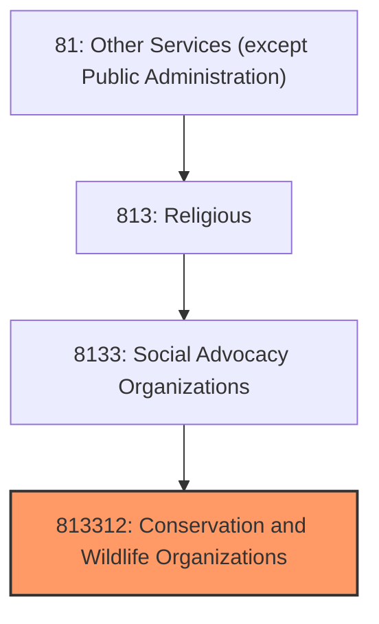
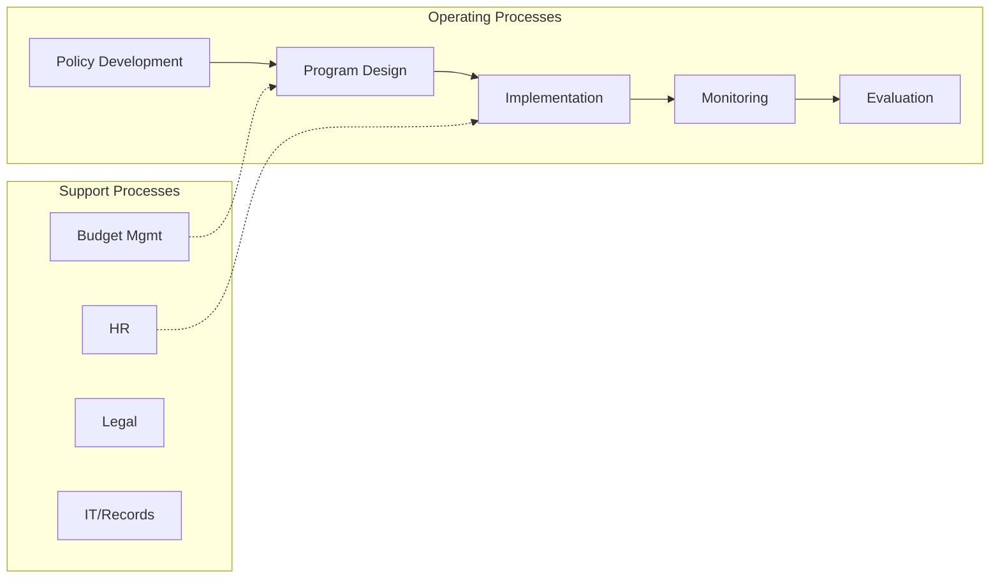

# Conservation and Wildlife Organizations

> This U.

## Overview

Conservation and Wildlife Organizations represents a specialized segment within the Other Services (except Public Administration) sector (NAICS 81).

This U.S. industry comprises establishments primarily engaged in promoting the preservation and protection of the environment and wildlife. Establishments in this industry address issues, such as clean air and water; global warming; conserving and developing natural resources, including land, plant, water, and energy resources; and protecting and preserving wildlife and endangered species. These organizations may solicit contributions and offer memberships to support these causes. Illustrative Examples: Animal rights organizations Natural resource preservation organizations Conservation advocacy organizations Wildlife preservation organizations Humane societies without animal shelters Cross-References.

## Industry Hierarchy

## Key Statistics

| Metric | Value |
|--------|-------|
| NAICS Code | 813312 |
| Level | National Industry |
| Child Industries | 0 |

## Related Occupations

- [Automotive Service Technicians](/occupations/Maintenance/AutomotiveServiceTechniciansAndMechanics) - Diagnose and repair motor vehicles
- [Hairdressers and Cosmetologists](/occupations/PersonalService/HairdressersHairstylistsAndCosmetologists) - Provide beauty services
- [General Maintenance and Repair Workers](/occupations/GeneralMaintenanceAndRepairWorkers) - Perform general maintenance tasks
- [Clergy](/occupations/SocialServices/Clergy) - Conduct religious services and provide spiritual guidance

## Core Business Processes

## Industry Value Chain

## Regulatory Environment

- **EPA** (Environmental Protection Agency) - Regulates auto repair waste and emissions testing
- **State Licensing Boards** - License repair shops, cosmetologists, and other services
- **IRS** (Internal Revenue Service) - Governs tax-exempt status for religious organizations
- **OSHA** (Occupational Safety and Health Administration) - Workplace safety for service workers

## Technology & Innovation

- **Digital Booking Platforms** - Online appointment scheduling for auto repair, salons, and services
- **Diagnostic Technology** - OBD-II scanners, AI-powered diagnostics, and predictive vehicle maintenance
- **Mobile Service Delivery** - On-demand home repair, mobile detailing, and field service apps
- **Contactless Payments** - Tap-to-pay, mobile wallets, and automated invoicing

## Industry Outlook

The other services sector encompasses diverse businesses adapting to digital transformation and changing consumer preferences. Auto repair shops are navigating the transition to electric vehicles, personal care services are adopting online booking and contactless payments, and religious organizations are expanding digital outreach. Skilled trade shortages and aging workforce demographics present ongoing challenges.

---

*Source: NAICS 813312 - Conservation and Wildlife Organizations*
