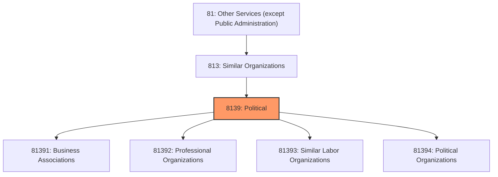
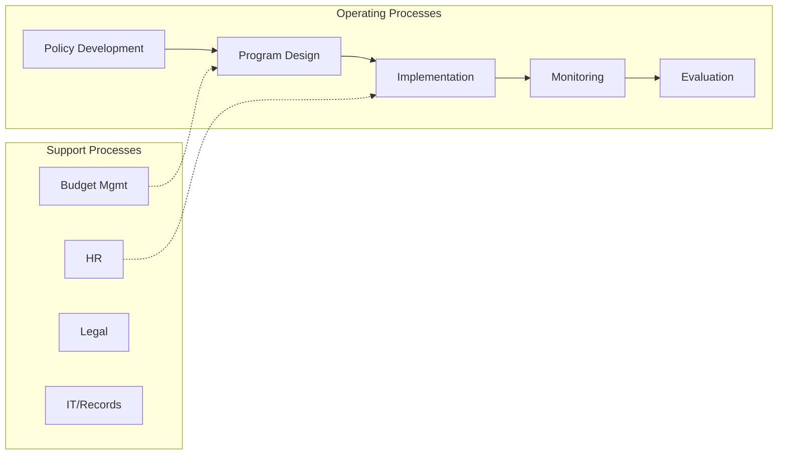

# Political

> This industry group comprises establishments primarily engaged in promoting the interests of their members (except religious organizations, social advocacy organizations, and civic and social organizations).

## Overview

Political represents an important category within the Other Services (except Public Administration) sector (NAICS 81). This industry group encompasses establishments primarily engaged in political.

This industry group comprises establishments primarily engaged in promoting the interests of their members (except religious organizations, social advocacy organizations, and civic and social organizations). Examples of establishments in this industry are business associations, professional organizations, labor unions, and political organizations.

## Industry Hierarchy

## Key Statistics

| Metric | Value |
|--------|-------|
| NAICS Code | 8139 |
| Level | Industry Group |
| Parent | [Similar Organizations](../) |
| Child Industries | 4 |

## Sub-Industries

| Industry | Code | Description |
|----------|------|-------------|
| [Business Associations](./BusinessAssociations/) | 81391 | See industry description for 813910 |
| [Professional Organizations](./ProfessionalOrganizations/) | 81392 | See industry description for 813920 |
| [Similar Labor Organizations](./SimilarLaborOrganizations/) | 81393 | See industry description for 813930 |
| [Political Organizations](./PoliticalOrganizations/) | 81394 | See industry description for 813940 |

## Core Business Processes

## Industry Value Chain

---

*Source: NAICS 8139 - Political*
