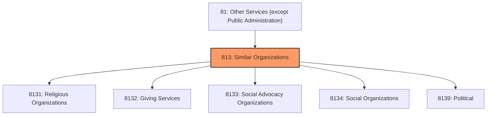
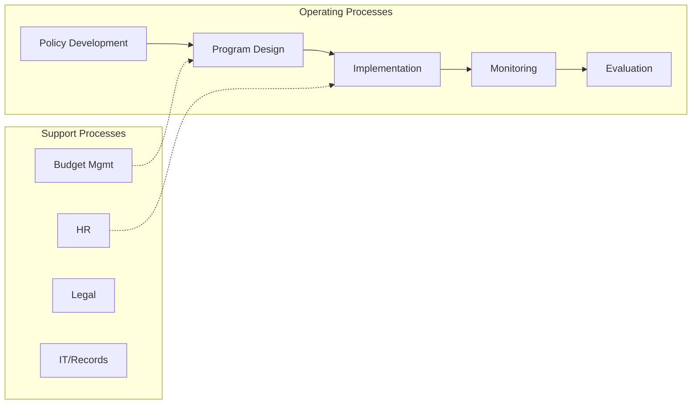

# Similar Organizations

> Industries in the Religious, Grantmaking, Civic, Professional, and Similar Organizations subsector group establishments that organize and promote religious activities; support various causes through grantmaking; advocate various social and political causes; and promote and defend the interests of their members.

## Overview

Similar Organizations represents an important category within the Other Services (except Public Administration) sector (NAICS 81). This subsector encompasses establishments primarily engaged in similar organizations.

Industries in the Religious, Grantmaking, Civic, Professional, and Similar Organizations subsector group establishments that organize and promote religious activities; support various causes through grantmaking; advocate various social and political causes; and promote and defend the interests of their members. The industry groups within the subsector are defined in terms of their activities, such as establishments that provide funding for specific causes or for a variety of charitable causes; establishments that advocate and actively promote causes and beliefs for the public good; and establishments that have an active membership structure to promote causes and represent the interests of their members. Establishments in this subsector may publish newsletters, books, and periodicals for distribution to their members.

## Industry Hierarchy

## Key Statistics

| Metric | Value |
|--------|-------|
| NAICS Code | 813 |
| Level | Subsector |
| Child Industries | 5 |

## Sub-Industries

| Industry | Code | Description |
|----------|------|-------------|
| [Religious Organizations](./ReligiousOrganizations/) | 8131 | Religious Organizations |
| [Giving Services](./GivingServices/) | 8132 | Giving Services |
| [Social Advocacy Organizations](./SocialAdvocacyOrganizations/) | 8133 | Social Advocacy Organizations |
| [Social Organizations](./SocialOrganizations/) | 8134 | Social Organizations |
| [Political](./Political/) | 8139 | This industry group comprises establishments primarily engaged in promoting the  |

## Core Business Processes

## Industry Value Chain

---

*Source: NAICS 813 - Similar Organizations*
