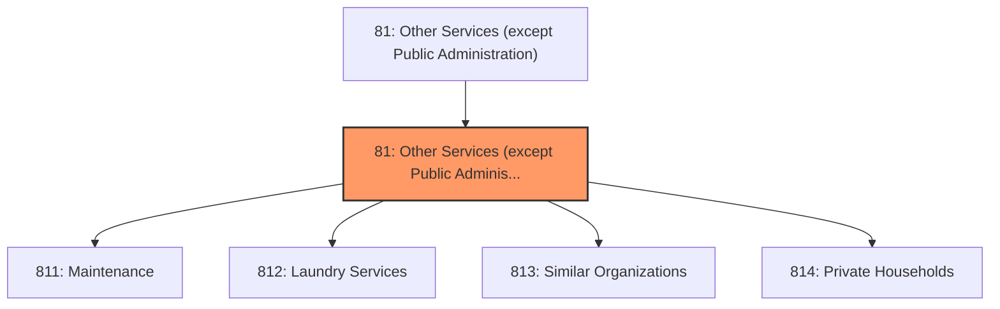
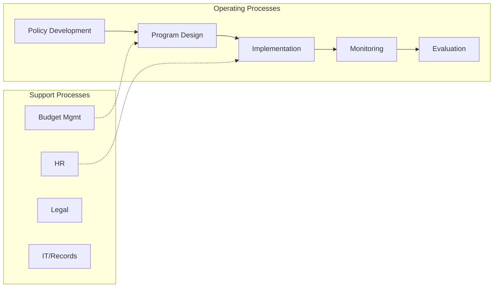

# Other Services (except Public Administration)

> The Other Services (except Public Administration) sector encompasses a broad range of establishments classified under NAICS 81.

## Overview

Other Services (except Public Administration) represents an important category within the Other Services (except Public Administration) sector (NAICS 81). This sector encompasses establishments primarily engaged in other services (except public administration).

The Other Services (except Public Administration) sector encompasses a broad range of establishments classified under NAICS 81.

## Industry Hierarchy

## Key Statistics

| Metric | Value |
|--------|-------|
| NAICS Code | 81 |
| Level | Sector |
| Child Industries | 4 |

## Sub-Industries

| Industry | Code | Description |
|----------|------|-------------|
| [Maintenance](./Maintenance/) | 811 | Industries in the Repair and Maintenance subsector restore machinery, equipment, |
| [Laundry Services](./LaundryServices/) | 812 | Industries in the Personal and Laundry Services subsector group establishments t |
| [Similar Organizations](./SimilarOrganizations/) | 813 | Industries in the Religious, Grantmaking, Civic, Professional, and Similar Organ |
| [Private Households](./PrivateHouseholds/) | 814 | The Private Households subsector includes private households that engage in empl |

## Core Business Processes

## Industry Value Chain

```mermaid
graph LR
    subgraph Inputs["Inputs"]
        I1["Resources"]
        I2["Expertise"]
        I3["Technology"]
    end

    subgraph Primary["Primary Activities"]
        A1["Inbound Logistics"]
        A2["Core Operations"]
        A3["Quality Assurance"]
        A4["Outbound/Delivery"]
    end

    subgraph Outputs["Products/Services"]
        O1["Products"]
        O2["Services"]
        O3["Solutions"]
    end

    subgraph Customers["Markets"]
        C1["Businesses"]
        C2["Consumers"]
        C3["Government"]
        C4["Institutions"]
    end

    Inputs --> Primary --> Outputs --> Customers
```

---

*Source: NAICS 81 - Other Services (except Public Administration)*
