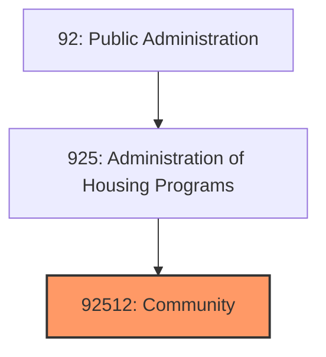
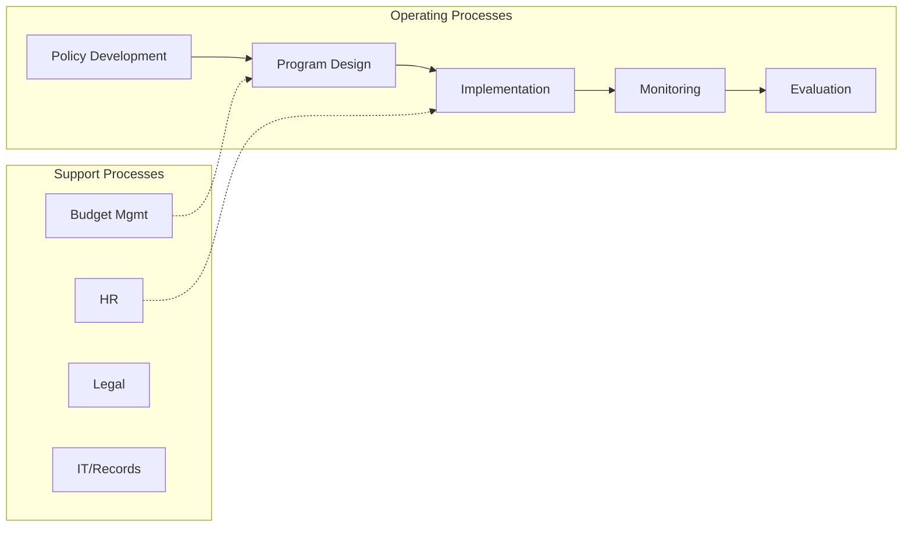

# Community

> See industry description for 925120.

## Overview

Community represents an important category within the Public Administration sector (NAICS 92).

## Industry Hierarchy

## Key Statistics

| Metric | Value |
|--------|-------|
| NAICS Code | 92512 |
| Level | Industry |
| Child Industries | 0 |

## Related Occupations

- [Legislators](/occupations/Management/Legislators) - Develop and enact laws
- [Chief Executives](/occupations/Management/ChiefExecutives) - Direct government agency operations
- [Urban and Regional Planners](/occupations/Science/UrbanAndRegionalPlanners) - Develop land use plans
- [Firefighters](/occupations/FirefightersAndFireInspectors) - Control and extinguish fires

## Core Business Processes

## Industry Value Chain

```mermaid
graph LR
    subgraph Inputs["Inputs"]
        I1["Resources"]
        I2["Expertise"]
        I3["Technology"]
    end

    subgraph Primary["Primary Activities"]
        A1["Inbound Logistics"]
        A2["Core Operations"]
        A3["Quality Assurance"]
        A4["Outbound/Delivery"]
    end

    subgraph Outputs["Products/Services"]
        O1["Products"]
        O2["Services"]
        O3["Solutions"]
    end

    subgraph Customers["Markets"]
        C1["Businesses"]
        C2["Consumers"]
        C3["Government"]
        C4["Institutions"]
    end

    Inputs --> Primary --> Outputs --> Customers
```

## Regulatory Environment

- **Office of Management and Budget** - Oversees federal budgeting and regulatory review
- **Government Accountability Office** - Audits government programs and spending
- **Office of Personnel Management** - Manages federal workforce policies
- **State and Local Ethics Commissions** - Enforce government transparency and accountability

## Technology & Innovation

- **GovTech** - Digital government services, e-permitting, and online citizen engagement
- **Open Data** - Public data portals, transparency dashboards, and civic analytics
- **AI in Government** - Automated case management, predictive policing, and fraud detection
- **Smart City Infrastructure** - IoT sensors, connected transportation, and digital public services

## Industry Outlook

The public administration sector is modernizing through digital government initiatives, data-driven decision making, and citizen-centric service design. AI and automation are improving operational efficiency in permitting, compliance, and public safety. Smart city investments in connected infrastructure, sustainability, and resilience planning are accelerating, while cybersecurity and data governance remain critical priorities.

## Market Context

Manufacturing transforms raw materials into finished goods, with Industry 4.0 driving automation, digitalization, and smart factory implementations.

| Aspect | Details |
|--------|---------|
| Industry Sector | PublicAdministration |
| NAICS/SIC Code | 92512 |
| Market Segment | Community |

## Key Business Processes

- Production planning
- Manufacturing operations
- Quality assurance
- Inventory management
- Distribution and logistics

## Common Occupations

- [Industrial Production Managers](/occupations/Management/IndustrialProductionManagers)
- [Production Workers](/occupations/Production/ProductionWorkers)
- [Quality Control Inspectors](/occupations/Production/QualityControlInspectors)
- [Industrial Engineers](/occupations/Engineering/IndustrialEngineers)

## Regulations and Standards

- OSHA Manufacturing Standards
- EPA Environmental Regulations
- FDA regulations (where applicable)
- ISO quality standards
- Industry-specific certifications

## Technology and Tools

- Industrial automation and robotics
- Enterprise Resource Planning (ERP)
- Quality management systems
- Predictive maintenance
- IoT and smart manufacturing

## Industry Trends

- Digital transformation and automation adoption
- Sustainability and environmental compliance focus
- Workforce development and skills training
- Supply chain resilience and optimization
- Customer experience enhancement

---

*Source: NAICS 92512 - Community*
