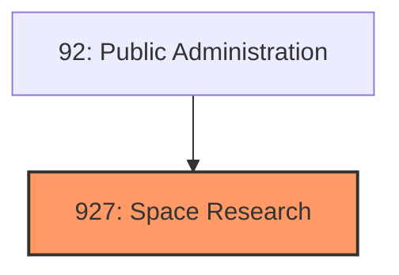
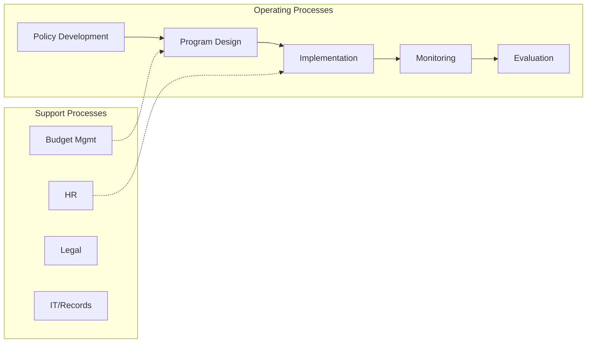

# Space Research

> The Space Research and Technology subsector comprises government establishments primarily engaged in the administration and operations of space flights, space research, and space exploration.

## Overview

Space Research represents an important category within the Public Administration sector (NAICS 92). This subsector encompasses establishments primarily engaged in space research.

The Space Research and Technology subsector comprises government establishments primarily engaged in the administration and operations of space flights, space research, and space exploration.

## Industry Hierarchy

## Key Statistics

| Metric | Value |
|--------|-------|
| NAICS Code | 927 |
| Level | Subsector |
| Parent | [Public Administration](../) |
| Child Industries | 0 |

## Core Business Processes

## Industry Value Chain

```mermaid
graph LR
    subgraph Inputs["Inputs"]
        I1["Resources"]
        I2["Expertise"]
        I3["Technology"]
    end

    subgraph Primary["Primary Activities"]
        A1["Inbound Logistics"]
        A2["Core Operations"]
        A3["Quality Assurance"]
        A4["Outbound/Delivery"]
    end

    subgraph Outputs["Products/Services"]
        O1["Products"]
        O2["Services"]
        O3["Solutions"]
    end

    subgraph Customers["Markets"]
        C1["Businesses"]
        C2["Consumers"]
        C3["Government"]
        C4["Institutions"]
    end

    Inputs --> Primary --> Outputs --> Customers
```

---

*Source: NAICS 927 - Space Research*
