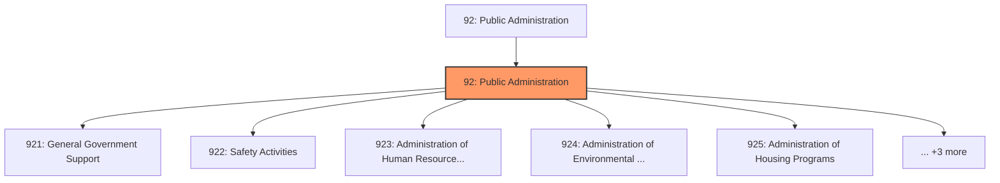
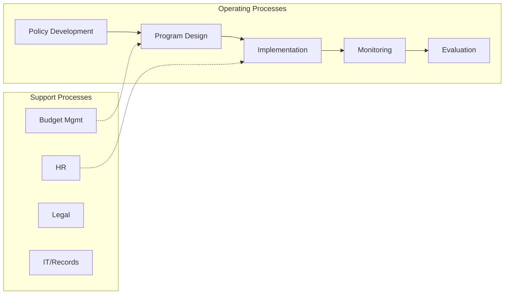

# Public Administration

> The Sector as a Whole The Public Administration sector consists of establishments of federal, state, and local government agencies that administer, oversee, and manage public programs and have executive, legislative, or judicial authority over other institutions within a given area.

## Overview

Public Administration represents an important category within the Public Administration sector (NAICS 92). This sector encompasses establishments primarily engaged in public administration.

The Sector as a Whole The Public Administration sector consists of establishments of federal, state, and local government agencies that administer, oversee, and manage public programs and have executive, legislative, or judicial authority over other institutions within a given area. These agencies also set policy, create laws, adjudicate civil and criminal legal cases, and provide for public safety and for national defense. In general, government establishments in the Public Administration sector oversee governmental programs and activities that are not performed by private establishments. Establishments in this sector typically are engaged in the organization and financing of the production of public goods and services, most of which are provided for free or at prices that are not economically significant. Government establishments also engage in a wide range of productive activities covering not only public goods and services but also individual goods and services similar to those produced in sectors typically identified with private-sector establishments. In general, ownership is not a criterion for classification in NAICS. Therefore, government establishments engaged in the production of private-sector-like goods and services should be classified in the same industry as private-sector establishments engaged in similar activities. As a practical matter, it is difficult to identify separate establishment detail for many government agencies. To the extent that separate establishment records are available, the administration of governmental programs is classified in Sector 92, Public Administration, while the operation of governmental programs is classified elsewhere in NAICS based on the activities performed. For example, the governmental administrative authority for an airport is classified in Industry 92612, Regulation and Administration of Transportation Programs, while operating the airport is classified in Industry 48811, Airport Operations. When separate records for multi-establishment companies are not available to distinguish between the administration of a governmental program and the operation of it, the establishment is classified in Sector 92, Public Administration. Examples of government-provided goods and services that are classified in sectors other than Public Administration include: schools, classified in Sector 61, Educational Services; health care facilities, classified in Sector 62, Health Care and Social Assistance; establishments operating transportation facilities, classified in Sector 48-49, Transportation and Warehousing; the operation of utilities, classified in Sector 22, Utilities; and the Government Printing Office, classified in Subsector 323, Printing and Related Support Activities.

## Industry Hierarchy

## Key Statistics

| Metric | Value |
|--------|-------|
| NAICS Code | 92 |
| Level | Sector |
| Child Industries | 8 |

## Sub-Industries

| Industry | Code | Description |
|----------|------|-------------|
| [General Government Support](./GeneralGovernmentSupport/) | 921 | The Executive, Legislative, and Other General Government Support subsector group |
| [Safety Activities](./SafetyActivities/) | 922 | The Justice, Public Order, and Safety Activities subsector groups government est |
| [Administration of Human Resource Programs](./AdministrationOfHumanResourcePrograms/) | 923 | The Administration of Human Resource Programs subsector groups government establ |
| [Administration of Environmental Quality Programs](./AdministrationOfEnvironmentalQualityPrograms/) | 924 | The Administration of Environmental Quality Programs subsector groups government |
| [Administration of Housing Programs](./AdministrationOfHousingPrograms/) | 925 | The Administration of Housing Programs, Urban Planning, and Community Developmen |
| [Administration of Economic Programs](./AdministrationOfEconomicPrograms/) | 926 | The Administration of Economic Programs subsector groups government establishmen |
| [Space Research](./SpaceResearch/) | 927 | The Space Research and Technology subsector comprises government establishments  |
| [International Affairs](./InternationalAffairs/) | 928 | The National Security and International Affairs subsector groups government esta |

## Core Business Processes

## Industry Value Chain

```mermaid
graph LR
    subgraph Inputs["Inputs"]
        I1["Resources"]
        I2["Expertise"]
        I3["Technology"]
    end

    subgraph Primary["Primary Activities"]
        A1["Inbound Logistics"]
        A2["Core Operations"]
        A3["Quality Assurance"]
        A4["Outbound/Delivery"]
    end

    subgraph Outputs["Products/Services"]
        O1["Products"]
        O2["Services"]
        O3["Solutions"]
    end

    subgraph Customers["Markets"]
        C1["Businesses"]
        C2["Consumers"]
        C3["Government"]
        C4["Institutions"]
    end

    Inputs --> Primary --> Outputs --> Customers
```

---

*Source: NAICS 92 - Public Administration*
