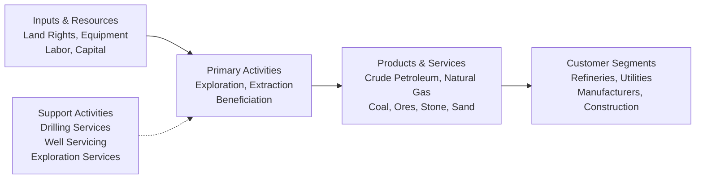

# Mining, Quarrying, and Oil and Gas Extraction

> The Mining, Quarrying, and Oil and Gas Extraction sector comprises establishments that extract naturally occurring mineral solids (coal and ores), liquid minerals (crude petroleum), and gases (natural gas) through mining, quarrying, and well operations.

## Overview

This sector encompasses the extraction of naturally occurring resources from the earth. The term "mining" is used broadly to include quarrying, well operations, beneficiating (crushing, screening, washing, flotation), and other preparation customarily performed at the mine site or as part of mining activity.

The sector distinguishes two basic activities: mine operation and mining support activities. Mine operation includes establishments operating mines, quarries, or oil and gas wells on their own account or for others on a contract or fee basis. Mining support activities include establishments that perform exploration (except geophysical surveying and mapping) on a contract or fee basis and/or other mining services.

Establishments are grouped and classified according to the natural resource mined or to be mined, including those that develop and/or operate the mine site, extract the natural resources, beneficiate (prepare) the mineral mined, or provide mining support activities. Beneficiation is the process whereby extracted material is reduced to particles that can be separated into mineral and waste suitable for further processing or direct use.

## Industry Hierarchy

```mermaid
graph TD
    S21["NAICS 21: Mining, Quarrying, and Oil & Gas Extraction"]
    S21 --> SS211["211: Oil and Gas Extraction"]
    S21 --> SS212["212: Mining (except Oil and Gas)"]
    S21 --> SS213["213: Support Activities for Mining"]

    SS211 --> G2111["2111: Oil and Gas Extraction"]
    G2111 --> I21112["21112: Crude Petroleum Extraction"]
    G2111 --> I21113["21113: Natural Gas Extraction"]

    SS212 --> G2121["2121: Coal Mining"]
    SS212 --> G2122["2122: Metal Ore Mining"]
    SS212 --> G2123["2123: Nonmetallic Mineral Mining & Quarrying"]

    G2121 --> I212114["212114: Surface Coal Mining"]
    G2121 --> I212115["212115: Underground Coal Mining"]

    G2122 --> I21221["21221: Iron Ore Mining"]
    G2122 --> I21222["21222: Gold Ore & Silver Ore Mining"]
    G2122 --> I21223["21223: Copper, Nickel, Lead, Zinc Mining"]

    G2123 --> I21231["21231: Stone Mining & Quarrying"]
    G2123 --> I21232["21232: Sand, Gravel, Clay, Ceramic Mining"]

    SS213 --> G2131["2131: Support Activities for Mining"]
    G2131 --> I213111["213111: Drilling Oil and Gas Wells"]
    G2131 --> I213112["213112: Support Activities for Oil & Gas"]
    G2131 --> I213113["213113: Support Activities for Coal Mining"]
    G2131 --> I213114["213114: Support Activities for Metal Mining"]
    G2131 --> I213115["213115: Support Activities for Nonmetallic Minerals"]
```

## Key Statistics

| Metric | Value |
|--------|-------|
| NAICS Code | 21 |
| Level | Sector |
| Subsectors | 3 |
| Industry Groups | 7 |
| Industries | 20+ |

## Sub-Industries

| Subsector | Code | Description |
|-----------|------|-------------|
| [Oil and Gas Extraction](../OilAndGas/) | 211 | Operating and developing oil and gas field properties including exploration, drilling, completing and equipping wells |
| Mining (except Oil and Gas) | 212 | Developing mine sites or mining coal, metallic minerals, and nonmetallic minerals |
| Support Activities for Mining | 213 | Providing support services for mining and quarrying operations on a contract or fee basis |

## Related Occupations

- [Mining and Geological Engineers](/occupations/Architecture/MiningAndGeologicalEngineers) - Designing mines and directing mining operations
- [Extraction Workers](/occupations/Construction/ExtractionWorkers) - Operating mining and drilling equipment
- [Derrick Operators](/occupations/DerrickOperators) - Operating oil and gas drilling derricks
- [Rotary Drill Operators](/occupations/RotaryDrillOperators) - Operating drilling machinery
- [Explosives Workers](/occupations/ExplosivesWorkers) - Placing and detonating explosives
- [Earth Drillers](/occupations/EarthDrillers) - Operating drilling equipment for oil, gas, minerals, or water
- [Continuous Mining Machine Operators](/occupations/Construction/ContinuousMiningMachineOperators) - Operating continuous mining equipment

## Core Business Processes

```mermaid
flowchart LR
    subgraph Exploration["Exploration & Development"]
        E1["Geological Survey"]
        E2["Site Assessment"]
        E3["Permitting"]
        E4["Mine/Well Development"]
    end

    subgraph Extraction["Extraction Operations"]
        X1["Drilling/Mining"]
        X2["Primary Extraction"]
        X3["Material Handling"]
    end

    subgraph Processing["Beneficiation/Processing"]
        P1["Crushing/Screening"]
        P2["Separation/Washing"]
        P3["Sizing/Grading"]
    end

    subgraph Closure["Reclamation & Closure"]
        C1["Site Restoration"]
        C2["Environmental Monitoring"]
    end

    E1 --> E2 --> E3 --> E4
    E4 --> X1 --> X2 --> X3
    X3 --> P1 --> P2 --> P3
    P3 --> C1 --> C2
```

### Exploration and Development

Locating mineral deposits through geological surveys, core sampling, and prospecting, followed by site development and permitting.

**Key Activities:**
- Conduct geological surveys and mapping
- Perform core sampling and assaying
- Assess resource viability and reserves
- Obtain mining permits and environmental approvals
- Develop mine site infrastructure

### Extraction Operations

Removing minerals from the earth through various mining methods including surface mining, underground mining, and well drilling.

**Key Activities:**
- Operate surface mining equipment (draglines, shovels, trucks)
- Conduct underground mining operations
- Drill and operate oil and gas wells
- Manage blasting and explosive operations
- Handle and transport extracted materials

### Beneficiation

Processing extracted materials to separate mineral content from waste material through mechanical processes.

**Key Activities:**
- Crush, grind, and screen raw materials
- Wash and separate mineral content
- Size and grade processed materials
- Transform metals to bullion where applicable
- Prepare materials for shipment or further processing

## Industry Value Chain

## Mining Methods

### Surface Mining

| Method | Description | Application |
|--------|-------------|-------------|
| Open Pit | Large-scale excavation from surface | Copper, iron ore, gold |
| Strip Mining | Removing overburden in strips | Coal, oil sands |
| Quarrying | Extraction of dimension/crushed stone | Granite, limestone, marble |
| Dredging | Underwater extraction | Sand, gravel, minerals |

### Underground Mining

| Method | Description | Application |
|--------|-------------|-------------|
| Room and Pillar | Pillars left to support roof | Coal, salt |
| Longwall | Complete extraction with roof supports | Coal |
| Block Caving | Controlled collapse of ore body | Copper, iron |
| Cut and Fill | Progressive excavation with backfill | Gold, silver |

### Well Operations

| Type | Description | Products |
|------|-------------|----------|
| Conventional Wells | Traditional drilling | Crude oil, natural gas |
| Horizontal Drilling | Lateral well extensions | Shale oil, tight gas |
| Offshore Drilling | Platform-based extraction | Deepwater oil/gas |

## Regulatory Environment

The mining sector operates under comprehensive regulatory oversight:

- **Mine Safety and Health Administration (MSHA)**: Worker safety and health regulations
- **Bureau of Land Management (BLM)**: Federal land mining permits
- **Environmental Protection Agency (EPA)**: Air and water quality, waste management
- **Office of Surface Mining (OSM)**: Surface coal mining regulation
- **Bureau of Safety and Environmental Enforcement (BSEE)**: Offshore oil and gas operations
- **State Mining Boards**: State-specific mining permits and regulations
- **Securities and Exchange Commission (SEC)**: Mining company disclosure requirements

### Key Regulatory Considerations

- Mine permits and environmental impact assessments
- Reclamation bonding and land restoration requirements
- Worker safety training and certification
- Air and water quality monitoring and reporting
- Hazardous materials handling and disposal
- Royalty payments for federal mineral extraction

## Technology & Innovation

The mining and extraction sector is embracing technological advancement:

- **Autonomous Equipment**: Self-driving haul trucks, autonomous drilling systems
- **Remote Operations**: Control rooms managing remote mine sites
- **Advanced Analytics**: Predictive maintenance, ore grade optimization
- **Drone Technology**: Aerial surveys, stockpile measurement, safety inspections
- **3D Modeling**: Digital mine planning and geological modeling
- **Enhanced Recovery**: Improved oil and gas extraction techniques
- **Water Recycling**: Closed-loop water systems, treatment technologies
- **Electrification**: Battery-electric mining vehicles, reduced emissions
- **Real-time Monitoring**: IoT sensors for equipment and environmental tracking

## Classification Boundaries

Mining, beneficiating, and manufacturing activities often occur at a single location. When receipts cannot be separated:
- Establishments that mine or quarry nonmetallic minerals and then beneficiate into more finished products are classified based on primary activity
- A mine producing small amounts of finished products is classified in Sector 21
- An establishment whose primary output is a finished manufactured product is classified in Sector 31-33, Manufacturing

Establishments primarily engaged in geophysical surveying and mapping are excluded and classified elsewhere.

---

*Source: NAICS 21 - Mining, Quarrying, and Oil and Gas Extraction*
