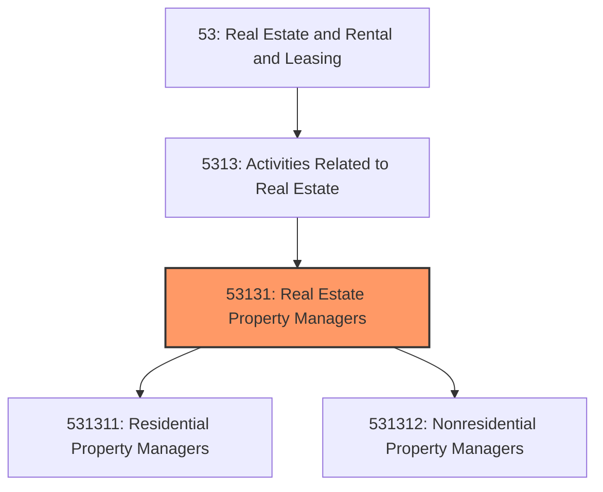
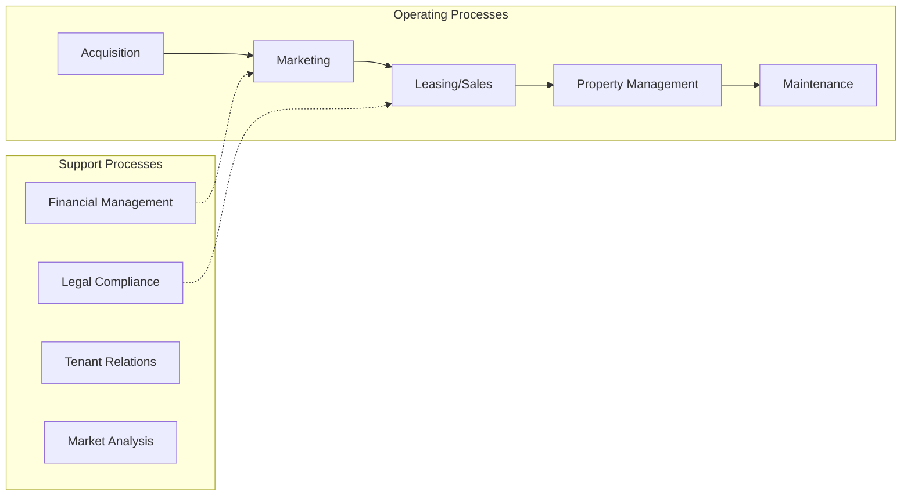

# Real Estate Property Managers

> This industry comprises establishments primarily engaged in managing real property for others.

## Overview

Real Estate Property Managers represents an important category within the Real Estate and Rental and Leasing sector (NAICS 53).

This industry comprises establishments primarily engaged in managing real property for others. Management includes ensuring that various activities associated with the overall operation of the property are performed, such as collecting rents and overseeing other services (e.g., maintenance, security, trash removal). Cross-References.

## Industry Hierarchy

## Key Statistics

| Metric | Value |
|--------|-------|
| NAICS Code | 53131 |
| Level | Industry |
| Parent | [Activities Related to Real Estate](../) |
| Child Industries | 2 |

## Sub-Industries

| Industry | Code | Description |
|----------|------|-------------|
| [Residential Property Managers](./ResidentialPropertyManagers.mdx) | 531311 | This U |
| [Nonresidential Property Managers](./NonresidentialPropertyManagers.mdx) | 531312 | This U |

## Related Occupations

See the [occupations directory](/occupations) for roles commonly found in this industry.

## Core Business Processes

## Industry Value Chain

```mermaid
graph LR
    subgraph Inputs["Inputs"]
        I1["Resources"]
        I2["Expertise"]
        I3["Technology"]
    end

    subgraph Primary["Primary Activities"]
        A1["Inbound Logistics"]
        A2["Core Operations"]
        A3["Quality Assurance"]
        A4["Outbound/Delivery"]
    end

    subgraph Outputs["Products/Services"]
        O1["Products"]
        O2["Services"]
        O3["Solutions"]
    end

    subgraph Customers["Markets"]
        C1["Businesses"]
        C2["Consumers"]
        C3["Government"]
        C4["Institutions"]
    end

    Inputs --> Primary --> Outputs --> Customers
```

---

*Source: NAICS 53131 - Real Estate Property Managers*
