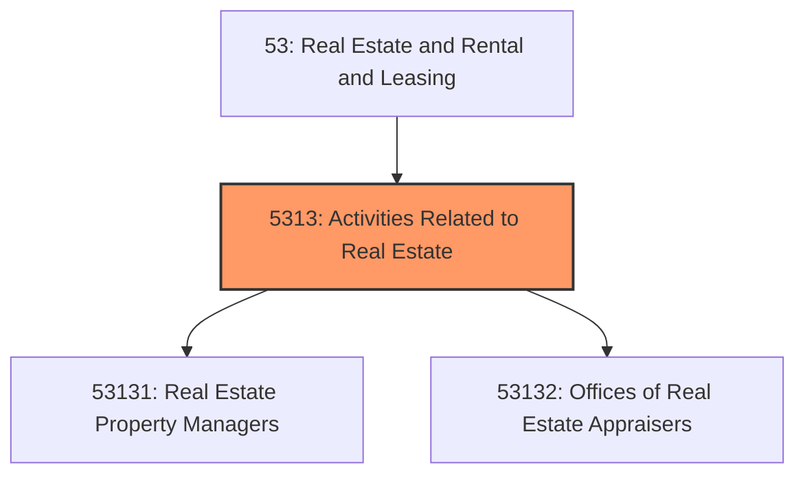
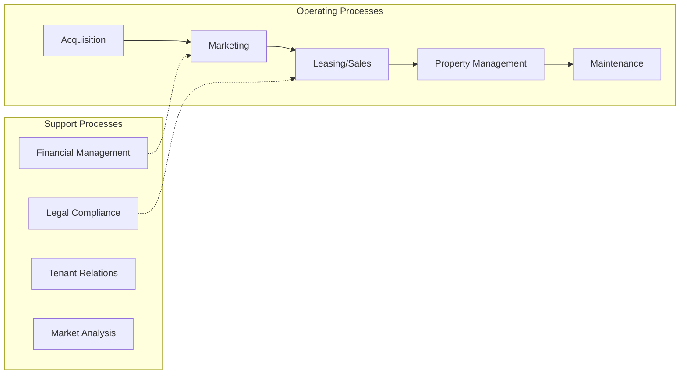

# Activities Related to Real Estate

> This industry group comprises establishments primarily engaged in providing real estate services (except lessors of real estate and offices of real estate agents and brokers).

## Overview

Activities Related to Real Estate represents an important category within the Real Estate and Rental and Leasing sector (NAICS 53).

This industry group comprises establishments primarily engaged in providing real estate services (except lessors of real estate and offices of real estate agents and brokers). Included in this industry group are establishments primarily engaged in managing real estate for others and appraising real estate.

## Industry Hierarchy

## Key Statistics

| Metric | Value |
|--------|-------|
| NAICS Code | 5313 |
| Level | Industry Group |
| Child Industries | 2 |

## Sub-Industries

| Industry | Code | Description |
|----------|------|-------------|
| [Real Estate Property Managers](./RealEstatePropertyManagers/) | 53131 | This industry comprises establishments primarily engaged in managing real proper |
| [Offices of Real Estate Appraisers](./OfficesOfRealEstateAppraisers/) | 53132 | See industry description for 531320 |

## Related Occupations

See the [occupations directory](/occupations) for roles commonly found in this industry.

## Core Business Processes

## Industry Value Chain

```mermaid
graph LR
    subgraph Inputs["Inputs"]
        I1["Resources"]
        I2["Expertise"]
        I3["Technology"]
    end

    subgraph Primary["Primary Activities"]
        A1["Inbound Logistics"]
        A2["Core Operations"]
        A3["Quality Assurance"]
        A4["Outbound/Delivery"]
    end

    subgraph Outputs["Products/Services"]
        O1["Products"]
        O2["Services"]
        O3["Solutions"]
    end

    subgraph Customers["Markets"]
        C1["Businesses"]
        C2["Consumers"]
        C3["Government"]
        C4["Institutions"]
    end

    Inputs --> Primary --> Outputs --> Customers
```

---

*Source: NAICS 5313 - Activities Related to Real Estate*
