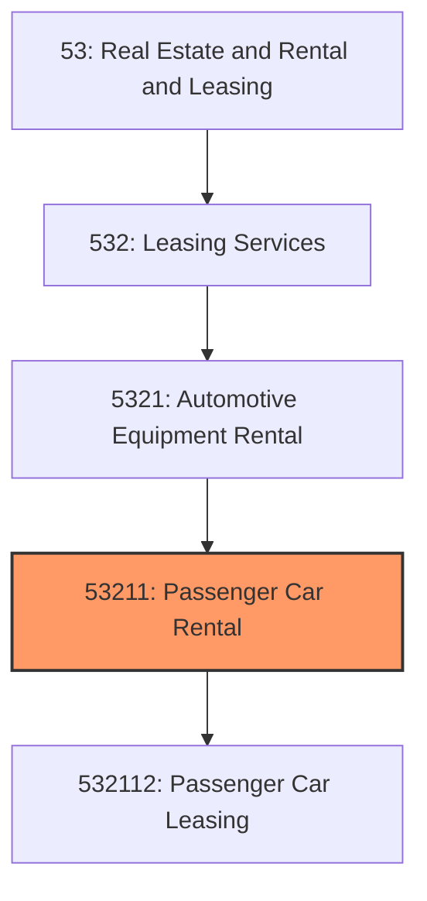
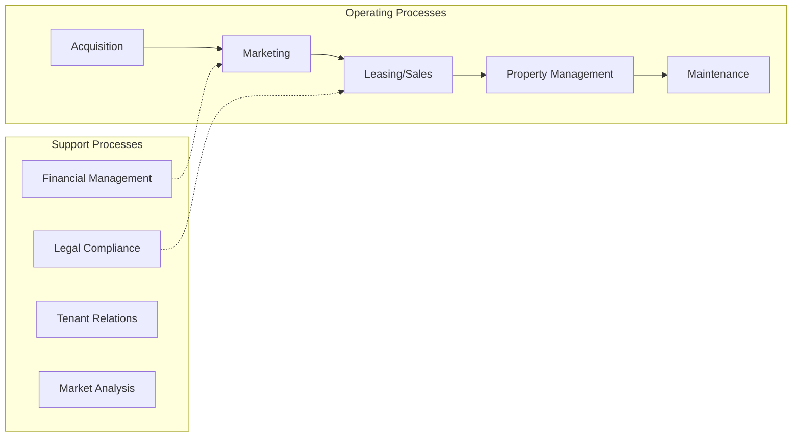

# Passenger Car Rental

> This industry comprises establishments primarily engaged in renting or leasing passenger cars without drivers.

## Overview

Passenger Car Rental represents an important category within the Real Estate and Rental and Leasing sector (NAICS 53). This industry encompasses establishments primarily engaged in passenger car rental.

This industry comprises establishments primarily engaged in renting or leasing passenger cars without drivers. Illustrative Examples: Passenger car rental or leasing Passenger truck (light duty) rental or leasing Passenger van rental or leasing Sport utility vehicle rental or leasing Cross-References. Establishments primarily engaged in--

## Industry Hierarchy

## Key Statistics

| Metric | Value |
|--------|-------|
| NAICS Code | 53211 |
| Level | Industry |
| Parent | [Automotive Equipment Rental](../) |
| Child Industries | 1 |

## Sub-Industries

| Industry | Code | Description |
|----------|------|-------------|
| [Passenger Car Leasing](./PassengerCarLeasing.mdx) | 532112 | This U |

## Core Business Processes

## Industry Value Chain

```mermaid
graph LR
    subgraph Inputs["Inputs"]
        I1["Resources"]
        I2["Expertise"]
        I3["Technology"]
    end

    subgraph Primary["Primary Activities"]
        A1["Inbound Logistics"]
        A2["Core Operations"]
        A3["Quality Assurance"]
        A4["Outbound/Delivery"]
    end

    subgraph Outputs["Products/Services"]
        O1["Products"]
        O2["Services"]
        O3["Solutions"]
    end

    subgraph Customers["Markets"]
        C1["Businesses"]
        C2["Consumers"]
        C3["Government"]
        C4["Institutions"]
    end

    Inputs --> Primary --> Outputs --> Customers
```

---

*Source: NAICS 53211 - Passenger Car Rental*
