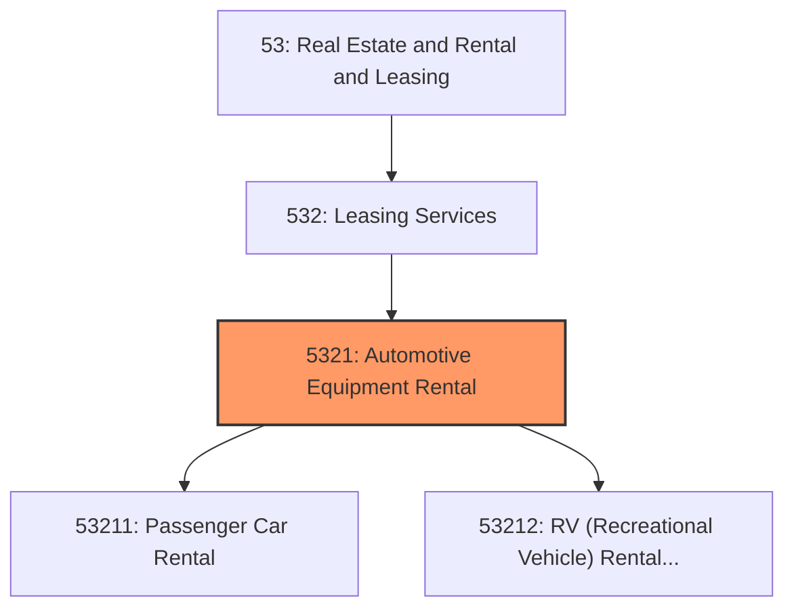
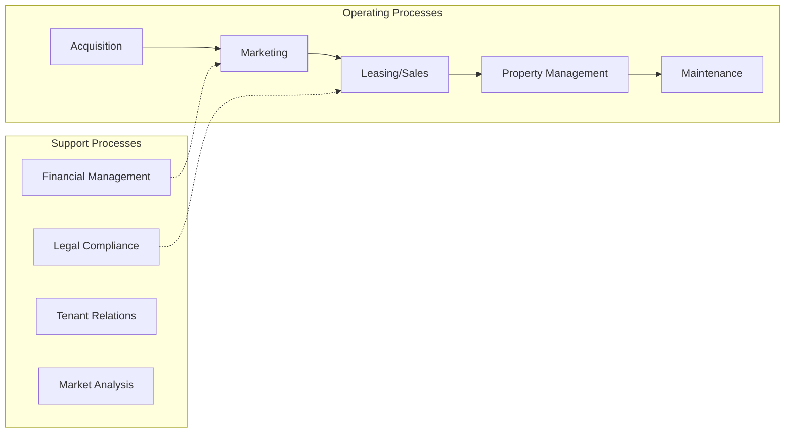

# Automotive Equipment Rental

> This industry group comprises establishments primarily engaged in renting or leasing passenger cars and trucks without drivers and utility trailers.

## Overview

Automotive Equipment Rental represents an important category within the Real Estate and Rental and Leasing sector (NAICS 53). This industry group encompasses establishments primarily engaged in automotive equipment rental.

This industry group comprises establishments primarily engaged in renting or leasing passenger cars and trucks without drivers and utility trailers. These establishments generally operate from a retail-like facility. Some establishments offer only short-term rental, others only longer-term leases, and some provide both types of services.

## Industry Hierarchy

## Key Statistics

| Metric | Value |
|--------|-------|
| NAICS Code | 5321 |
| Level | Industry Group |
| Parent | [Leasing Services](../) |
| Child Industries | 2 |

## Sub-Industries

| Industry | Code | Description |
|----------|------|-------------|
| [Passenger Car Rental](./PassengerCarRental/) | 53211 | This industry comprises establishments primarily engaged in renting or leasing p |
| [RV (Recreational Vehicle) Rental and Leasing](./RvRecreationalVehicleRentalAndLeasing/) | 53212 | See industry description for 532120 |

## Core Business Processes

## Industry Value Chain

```mermaid
graph LR
    subgraph Inputs["Inputs"]
        I1["Resources"]
        I2["Expertise"]
        I3["Technology"]
    end

    subgraph Primary["Primary Activities"]
        A1["Inbound Logistics"]
        A2["Core Operations"]
        A3["Quality Assurance"]
        A4["Outbound/Delivery"]
    end

    subgraph Outputs["Products/Services"]
        O1["Products"]
        O2["Services"]
        O3["Solutions"]
    end

    subgraph Customers["Markets"]
        C1["Businesses"]
        C2["Consumers"]
        C3["Government"]
        C4["Institutions"]
    end

    Inputs --> Primary --> Outputs --> Customers
```

---

*Source: NAICS 5321 - Automotive Equipment Rental*
