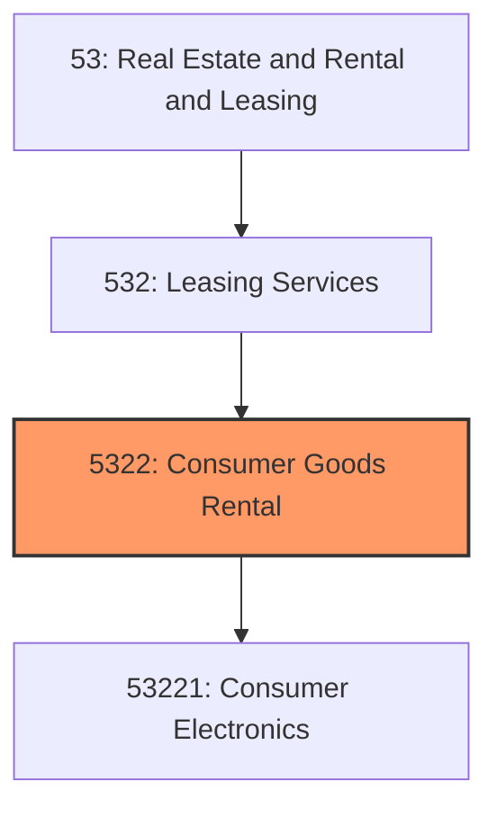
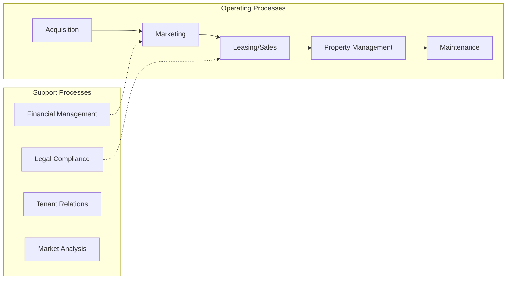

# Consumer Goods Rental

> This industry group comprises establishments primarily engaged in renting personal and household-type goods.

## Overview

Consumer Goods Rental represents an important category within the Real Estate and Rental and Leasing sector (NAICS 53). This industry group encompasses establishments primarily engaged in consumer goods rental.

This industry group comprises establishments primarily engaged in renting personal and household-type goods. Establishments classified in this industry group generally provide short-term rental although in some instances, the goods may be leased for longer periods of time. These establishments often operate from a retail-like or storefront facility.

## Industry Hierarchy

## Key Statistics

| Metric | Value |
|--------|-------|
| NAICS Code | 5322 |
| Level | Industry Group |
| Parent | [Leasing Services](../) |
| Child Industries | 1 |

## Sub-Industries

| Industry | Code | Description |
|----------|------|-------------|
| [Consumer Electronics](./ConsumerElectronics/) | 53221 | See industry description for 532210 |

## Core Business Processes

## Industry Value Chain

```mermaid
graph LR
    subgraph Inputs["Inputs"]
        I1["Resources"]
        I2["Expertise"]
        I3["Technology"]
    end

    subgraph Primary["Primary Activities"]
        A1["Inbound Logistics"]
        A2["Core Operations"]
        A3["Quality Assurance"]
        A4["Outbound/Delivery"]
    end

    subgraph Outputs["Products/Services"]
        O1["Products"]
        O2["Services"]
        O3["Solutions"]
    end

    subgraph Customers["Markets"]
        C1["Businesses"]
        C2["Consumers"]
        C3["Government"]
        C4["Institutions"]
    end

    Inputs --> Primary --> Outputs --> Customers
```

---

*Source: NAICS 5322 - Consumer Goods Rental*
