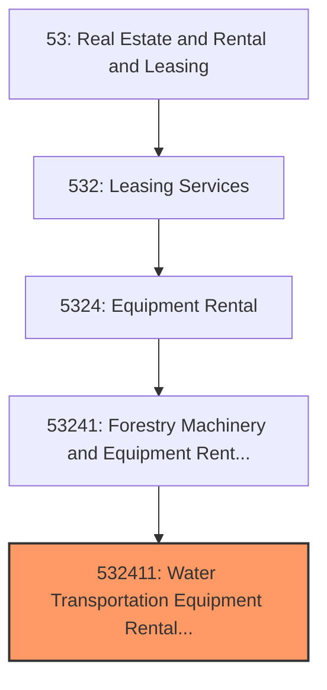
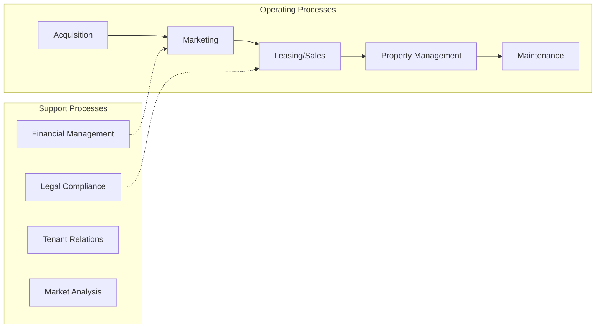

# Water Transportation Equipment Rental and Leasing

> This U.S.

## Overview

Water Transportation Equipment Rental and Leasing represents a specialized segment within the Real Estate and Rental and Leasing sector (NAICS 53). This national industry encompasses establishments primarily engaged in water transportation equipment rental and leasing.

This U.S. industry comprises establishments primarily engaged in renting or leasing off-highway transportation equipment without operators, such as aircraft, railroad cars, steamships, or tugboats. Cross-References. Establishments primarily engaged in--

## Industry Hierarchy

## Key Statistics

| Metric | Value |
|--------|-------|
| NAICS Code | 532411 |
| Level | National Industry |
| Parent | [Forestry Machinery and Equipment Rental and Leasing](../) |
| Child Industries | 0 |

## Core Business Processes

## Industry Value Chain

```mermaid
graph LR
    subgraph Inputs["Inputs"]
        I1["Resources"]
        I2["Expertise"]
        I3["Technology"]
    end

    subgraph Primary["Primary Activities"]
        A1["Inbound Logistics"]
        A2["Core Operations"]
        A3["Quality Assurance"]
        A4["Outbound/Delivery"]
    end

    subgraph Outputs["Products/Services"]
        O1["Products"]
        O2["Services"]
        O3["Solutions"]
    end

    subgraph Customers["Markets"]
        C1["Businesses"]
        C2["Consumers"]
        C3["Government"]
        C4["Institutions"]
    end

    Inputs --> Primary --> Outputs --> Customers
```

---

*Source: NAICS 532411 - Water Transportation Equipment Rental and Leasing*
