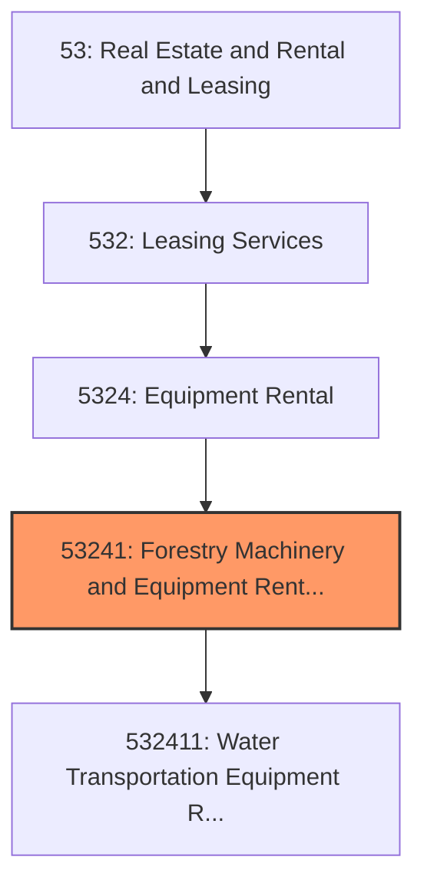
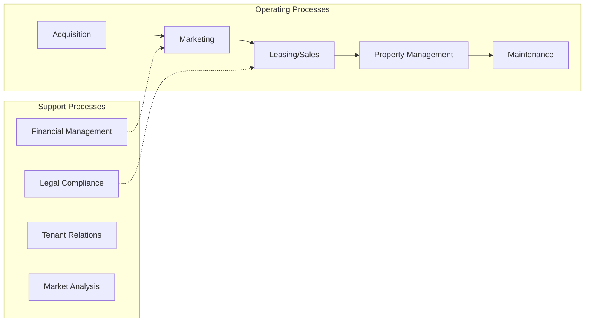

# Forestry Machinery and Equipment Rental and Leasing

> This industry comprises establishments primarily engaged in renting or leasing one or more of the following without operators: heavy construction, off-highway transportation, mining, and forestry machinery and equipment.

## Overview

Forestry Machinery and Equipment Rental and Leasing represents an important category within the Real Estate and Rental and Leasing sector (NAICS 53). This industry encompasses establishments primarily engaged in forestry machinery and equipment rental and leasing.

This industry comprises establishments primarily engaged in renting or leasing one or more of the following without operators: heavy construction, off-highway transportation, mining, and forestry machinery and equipment. Establishments in this industry may rent or lease products, such as aircraft, railroad cars, steamships, tugboats, bulldozers, earthmoving equipment, well drilling machinery and equipment, or cranes. Cross-References. Establishments primarily engaged in--

## Industry Hierarchy

## Key Statistics

| Metric | Value |
|--------|-------|
| NAICS Code | 53241 |
| Level | Industry |
| Parent | [Equipment Rental](../) |
| Child Industries | 1 |

## Sub-Industries

| Industry | Code | Description |
|----------|------|-------------|
| [Water Transportation Equipment Rental and Leasing](./WaterTransportationEquipmentRentalAndLeasing.mdx) | 532411 | This U |

## Core Business Processes

## Industry Value Chain

```mermaid
graph LR
    subgraph Inputs["Inputs"]
        I1["Resources"]
        I2["Expertise"]
        I3["Technology"]
    end

    subgraph Primary["Primary Activities"]
        A1["Inbound Logistics"]
        A2["Core Operations"]
        A3["Quality Assurance"]
        A4["Outbound/Delivery"]
    end

    subgraph Outputs["Products/Services"]
        O1["Products"]
        O2["Services"]
        O3["Solutions"]
    end

    subgraph Customers["Markets"]
        C1["Businesses"]
        C2["Consumers"]
        C3["Government"]
        C4["Institutions"]
    end

    Inputs --> Primary --> Outputs --> Customers
```

## Market Context

Manufacturing transforms raw materials into finished goods, with Industry 4.0 driving automation, digitalization, and smart factory implementations.

| Aspect | Details |
|--------|---------|
| Industry Sector | RealEstate |
| NAICS/SIC Code | 53241 |
| Market Segment | Forestry Machinery and Equipment Rental and Leasing |

## Key Business Processes

- Production planning
- Manufacturing operations
- Quality assurance
- Inventory management
- Distribution and logistics

## Common Occupations

- [Industrial Production Managers](/occupations/Management/IndustrialProductionManagers)
- [Production Workers](/occupations/Production/ProductionWorkers)
- [Quality Control Inspectors](/occupations/Production/QualityControlInspectors)
- [Industrial Engineers](/occupations/Engineering/IndustrialEngineers)

## Regulations and Standards

- OSHA Manufacturing Standards
- EPA Environmental Regulations
- FDA regulations (where applicable)
- ISO quality standards
- Industry-specific certifications

## Technology and Tools

- Industrial automation and robotics
- Enterprise Resource Planning (ERP)
- Quality management systems
- Predictive maintenance
- IoT and smart manufacturing

## Industry Trends

- Digital transformation and automation adoption
- Sustainability and environmental compliance focus
- Workforce development and skills training
- Supply chain resilience and optimization
- Customer experience enhancement

---

*Source: NAICS 53241 - Forestry Machinery and Equipment Rental and Leasing*
