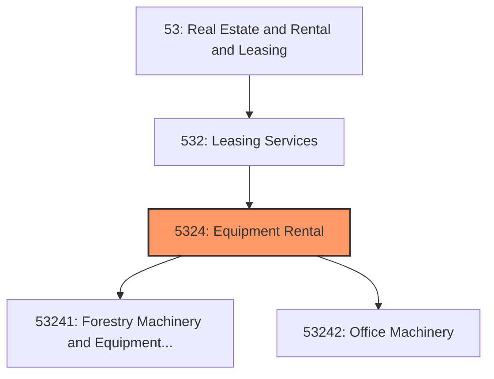
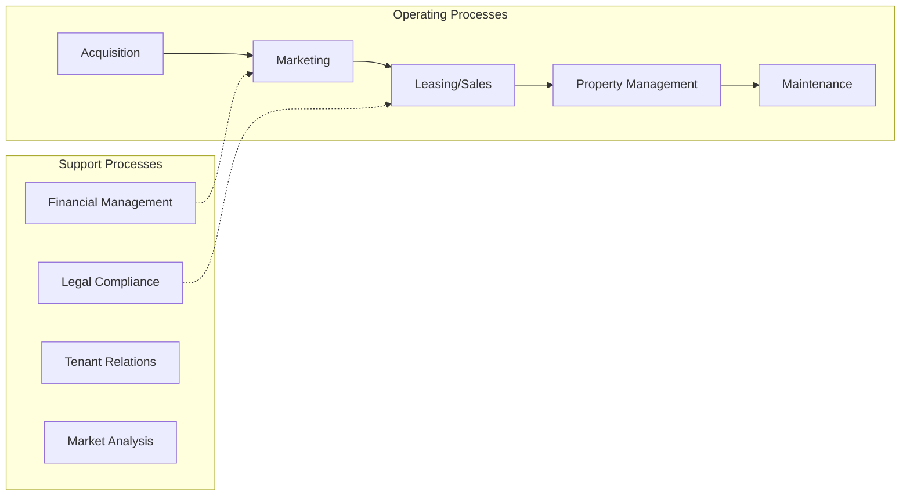

# Equipment Rental

> This industry group comprises establishments primarily engaged in renting or leasing commercial-type and industrial-type machinery and equipment.

## Overview

Equipment Rental represents an important category within the Real Estate and Rental and Leasing sector (NAICS 53). This industry group encompasses establishments primarily engaged in equipment rental.

This industry group comprises establishments primarily engaged in renting or leasing commercial-type and industrial-type machinery and equipment. Establishments included in this industry group are generally involved in providing capital or investment-type equipment that clients use in their business operations. These establishments typically cater to a business clientele and do not generally operate a retail-like or storefront facility.

## Industry Hierarchy

## Key Statistics

| Metric | Value |
|--------|-------|
| NAICS Code | 5324 |
| Level | Industry Group |
| Parent | [Leasing Services](../) |
| Child Industries | 2 |

## Sub-Industries

| Industry | Code | Description |
|----------|------|-------------|
| [Forestry Machinery and Equipment Rental and Leasing](./ForestryMachineryAndEquipmentRentalAndLeasing/) | 53241 | This industry comprises establishments primarily engaged in renting or leasing o |
| [Office Machinery](./OfficeMachinery/) | 53242 | See industry description for 532420 |

## Related Occupations

- [Property and Real Estate Managers](/occupations/Management/PropertyRealEstateAndCommunityAssociationManagers) - Manage real property operations
- [Real Estate Brokers](/occupations/Sales/RealEstateBrokers) - Operate real estate offices
- [Real Estate Sales Agents](/occupations/Sales/RealEstateSalesAgents) - Rent, buy, or sell property
- [Appraisers and Assessors of Real Estate](/occupations/Business/AppraisersAndAssessorsOfRealEstate) - Appraise real property value

## Core Business Processes

## Industry Value Chain

```mermaid
graph LR
    subgraph Inputs["Inputs"]
        I1["Resources"]
        I2["Expertise"]
        I3["Technology"]
    end

    subgraph Primary["Primary Activities"]
        A1["Inbound Logistics"]
        A2["Core Operations"]
        A3["Quality Assurance"]
        A4["Outbound/Delivery"]
    end

    subgraph Outputs["Products/Services"]
        O1["Products"]
        O2["Services"]
        O3["Solutions"]
    end

    subgraph Customers["Markets"]
        C1["Businesses"]
        C2["Consumers"]
        C3["Government"]
        C4["Institutions"]
    end

    Inputs --> Primary --> Outputs --> Customers
```

## Regulatory Environment

- **HUD** (Department of Housing and Urban Development) - Enforces fair housing laws
- **State Real Estate Commissions** - License and regulate agents and brokers
- **Local Zoning Boards** - Govern land use and property development
- **CFPB** (Consumer Financial Protection Bureau) - Regulates mortgage and lending practices

## Technology & Innovation

- **PropTech** - Digital platforms for property management, leasing, and tenant engagement
- **Smart Buildings** - IoT sensors for energy management, security, and occupant comfort
- **Virtual Tours** - 3D property walkthroughs and AI-powered property valuation
- **Blockchain in Real Estate** - Tokenized property ownership and smart contract transactions

## Industry Outlook

The real estate sector is adapting to shifting work and lifestyle patterns, with hybrid work models influencing demand for office, residential, and mixed-use properties. PropTech solutions are transforming property management, valuation, and tenant experience. Sustainability and ESG considerations increasingly drive investment decisions, while housing affordability remains a central policy challenge.

---

*Source: NAICS 5324 - Equipment Rental*
