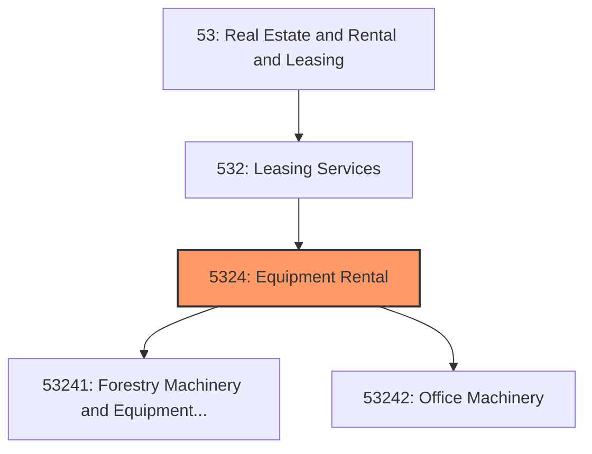
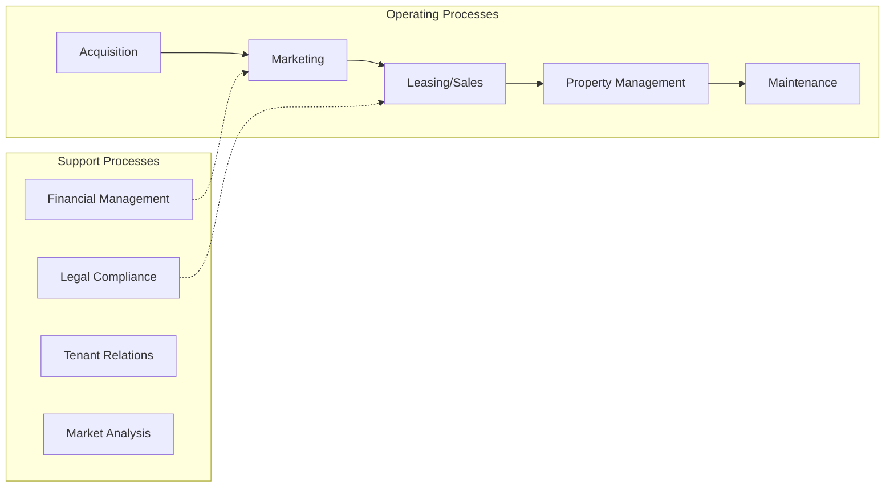

# Equipment Rental

> This industry group comprises establishments primarily engaged in renting or leasing commercial-type and industrial-type machinery and equipment.

## Overview

Equipment Rental represents an important category within the Real Estate and Rental and Leasing sector (NAICS 53). This industry group encompasses establishments primarily engaged in equipment rental.

This industry group comprises establishments primarily engaged in renting or leasing commercial-type and industrial-type machinery and equipment. Establishments included in this industry group are generally involved in providing capital or investment-type equipment that clients use in their business operations. These establishments typically cater to a business clientele and do not generally operate a retail-like or storefront facility.

## Industry Hierarchy

## Key Statistics

| Metric | Value |
|--------|-------|
| NAICS Code | 5324 |
| Level | Industry Group |
| Parent | [Leasing Services](../) |
| Child Industries | 2 |

## Sub-Industries

| Industry | Code | Description |
|----------|------|-------------|
| [Forestry Machinery and Equipment Rental and Leasing](./ForestryMachineryAndEquipmentRentalAndLeasing/) | 53241 | This industry comprises establishments primarily engaged in renting or leasing o |
| [Office Machinery](./OfficeMachinery/) | 53242 | See industry description for 532420 |

## Core Business Processes

## Industry Value Chain

```mermaid
graph LR
    subgraph Inputs["Inputs"]
        I1["Resources"]
        I2["Expertise"]
        I3["Technology"]
    end

    subgraph Primary["Primary Activities"]
        A1["Inbound Logistics"]
        A2["Core Operations"]
        A3["Quality Assurance"]
        A4["Outbound/Delivery"]
    end

    subgraph Outputs["Products/Services"]
        O1["Products"]
        O2["Services"]
        O3["Solutions"]
    end

    subgraph Customers["Markets"]
        C1["Businesses"]
        C2["Consumers"]
        C3["Government"]
        C4["Institutions"]
    end

    Inputs --> Primary --> Outputs --> Customers
```

---

*Source: NAICS 5324 - Equipment Rental*
