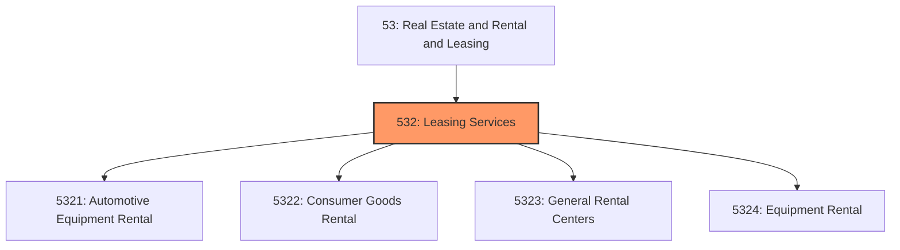
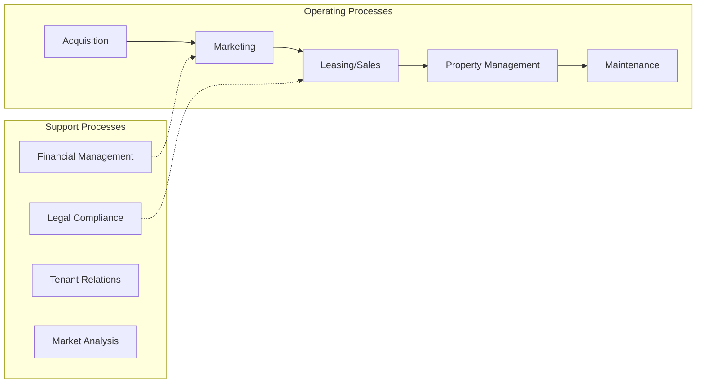

# Leasing Services

> Industries in the Rental and Leasing Services subsector include establishments that provide a wide array of tangible goods, such as automobiles, computers, consumer goods, and industrial machinery and equipment, to customers in return for a periodic rental or lease payment.

## Overview

Leasing Services represents an important category within the Real Estate and Rental and Leasing sector (NAICS 53). This subsector encompasses establishments primarily engaged in leasing services.

Industries in the Rental and Leasing Services subsector include establishments that provide a wide array of tangible goods, such as automobiles, computers, consumer goods, and industrial machinery and equipment, to customers in return for a periodic rental or lease payment. The subsector includes two main types of establishments: (1) those that are engaged in renting consumer goods and equipment and (2) those that are engaged in leasing machinery and equipment often used for business operations. The first type typically operates from a retail-like or storefront facility and maintains inventories of goods that are rented for short periods of time. The latter type typically does not operate from retail-like locations or maintain inventories, and usually offers longer-term leases. These establishments work directly with clients to enable them to acquire the use of equipment on a lease basis, or they work with equipment vendors or dealers to support the marketing of equipment to their customers under lease arrangements. Equipment lessors generally structure lease contracts to meet the specialized needs of their clients and use their remarketing expertise to find other users for previously leased equipment. Establishments that provide operating and capital (i.e., finance) leases are included in this subsector. Establishments primarily engaged in leasing in combination with providing loans are classified in Sector 52, Finance and Insurance. Establishments primarily engaged in leasing real property are classified in Subsector 531, Real Estate. Establishments primarily engaged in renting or leasing equipment with operators are classified in various subsectors of NAICS depending on the nature of the services provided (e.g., transportation, construction, agriculture). These activities are excluded from this subsector since the client is paying for the expertise and knowledge of the equipment operator, in addition to the rental of the equipment. In many cases, such as the rental of heavy construction equipment, the operator is essential to operate the equipment. Likewise, since the provision of crop harvesting services includes both the equipment and operator, it is included in Subsector 115, Support Activities for Agriculture and Forestry. The rental or leasing of copyrighted works is classified in Sector 51, Information, and the rental or leasing of nonfinancial intangible assets, such as patents, trademarks, and/or licensing agreements, is classified in Subsector 533, Lessors of Nonfinancial Intangible Assets (except Copyrighted Works).

## Industry Hierarchy

## Key Statistics

| Metric | Value |
|--------|-------|
| NAICS Code | 532 |
| Level | Subsector |
| Parent | [Real Estate](../) |
| Child Industries | 4 |

## Sub-Industries

| Industry | Code | Description |
|----------|------|-------------|
| [Automotive Equipment Rental](./AutomotiveEquipmentRental/) | 5321 | This industry group comprises establishments primarily engaged in renting or lea |
| [Consumer Goods Rental](./ConsumerGoodsRental/) | 5322 | This industry group comprises establishments primarily engaged in renting person |
| [General Rental Centers](./GeneralRentalCenters/) | 5323 | General Rental Centers |
| [Equipment Rental](./EquipmentRental/) | 5324 | This industry group comprises establishments primarily engaged in renting or lea |

## Core Business Processes

## Industry Value Chain

---

*Source: NAICS 532 - Leasing Services*
