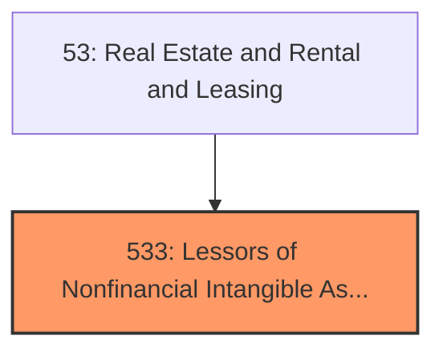
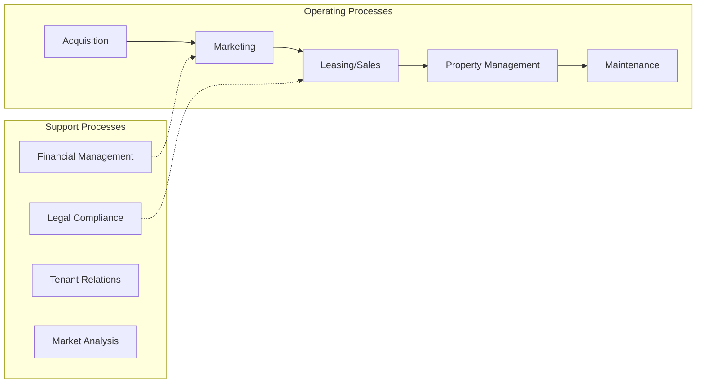

# Lessors of Nonfinancial Intangible Assets

> Industries in the Lessors of Nonfinancial Intangible Assets (except Copyrighted Works) subsector include establishments primarily engaged in assigning rights to assets, such as patents, trademarks, brand names, and/or franchise agreements, for which a royalty payment or licensing fee is paid to the asset holder.

## Overview

Lessors of Nonfinancial Intangible Assets represents an important category within the Real Estate and Rental and Leasing sector (NAICS 53). This subsector encompasses establishments primarily engaged in lessors of nonfinancial intangible assets.

Industries in the Lessors of Nonfinancial Intangible Assets (except Copyrighted Works) subsector include establishments primarily engaged in assigning rights to assets, such as patents, trademarks, brand names, and/or franchise agreements, for which a royalty payment or licensing fee is paid to the asset holder. Establishments in this subsector own the patents, trademarks, and/or franchise agreements that they allow others to use or reproduce for a fee and may or may not have created those assets. Establishments that allow franchisees the use of the franchise name, contingent on the franchisee buying products or services from the franchisor, are classified elsewhere. Excluded from this subsector are establishments primarily engaged in leasing real property and establishments primarily engaged in leasing tangible assets, such as automobiles, computers, consumer goods, and industrial machinery and equipment. These establishments are classified in Subsector 531, Real Estate, and Subsector 532, Rental and Leasing Services, respectively.

## Industry Hierarchy

## Key Statistics

| Metric | Value |
|--------|-------|
| NAICS Code | 533 |
| Level | Subsector |
| Parent | [Real Estate](../) |
| Child Industries | 0 |

## Core Business Processes

## Industry Value Chain

```mermaid
graph LR
    subgraph Inputs["Inputs"]
        I1["Resources"]
        I2["Expertise"]
        I3["Technology"]
    end

    subgraph Primary["Primary Activities"]
        A1["Inbound Logistics"]
        A2["Core Operations"]
        A3["Quality Assurance"]
        A4["Outbound/Delivery"]
    end

    subgraph Outputs["Products/Services"]
        O1["Products"]
        O2["Services"]
        O3["Solutions"]
    end

    subgraph Customers["Markets"]
        C1["Businesses"]
        C2["Consumers"]
        C3["Government"]
        C4["Institutions"]
    end

    Inputs --> Primary --> Outputs --> Customers
```

---

*Source: NAICS 533 - Lessors of Nonfinancial Intangible Assets*
