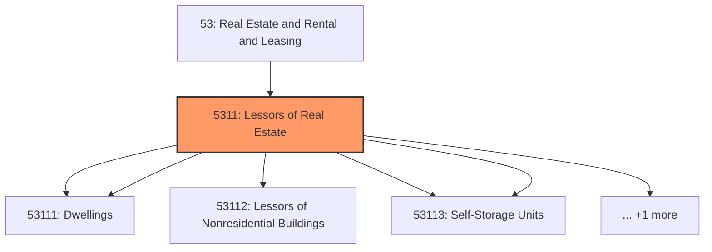
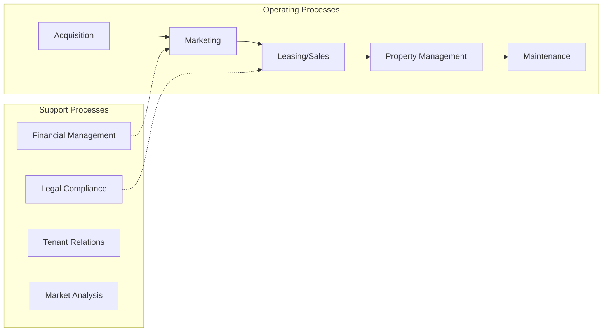

# Lessors of Real Estate

> This industry group comprises establishments primarily engaged in acting as lessors of (1) residential buildings and dwellings; (2) nonresidential buildings (except miniwarehouses); (3) miniwarehouses and self-storage units; and (4) other real estate property.

## Overview

Lessors of Real Estate represents an important category within the Real Estate and Rental and Leasing sector (NAICS 53).

This industry group comprises establishments primarily engaged in acting as lessors of (1) residential buildings and dwellings; (2) nonresidential buildings (except miniwarehouses); (3) miniwarehouses and self-storage units; and (4) other real estate property. This industry group includes equity real estate investment trusts (REITs) primarily engaged in leasing buildings, dwellings, or other real estate property to others.

## Industry Hierarchy

## Key Statistics

| Metric | Value |
|--------|-------|
| NAICS Code | 5311 |
| Level | Industry Group |
| Child Industries | 6 |

## Sub-Industries

| Industry | Code | Description |
|----------|------|-------------|
| [Lessors of Residential Buildings](./LessorsOfResidentialBuildings/) | 53111 | See industry description for 531110 |
| [Dwellings](./Dwellings/) | 53111 | See industry description for 531110 |
| [Lessors of Nonresidential Buildings](./LessorsOfNonresidentialBuildings/) | 53112 | See industry description for 531120 |
| [Lessors of Miniwarehouses](./LessorsOfMiniwarehouses/) | 53113 | See industry description for 531130 |
| [Self-Storage Units](./SelfstorageUnits/) | 53113 | See industry description for 531130 |
| [Lessors of Real Estate Property](./LessorsOfRealEstateProperty/) | 53119 | See industry description for 531190 |

## Related Occupations

See the [occupations directory](/occupations) for roles commonly found in this industry.

## Core Business Processes

## Industry Value Chain

```mermaid
graph LR
    subgraph Inputs["Inputs"]
        I1["Resources"]
        I2["Expertise"]
        I3["Technology"]
    end

    subgraph Primary["Primary Activities"]
        A1["Inbound Logistics"]
        A2["Core Operations"]
        A3["Quality Assurance"]
        A4["Outbound/Delivery"]
    end

    subgraph Outputs["Products/Services"]
        O1["Products"]
        O2["Services"]
        O3["Solutions"]
    end

    subgraph Customers["Markets"]
        C1["Businesses"]
        C2["Consumers"]
        C3["Government"]
        C4["Institutions"]
    end

    Inputs --> Primary --> Outputs --> Customers
```

## Market Context

Manufacturing transforms raw materials into finished goods, with Industry 4.0 driving automation, digitalization, and smart factory implementations.

| Aspect | Details |
|--------|---------|
| Industry Sector | RealEstate |
| NAICS/SIC Code | 5311 |
| Market Segment | Lessors of Real Estate |

## Key Business Processes

- Production planning
- Manufacturing operations
- Quality assurance
- Inventory management
- Distribution and logistics

## Common Occupations

- [Industrial Production Managers](/occupations/Management/IndustrialProductionManagers)
- [Production Workers](/occupations/Production/ProductionWorkers)
- [Quality Control Inspectors](/occupations/Production/QualityControlInspectors)
- [Industrial Engineers](/occupations/Engineering/IndustrialEngineers)

## Regulations and Standards

- OSHA Manufacturing Standards
- EPA Environmental Regulations
- FDA regulations (where applicable)
- ISO quality standards
- Industry-specific certifications

## Technology and Tools

- Industrial automation and robotics
- Enterprise Resource Planning (ERP)
- Quality management systems
- Predictive maintenance
- IoT and smart manufacturing

## Industry Trends

- Digital transformation and automation adoption
- Sustainability and environmental compliance focus
- Workforce development and skills training
- Supply chain resilience and optimization
- Customer experience enhancement

---

*Source: NAICS 5311 - Lessors of Real Estate*
