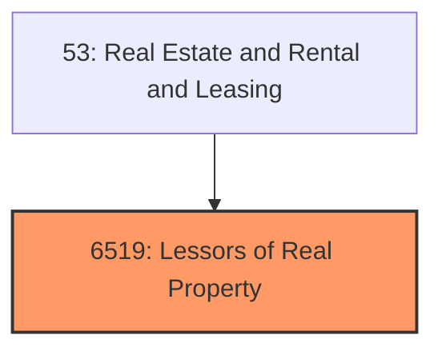
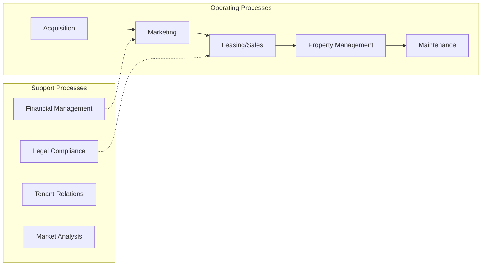

# Lessors of Real Property

> Lessors of Real Property.

## Overview

Lessors of Real Property represents an important category within the Real Estate and Rental and Leasing sector (SIC 6519).

## Industry Hierarchy

## Key Statistics

| Metric | Value |
|--------|-------|
| SIC Code | 6519 |
| Level | SIC (6519) |
| Child Industries | 0 |

## Related Occupations

- [Property and Real Estate Managers](/occupations/Management/PropertyRealEstateAndCommunityAssociationManagers) - Manage real property operations
- [Real Estate Brokers](/occupations/Sales/RealEstateBrokers) - Operate real estate offices
- [Real Estate Sales Agents](/occupations/Sales/RealEstateSalesAgents) - Rent, buy, or sell property
- [Appraisers and Assessors of Real Estate](/occupations/Business/AppraisersAndAssessorsOfRealEstate) - Appraise real property value

## Core Business Processes

## Industry Value Chain

```mermaid
graph LR
    subgraph Inputs["Inputs"]
        I1["Resources"]
        I2["Expertise"]
        I3["Technology"]
    end

    subgraph Primary["Primary Activities"]
        A1["Inbound Logistics"]
        A2["Core Operations"]
        A3["Quality Assurance"]
        A4["Outbound/Delivery"]
    end

    subgraph Outputs["Products/Services"]
        O1["Products"]
        O2["Services"]
        O3["Solutions"]
    end

    subgraph Customers["Markets"]
        C1["Businesses"]
        C2["Consumers"]
        C3["Government"]
        C4["Institutions"]
    end

    Inputs --> Primary --> Outputs --> Customers
```

## Regulatory Environment

- **HUD** (Department of Housing and Urban Development) - Enforces fair housing laws
- **State Real Estate Commissions** - License and regulate agents and brokers
- **Local Zoning Boards** - Govern land use and property development
- **CFPB** (Consumer Financial Protection Bureau) - Regulates mortgage and lending practices

## Technology & Innovation

- **PropTech** - Digital platforms for property management, leasing, and tenant engagement
- **Smart Buildings** - IoT sensors for energy management, security, and occupant comfort
- **Virtual Tours** - 3D property walkthroughs and AI-powered property valuation
- **Blockchain in Real Estate** - Tokenized property ownership and smart contract transactions

## Industry Outlook

The real estate sector is adapting to shifting work and lifestyle patterns, with hybrid work models influencing demand for office, residential, and mixed-use properties. PropTech solutions are transforming property management, valuation, and tenant experience. Sustainability and ESG considerations increasingly drive investment decisions, while housing affordability remains a central policy challenge.

## Market Context

Manufacturing transforms raw materials into finished goods, with Industry 4.0 driving automation, digitalization, and smart factory implementations.

| Aspect | Details |
|--------|---------|
| Industry Sector | RealEstate |
| NAICS/SIC Code | 6519 |
| Market Segment | Lessors of Real Property |

## Key Business Processes

- Production planning
- Manufacturing operations
- Quality assurance
- Inventory management
- Distribution and logistics

## Common Occupations

- [Industrial Production Managers](/occupations/Management/IndustrialProductionManagers)
- [Production Workers](/occupations/Production/ProductionWorkers)
- [Quality Control Inspectors](/occupations/Production/QualityControlInspectors)
- [Industrial Engineers](/occupations/Engineering/IndustrialEngineers)

## Regulations and Standards

- OSHA Manufacturing Standards
- EPA Environmental Regulations
- FDA regulations (where applicable)
- ISO quality standards
- Industry-specific certifications

## Technology and Tools

- Industrial automation and robotics
- Enterprise Resource Planning (ERP)
- Quality management systems
- Predictive maintenance
- IoT and smart manufacturing

## Industry Trends

- Digital transformation and automation adoption
- Sustainability and environmental compliance focus
- Workforce development and skills training
- Supply chain resilience and optimization
- Customer experience enhancement

---

*Source: SIC 6519 - Lessors of Real Property*
