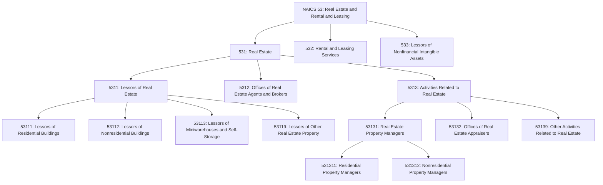
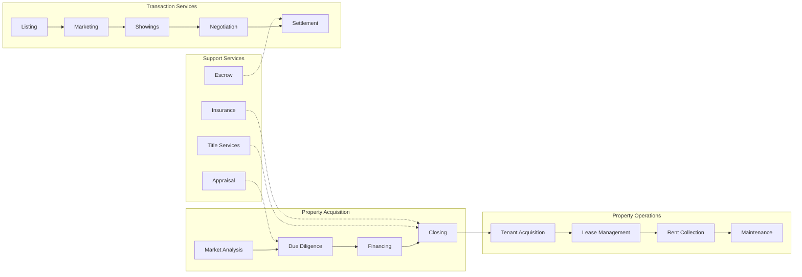
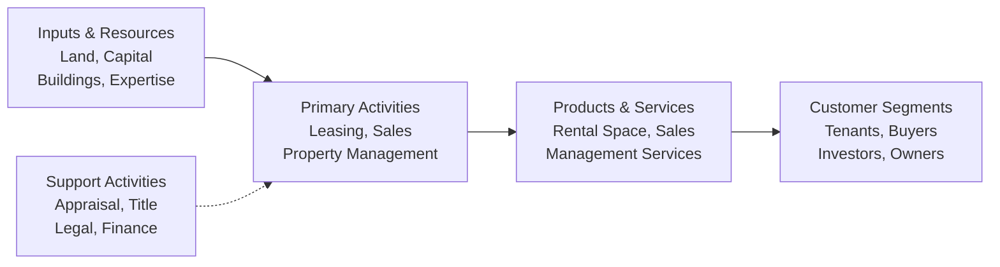

# Real Estate

> The Real Estate subsector comprises establishments primarily engaged in renting or leasing real estate to others; managing real estate for others; selling, buying, or renting real estate for others; and providing other real estate related services, such as appraisal services.

## Overview

The Real Estate subsector is a foundational component of the broader Real Estate and Rental and Leasing sector (NAICS 53). This subsector encompasses establishments that own, lease, or manage real property, as well as those providing ancillary services such as real estate brokerage, property management, and appraisal.

Real estate establishments generate revenue through three primary mechanisms:

1. **Leasing Income**: Collecting rent from tenants occupying residential, commercial, or industrial properties
2. **Transaction Fees**: Earning commissions from facilitating property sales or lease negotiations
3. **Management Fees**: Charging fees for overseeing property operations, maintenance, and tenant relations

The subsector includes equity real estate investment trusts (REITs) primarily engaged in leasing buildings, dwellings, or other real estate property to others. A substantial proportion of property management is self-performed by lessors, reflecting the close integration between property ownership and operational management.

## Industry Hierarchy

## Key Statistics

| Metric | Value |
|--------|-------|
| NAICS Code | 531 |
| Level | Subsector |
| Parent Sector | [Real Estate and Rental and Leasing](../) (53) |
| Industry Groups | 3 |
| Industries | 8 |
| National Industries | 12 |

## Sub-Industries

| Industry Group | Code | Description |
|----------------|------|-------------|
| Lessors of Real Estate | 5311 | Establishments acting as lessors of residential, nonresidential, miniwarehouses, and other real estate property; includes equity REITs |
| Offices of Real Estate Agents and Brokers | 5312 | Establishments primarily engaged in acting as agents or brokers in buying, selling, renting, or managing real estate for others |
| Activities Related to Real Estate | 5313 | Property management, appraisal, and other real estate services |

## Related Occupations

- [Real Estate Brokers](/occupations/RealEstateBrokers) - Property transaction facilitation
- [Real Estate Agents and Sales Associates](/occupations/RealEstateAgents) - Property sales and leasing
- [Property Managers](/occupations/PropertyManagers) - Property operations oversight
- [Real Estate Appraisers](/occupations/RealEstateAppraisers) - Property valuation
- [Construction Managers](/occupations/ConstructionManagers) - Development project oversight
- [Financial Managers](/occupations/FinancialManagers) - Real estate investment analysis
- [Chief Executives](/occupations/ChiefExecutives) - Strategic leadership
- [Facilities Managers](/occupations/FacilitiesManagers) - Building operations

## Core Business Processes

### Property Leasing and Management

Managing the lifecycle of lease relationships from tenant acquisition through lease expiration or renewal.

**Key Activities:**
- Market properties and attract qualified tenants
- Screen tenant applications and credit
- Negotiate lease terms and execute agreements
- Collect rent and manage accounts receivable
- Coordinate maintenance and repairs
- Handle tenant inquiries and complaints
- Enforce lease provisions and manage evictions

### Real Estate Brokerage

Facilitating property transactions between buyers and sellers or landlords and tenants.

**Key Activities:**
- List properties for sale or lease
- Conduct comparative market analysis
- Coordinate property showings and open houses
- Negotiate offers and counteroffers
- Manage transaction documentation
- Guide clients through closing processes
- Maintain MLS listings and marketing materials

### Property Appraisal and Valuation

Determining the market value of real property through systematic analysis.

**Key Activities:**
- Inspect properties and assess condition
- Research comparable sales and market data
- Apply valuation methodologies (sales comparison, income, cost)
- Prepare appraisal reports
- Provide expert testimony when required
- Maintain compliance with USPAP standards

## Industry Value Chain

## Property Types

### Residential Real Estate
Includes single-family homes, multifamily apartments, condominiums, and townhouses. Residential lessors provide housing for individuals and families, with lease terms typically ranging from month-to-month to annual agreements.

### Commercial Real Estate
Encompasses office buildings, retail centers, hotels, and mixed-use developments. Commercial leases are typically longer-term (3-10 years) with more complex terms including percentage rent, CAM charges, and tenant improvements.

### Industrial Real Estate
Includes warehouses, distribution centers, manufacturing facilities, and flex space. Industrial properties feature specialized infrastructure such as loading docks, clear heights, and heavy power capacity.

### Specialty Real Estate
Includes self-storage facilities, miniwarehouses, parking structures, and land parcels. These properties often operate with simpler lease structures but require specialized operational expertise.

## Regulatory Environment

The real estate industry operates under extensive regulatory oversight:

- **Fair Housing Act**: Prohibits discrimination in housing based on protected classes
- **Real Estate Settlement Procedures Act (RESPA)**: Governs settlement services and disclosures
- **Truth in Lending Act (TILA)**: Requires disclosure of loan terms and costs
- **State Licensing Requirements**: Real estate agents, brokers, and appraisers must obtain state licenses
- **USPAP Standards**: Uniform Standards of Professional Appraisal Practice govern appraisals
- **Local Zoning and Land Use**: Municipal regulations control property development and use
- **Building Codes**: Safety and construction standards for buildings
- **Environmental Regulations**: Phase I/II assessments, lead paint, asbestos disclosure
- **Landlord-Tenant Laws**: State-specific regulations governing lease relationships

## Technology & Innovation

The real estate industry is experiencing significant digital transformation:

- **Property Technology (PropTech)**: Digital platforms for property search, transactions, and management
- **Multiple Listing Services (MLS)**: Centralized databases of property listings
- **Virtual Tours and 3D Imaging**: Remote property viewing technology
- **Automated Valuation Models (AVMs)**: Algorithm-based property valuation
- **Property Management Software**: Integrated platforms for operations, accounting, and tenant communications
- **Smart Building Technology**: IoT sensors, energy management, and building automation
- **Blockchain Applications**: Title records, smart contracts, and tokenized ownership
- **CRM Systems**: Customer relationship management for agents and brokers
- **Digital Marketing**: SEO, social media, and targeted advertising platforms
- **Electronic Signatures**: DocuSign and similar platforms for remote document execution

## Market Dynamics

### Demand Drivers
- Population growth and household formation
- Employment trends and economic conditions
- Interest rates and mortgage availability
- Migration patterns and urbanization
- Corporate relocations and expansions

### Supply Factors
- Construction activity and development pipelines
- Land availability and entitlements
- Building permits and regulatory approvals
- Construction costs and labor availability
- Adaptive reuse and redevelopment

### Investment Considerations
- Cap rates and yield requirements
- Vacancy and absorption rates
- Rental growth trends
- Operating expense ratios
- Capital expenditure requirements

---

*Source: NAICS 531 - Real Estate*
