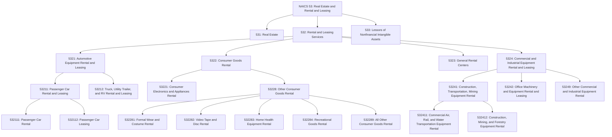
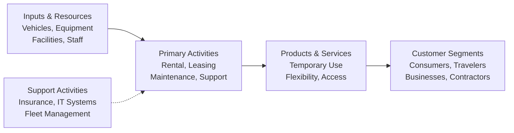

# Rental and Leasing Services

> The Rental and Leasing Services subsector includes establishments that provide a wide array of tangible goods, such as automobiles, computers, consumer goods, and industrial machinery and equipment, to customers in return for a periodic rental or lease payment.

## Overview

The Rental and Leasing Services subsector encompasses two distinct types of establishments:

1. **Consumer Goods Rental**: Establishments engaged in renting consumer goods and equipment, typically operating from retail-like or storefront facilities and maintaining inventories of goods rented for short periods.

2. **Commercial and Industrial Equipment Leasing**: Establishments engaged in leasing machinery and equipment used for business operations, typically offering longer-term leases and working directly with clients or equipment vendors to structure lease arrangements.

Equipment lessors generally structure lease contracts to meet the specialized needs of their clients and use their remarketing expertise to find other users for previously leased equipment. Both operating leases and capital (finance) leases are included in this subsector.

**Important Exclusions:**
- Equipment rental with operators is classified in other sectors (Transportation, Construction, Agriculture) since clients pay for both equipment and operator expertise
- Leasing combined with lending is classified in Finance and Insurance (Sector 52)
- Real property leasing is classified in Real Estate (Subsector 531)
- Copyrighted works rental is classified in Information (Sector 51)
- Nonfinancial intangible assets leasing is classified in Subsector 533

## Industry Hierarchy

## Key Statistics

| Metric | Value |
|--------|-------|
| NAICS Code | 532 |
| Level | Subsector |
| Parent Sector | [Real Estate and Rental and Leasing](../) (53) |
| Industry Groups | 4 |
| Industries | 10 |
| National Industries | 16 |

## Sub-Industries

| Industry Group | Code | Description |
|----------------|------|-------------|
| Automotive Equipment Rental and Leasing | 5321 | Passenger cars, trucks, utility trailers, and recreational vehicles without drivers |
| Consumer Goods Rental | 5322 | Electronics, appliances, formal wear, recreational goods, and other consumer items |
| General Rental Centers | 5323 | Wide range of consumer and commercial equipment from single location |
| Commercial and Industrial Equipment Rental and Leasing | 5324 | Heavy construction equipment, transportation equipment, office machinery |

## Related Occupations

- [Sales Managers](/occupations/SalesManagers) - Rental operations management
- [Customer Service Representatives](/occupations/CustomerServiceRepresentatives) - Counter service and reservations
- [Administrative Services Managers](/occupations/AdministrativeServicesManagers) - Facility and fleet management
- [Transportation, Storage, and Distribution Managers](/occupations/TransportationManagers) - Logistics coordination
- [Automotive Service Technicians](/occupations/AutomotiveServiceTechnicians) - Vehicle maintenance
- [Industrial Machinery Mechanics](/occupations/IndustrialMachineryMechanics) - Equipment maintenance
- [Financial Managers](/occupations/FinancialManagers) - Lease portfolio management
- [Facilities Managers](/occupations/FacilitiesManagers) - Location operations

## Core Business Processes

```mermaid
flowchart LR
    subgraph Acquisition["Asset Acquisition"]
        A1["Fleet Planning"]
        A2["Procurement"]
        A3["Inspection"]
        A4["Inventory"]
    end

    subgraph Operations["Rental Operations"]
        O1["Reservations"]
        O2["Checkout"]
        O3["Usage Period"]
        O4["Return/Check-in"]
    end

    subgraph Maintenance["Asset Management"]
        M1["Inspections"]
        M2["Repairs"]
        M3["Preventive Maint."]
        M4["Reconditioning"]
    end

    subgraph Disposition["Asset Disposition"]
        D1["Depreciation"]
        D2["Remarketing"]
        D3["Sale/Auction"]
        D4["Disposal"]
    end

    A1 --> A2 --> A3 --> A4
    A4 --> O1 --> O2 --> O3 --> O4
    O4 --> M1 --> M2 --> M3 --> M4
    M4 --> D1 --> D2 --> D3 --> D4
```

### Fleet and Inventory Management

Optimizing the composition, utilization, and condition of rental assets.

**Key Activities:**
- Forecast demand and plan fleet composition
- Procure new equipment and vehicles
- Manage inventory levels across locations
- Track asset utilization and performance metrics
- Determine optimal holding periods
- Coordinate fleet redistribution between locations

### Customer Transaction Processing

Managing the complete rental transaction from reservation through return.

**Key Activities:**
- Process reservations and bookings
- Verify customer credentials and payment
- Execute rental agreements and disclosures
- Perform checkout inspections
- Process returns and damage assessments
- Handle billing and payment reconciliation
- Manage customer disputes and claims

### Asset Maintenance and Reconditioning

Ensuring rental assets remain safe, functional, and presentable.

**Key Activities:**
- Conduct pre and post-rental inspections
- Perform preventive maintenance schedules
- Execute repairs and component replacements
- Recondition assets for re-rental
- Maintain safety compliance and certifications
- Track maintenance histories and costs

## Industry Value Chain

## Rental Categories

### Automotive Equipment Rental and Leasing
Establishments renting or leasing passenger cars, trucks, vans, SUVs, utility trailers, and recreational vehicles without drivers. Short-term rental operations serve travelers and temporary transportation needs, while leasing operations provide longer-term vehicle access, often as an alternative to ownership.

**Market Segments:**
- Airport and travel rental
- Local/replacement vehicle rental
- Commercial fleet leasing
- Consumer vehicle leasing

### Consumer Goods Rental
Establishments renting personal and household items including electronics, appliances, furniture, formal wear, costumes, and recreational equipment. These establishments typically operate from storefront locations and serve short-term needs.

**Product Categories:**
- Electronics and appliances (TVs, computers, washers)
- Furniture and home goods
- Formal wear and costumes
- Home health equipment
- Recreational goods (bikes, skis, boats)
- Party and event equipment

### Commercial and Industrial Equipment Rental
Establishments renting commercial-type machinery and equipment to business customers. These operations work directly with clients to structure lease arrangements and often provide specialized equipment for specific projects or operational needs.

**Equipment Types:**
- Construction equipment (excavators, loaders, cranes)
- Mining and forestry machinery
- Office equipment (copiers, computers)
- Medical and scientific equipment
- Commercial air, rail, and water transportation equipment

## Regulatory Environment

The rental and leasing industry operates under various regulatory frameworks:

- **Motor Vehicle Regulations**: State DMV requirements for vehicle rental companies
- **Consumer Protection Laws**: Rental agreement disclosures and damage waiver requirements
- **Airport Concession Agreements**: Regulations governing airport rental car operations
- **TILA/Regulation M**: Truth in Leasing Act requirements for consumer leases
- **UCC Article 2A**: Uniform Commercial Code provisions for lease transactions
- **OSHA Requirements**: Safety regulations for equipment rental operations
- **Environmental Regulations**: Disposal and recycling requirements for used equipment
- **Insurance Requirements**: Liability coverage minimums and customer protection options
- **ADA Compliance**: Accessibility requirements for rental locations and equipment

## Technology & Innovation

The rental and leasing industry is experiencing significant technological advancement:

- **Online Reservations**: Web and mobile booking platforms
- **Fleet Management Systems**: GPS tracking, telematics, and utilization analytics
- **Digital Rental Agreements**: Electronic contracts and e-signatures
- **Self-Service Kiosks**: Automated checkout and return processing
- **Mobile Apps**: Customer account management and rental extensions
- **Predictive Maintenance**: IoT sensors and analytics for equipment monitoring
- **Dynamic Pricing**: Yield management algorithms for rate optimization
- **Key/Access Technology**: Keyless entry and digital access codes
- **Damage Detection**: AI-powered vehicle inspection and documentation
- **Customer Data Platforms**: Personalization and loyalty program management

## Business Model Considerations

### Revenue Streams
- Base rental/lease fees
- Damage waiver and insurance products
- Additional driver and equipment fees
- Fuel service charges
- Late return penalties
- Excess mileage/usage charges
- Delivery and pickup services
- Remarketing gains on asset sales

### Cost Structure
- Asset depreciation
- Financing costs
- Maintenance and repairs
- Insurance and liability
- Facility costs (locations, lots)
- Labor (counter, mechanics)
- Technology systems
- Marketing and customer acquisition

### Key Performance Metrics
- Fleet utilization rate
- Revenue per available unit
- Time utilization percentage
- Average rental duration
- Customer acquisition cost
- Net promoter score
- Maintenance cost per unit
- Residual value performance

---

*Source: NAICS 532 - Rental and Leasing Services*
