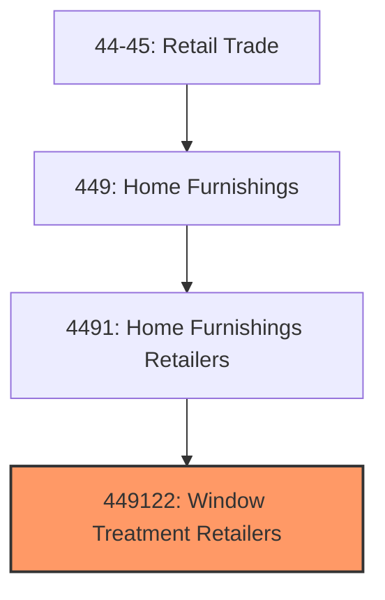
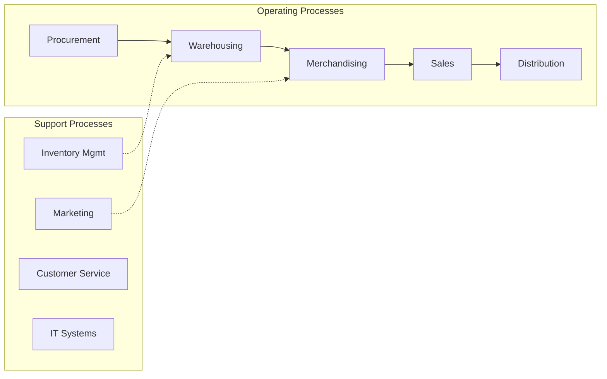

# Window Treatment Retailers

> This U.

## Overview

Window Treatment Retailers represents a specialized segment within the Retail Trade sector (NAICS 44-45).

This U.S. industry comprises establishments primarily engaged in retailing new window treatments, such as curtains, drapes, blinds, and shades. Cross-References. Establishments primarily engaged in--

## Industry Hierarchy

## Key Statistics

| Metric | Value |
|--------|-------|
| NAICS Code | 449122 |
| Level | National Industry |
| Child Industries | 0 |

## Related Occupations

- [Sales Managers](/occupations/Management/SalesManagers) - Direct sales teams and set goals
- [Retail Salespersons](/occupations/Sales/RetailSalespersons) - Sell merchandise in retail settings
- [Cashiers](/occupations/Sales/Cashiers) - Process customer transactions
- [First-Line Supervisors of Retail Sales Workers](/occupations/Sales/FirstLineSupervisorsOfRetailSalesWorkers) - Supervise retail staff

## Core Business Processes

## Industry Value Chain

```mermaid
graph LR
    subgraph Inputs["Inputs"]
        I1["Products"]
        I2["Inventory"]
        I3["Store/Warehouse"]
    end

    subgraph Primary["Primary Activities"]
        A1["Inbound Logistics"]
        A2["Core Operations"]
        A3["Quality Assurance"]
        A4["Outbound/Delivery"]
    end

    subgraph Outputs["Products/Services"]
        O1["Goods for Sale"]
        O2["Services"]
        O3["Delivery"]
    end

    subgraph Customers["Markets"]
        C1["Businesses"]
        C2["Consumers"]
        C3["Institutions"]
        C4["Government"]
    end

    Inputs --> Primary --> Outputs --> Customers
```

## Regulatory Environment

- **FTC** (Federal Trade Commission) - Enforces consumer protection and truth-in-advertising
- **CPSC** (Consumer Product Safety Commission) - Regulates product safety in retail
- **State Consumer Protection Agencies** - Handle retail licensing and consumer complaints
- **ADA** (Americans with Disabilities Act) - Governs accessibility requirements for retail spaces

## Technology & Innovation

- **E-commerce and Omnichannel** - Unified online/offline shopping experiences and last-mile delivery
- **AI Personalization** - Machine learning product recommendations and dynamic pricing
- **Cashierless Stores** - Computer vision and sensor-based automated checkout
- **Augmented Reality** - Virtual try-on, in-store navigation, and product visualization

## Industry Outlook

The retail sector continues its omnichannel evolution, with seamless integration between physical stores and digital channels becoming essential. AI-driven personalization, last-mile delivery innovation, and experiential retail are key differentiators. Consumer preferences for sustainability and social responsibility are influencing product sourcing and business practices across the industry.

## Market Context

Retail connects products to consumers through various channels, with omnichannel strategies and e-commerce reshaping traditional retail models.

| Aspect | Details |
|--------|---------|
| Industry Sector | Retail |
| NAICS/SIC Code | 449122 |
| Market Segment | Window Treatment Retailers |

## Key Business Processes

- Merchandising and display
- Sales and customer service
- Inventory management
- Loss prevention
- Omnichannel fulfillment

## Common Occupations

- [Retail Managers](/occupations/Management/SalesManagers)
- [Retail Salespersons](/occupations/Sales/RetailSalespersons)
- [Cashiers](/occupations/Sales/Cashiers)
- [Stock Clerks](/occupations/Sales/StockClerksAndOrderFillers)

## Regulations and Standards

- Consumer protection laws
- Payment Card Industry (PCI) compliance
- Labor and employment regulations
- Product safety standards
- State retail licensing

## Technology and Tools

- Point-of-sale (POS) systems
- Inventory management software
- E-commerce platforms
- Customer relationship management (CRM)
- Mobile payment solutions

## Industry Trends

- Digital transformation and automation adoption
- Sustainability and environmental compliance focus
- Workforce development and skills training
- Supply chain resilience and optimization
- Customer experience enhancement

---

*Source: NAICS 449122 - Window Treatment Retailers*
