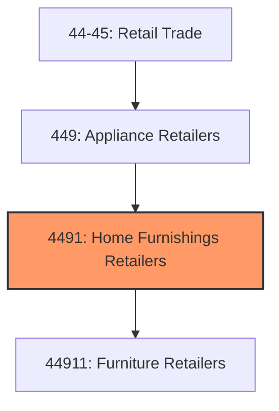
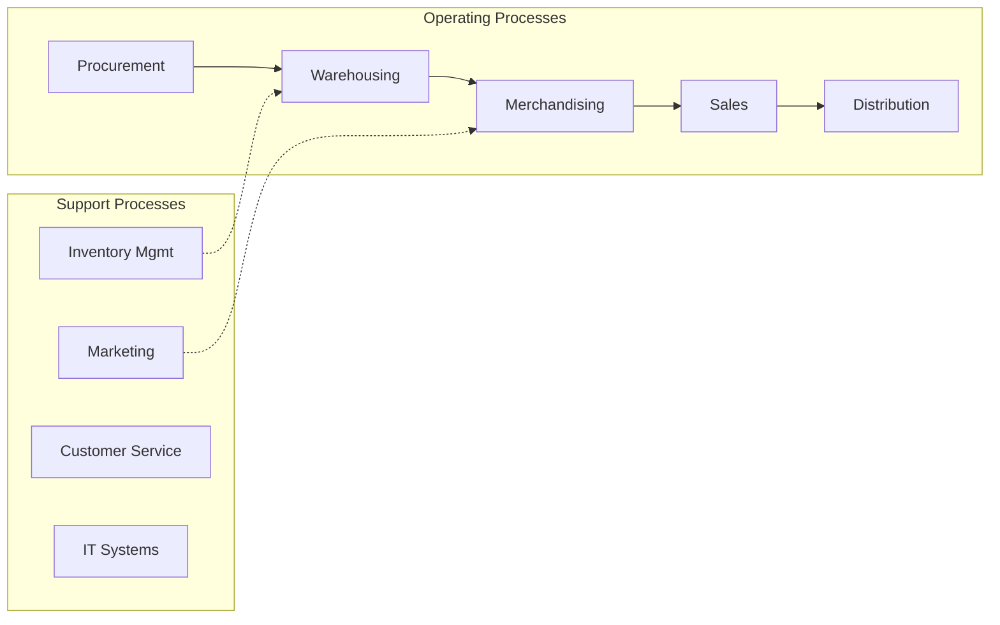

# Home Furnishings Retailers

> This industry group comprises establishments primarily engaged in retailing new furniture and home furnishings.

## Overview

Home Furnishings Retailers represents an important category within the Retail Trade sector (NAICS 44-45). This industry group encompasses establishments primarily engaged in home furnishings retailers.

This industry group comprises establishments primarily engaged in retailing new furniture and home furnishings. Establishments in this industry group with fixed point-of-sale locations may operate from showrooms and have substantial areas for the presentation of their products. Establishments in this industry group may provide incidental services, including interior decorating, product assembly, installation, or repair services.

## Industry Hierarchy

## Key Statistics

| Metric | Value |
|--------|-------|
| NAICS Code | 4491 |
| Level | Industry Group |
| Parent | [Appliance Retailers](../) |
| Child Industries | 1 |

## Sub-Industries

| Industry | Code | Description |
|----------|------|-------------|
| [Furniture Retailers](./FurnitureRetailers/) | 44911 | See industry description for 449110 |

## Core Business Processes

## Industry Value Chain

```mermaid
graph LR
    subgraph Inputs["Inputs"]
        I1["Products"]
        I2["Inventory"]
        I3["Store/Warehouse"]
    end

    subgraph Primary["Primary Activities"]
        A1["Inbound Logistics"]
        A2["Core Operations"]
        A3["Quality Assurance"]
        A4["Outbound/Delivery"]
    end

    subgraph Outputs["Products/Services"]
        O1["Goods for Sale"]
        O2["Services"]
        O3["Delivery"]
    end

    subgraph Customers["Markets"]
        C1["Businesses"]
        C2["Consumers"]
        C3["Institutions"]
        C4["Government"]
    end

    Inputs --> Primary --> Outputs --> Customers
```

---

*Source: NAICS 4491 - Home Furnishings Retailers*
