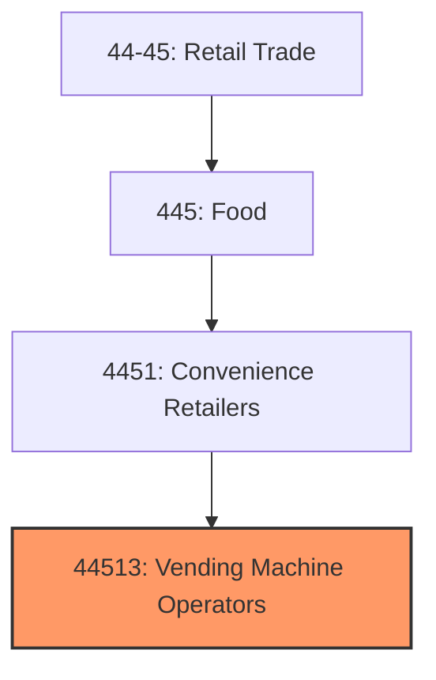
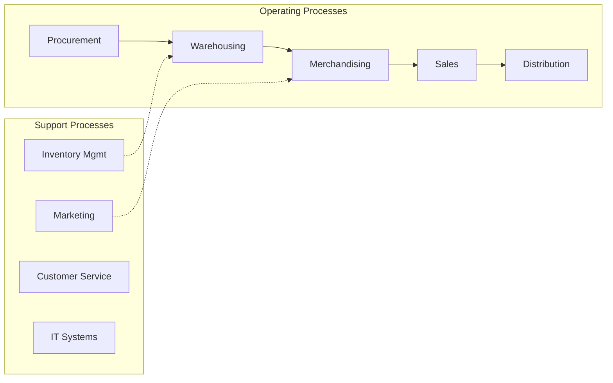

# Vending Machine Operators

> This industry comprises establishments primarily engaged in retailing a limited line of groceries that generally includes milk, bread, soda, and snacks.

## Overview

Vending Machine Operators represents an important category within the Retail Trade sector (NAICS 44-45).

This industry comprises establishments primarily engaged in retailing a limited line of groceries that generally includes milk, bread, soda, and snacks. Included in this industry are convenience retailers, such as convenience stores or food marts (except those operating fuel pumps), and vending machine operators. Cross-References. Establishments primarily engaged in--

## Industry Hierarchy

## Key Statistics

| Metric | Value |
|--------|-------|
| NAICS Code | 44513 |
| Level | Industry |
| Parent | [Convenience Retailers](../) |
| Child Industries | 0 |

## Related Occupations

See the [occupations directory](/occupations) for roles commonly found in this industry.

## Core Business Processes

## Industry Value Chain

```mermaid
graph LR
    subgraph Inputs["Inputs"]
        I1["Products"]
        I2["Inventory"]
        I3["Store/Warehouse"]
    end

    subgraph Primary["Primary Activities"]
        A1["Inbound Logistics"]
        A2["Core Operations"]
        A3["Quality Assurance"]
        A4["Outbound/Delivery"]
    end

    subgraph Outputs["Products/Services"]
        O1["Goods for Sale"]
        O2["Services"]
        O3["Delivery"]
    end

    subgraph Customers["Markets"]
        C1["Businesses"]
        C2["Consumers"]
        C3["Institutions"]
        C4["Government"]
    end

    Inputs --> Primary --> Outputs --> Customers
```

---

*Source: NAICS 44513 - Vending Machine Operators*
